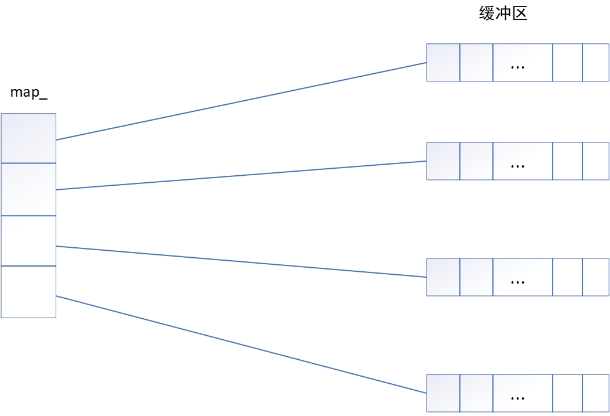
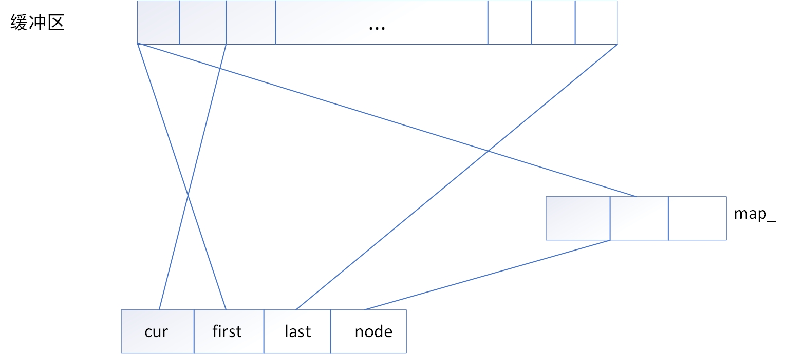

### deque

代码仓库：`https://github.com/sjz-hub/mystl`

**简介**

+ deque是双端队列，c++标准STL容器的一种
+ 特点
  + 双向访问：支持在队列的两端进行高效的插入和删除操作
  + 内部插入：支持在内部进行插入和删除操作，但是性能不如list
  + 随机访问：支持[]和at()，但是性能不如vector

**实现原理**

+ 双端队列容器的底层结构是维护多个内存块(缓冲区)，每个内存块都是一个存储指定类型数据的数组，多个内存块整体就是一个deque

+ 整体架构如上所示，每个内存块的长度大小一样，可以存放元素的数量也是一样，假定存放的数据类型为T,则缓冲区也就是内存块的类型为`T*`,则map_的类型为`T**`
+ 当向deque中放入元素空间不足时，会重新申请缓冲区，并让map_指向这些所有的缓冲区
+ deque类的成员变量为
  + `iterator begin_` 指向实际的第一个节点
  + `iterator end_`指向实际的最后一个节点的下一个节点
  + `T** map_`  存储所有缓冲区的地址
  + `size_t map_size_` 存储的是map_数组的长度大小

+ iterator结构
  + `T* cur` 表示当前迭代器指向的哪一个具体节点
  + `T* first`表示当前迭代器所指节点的内存块的第一个元素地址
  + `T* last`表示当前迭代器所指节点的内存块最后一个元素的下一个地址
  + `T** node`存储的是缓冲内存块的地址

**常见操作的原理**

+ deque内部插入元素，会根据插入位置执行不同的策略
  + 插入位置在deque的前半段，则将该位置前面的元素依次前移，然后在该位置插入元素
  + 插入位置在deque的后半段，则将该位置后面的元素依次后移，然后在该位置插入元素
+ 删除元素，和插入元素差不多，都是根据删除位置的不同决定是将元素后移还是前移

**迭代器实现的方法**

| 方法名                                         | 含义                                                         |
| ---------------------------------------------- | ------------------------------------------------------------ |
| deque_iterator() noexcept                      | 构造函数，四个成员置为nullptr                                |
| deque_iterator(value_pointer v, map_pointer n) | 构造函数，cur=v,first=*n,last=*n+buff_size,node=n            |
| deque_iterator(const iterator& rhs)            | 拷贝构造函数                                                 |
| deque_iterator(iterator&& rhs) noexcept        | 移动构造函数                                                 |
| deque_iterator(const const_iterator& rhs)      | 拷贝构造函数                                                 |
| self& operator=(const iterator& rhs)           | 拷贝赋值运算符                                               |
| void set_node(map_pointer new_node)            | 转到另一个缓冲区，对node,first,last进行重置，但是不理解为什么不对cur重置 |
| reference operator*() const                    | 重载运算符                                                   |
| pointer   operator->() const                   | 重载运算符                                                   |
| difference_type operator-(const self& x) const | 重载运算符                                                   |
| self& operator++()                             | 重载运算符                                                   |
| self operator++(int)                           | 重载运算符                                                   |
| self& operator--()                             | 重载运算符                                                   |
| self operator--(int)                           | 重载运算符                                                   |
| self& operator+=(difference_type n)            | 重载运算符                                                   |
| self operator+(difference_type n) const        | 重载运算符                                                   |
| self& operator-=(difference_type n)            | 重载运算符                                                   |
| self operator-(difference_type n) const        | 重载运算符                                                   |
| reference operator const  | 重载运算符                                                   |
| bool operator==(const self& rhs) const         | 重载运算符                                                   |
| bool operator< (const self& rhs) const         | 重载运算符                                                   |
| bool operator!=(const self& rhs) const         | 重载运算符                                                   |
| bool operator> (const self& rhs) const         | 重载运算符                                                   |
| bool operator<=(const self& rhs) const         | 重载运算符                                                   |
| bool operator>=(const self& rhs) const         | 重载运算符                                                   |

**deque类实现的public方法**

| 方法名                                                       | 含义                                                |
| ------------------------------------------------------------ | --------------------------------------------------- |
| deque()                                                      | 创建包含0个元素的deque                              |
| explicit deque(size_type n)                                  | 创建包含n个默认值的deque                            |
| deque(size_type n, const value_type& value)                  | 创建包含n个指定值的deque                            |
| template <class IIter, typename std::enable_if<   mystl::is_input_iterator<IIter>::value, int>::type = 0> deque(IIter first, IIter last) | 使用两个迭代器之间的值进行初始化                    |
| deque(std::initializer_list<value_type> ilist)               | 使用列表的方式进行初始化                            |
| deque(const deque& rhs)                                      | 拷贝构造函数                                        |
| deque(deque&& rhs) noexcept                                  | 移动构造函数                                        |
| deque& operator=(const deque& rhs);                          | 拷贝赋值运算符                                      |
| deque& operator=(deque&& rhs)                                | 移动赋值运算符                                      |
| deque& operator=(std::initializer_list<value_type> ilist)    | 列表的形式赋值                                      |
| ~deque()                                                     | 析构函数，释放所有空间                              |
| iterator               begin()         noexcept              |                                                     |
| const_iterator         begin()   const noexcept              |                                                     |
| iterator               end()           noexcept              |                                                     |
| const_iterator         end()     const noexcept              |                                                     |
| reverse_iterator       rbegin()        noexcept              |                                                     |
| const_reverse_iterator rbegin()  const noexcept              |                                                     |
| reverse_iterator       rend()          noexcept              |                                                     |
| const_reverse_iterator rend()    const noexcept              |                                                     |
| const_iterator         cbegin()  const noexcept              |                                                     |
| const_iterator         cend()    const noexcept              |                                                     |
| const_reverse_iterator crbegin() const noexcept              |                                                     |
| const_reverse_iterator crend()   const noexcept              |                                                     |
| bool      empty()    const noexcept                          | 判断容器是否为空                                    |
| size_type size()     const noexcept                          | 返回容器元素的个数                                  |
| size_type max_size() const noexcept                          | 返回容器包含元素的最大个数                          |
| void      resize(size_type new_size)                         | 重置容器大小，不足的填充默认值                      |
| void      resize(size_type new_size, const value_type& value); | 重置容器大小，不足的填充value                       |
| void      shrink_to_fit() noexcept;                          | 减少容器容量，其实就是减少缓冲区的数量              |
| reference       operator                      | 访问元素，返回引用                                  |
| const_reference operator const                | 访问元素，返回const引用                             |
| reference       at(size_type n)                              | 访问元素                                            |
| const_reference at(size_type n) const                        | 访问元素                                            |
| reference       front()                                      | 返回队头                                            |
| const_reference front() const                                | 返回const队头                                       |
| reference       back()                                       | 返回队尾                                            |
| const_reference back() const                                 | 返回const队尾                                       |
| void     assign(size_type n, const value_type& value)        | 重新分配容器，变为n个value,并且重置缓冲区           |
| template <class IIter, typename std::enable_if<   mystl::is_input_iterator<IIter>::value, int>::type = 0> void     assign(IIter first, IIter last) | 重置容器，变为两个迭代器之间的值                    |
| void     assign(std::initializer_list<value_type> ilist)     | 使用列表的方式重置容器                              |
| template <class ...Args> void     emplace_front(Args&& ...args); | 在最前面创建元素                                    |
| template <class ...Args> void     emplace_back(Args&& ...args); | 在最后面创建元素                                    |
| template <class ...Args> iterator emplace(iterator pos, Args&& ...args); | 在position前面插入一个元素，返回插入位置的迭代器    |
| void     push_front(const value_type& value);                | 在头部插入元素                                      |
| void     push_back(const value_type& value);                 | 在尾部插入元素                                      |
| void     push_front(value_type&& value)                      | 在头部插入元素                                      |
| void     push_back(value_type&& value)                       | 在尾部插入元素                                      |
| void     pop_front();                                        | 弹出头部元素                                        |
| void     pop_back();                                         | 弹出尾部元素                                        |
| iterator insert(iterator position, const value_type& value); | 在position前面插入value,返回插入元素的迭代器        |
| iterator insert(iterator position, value_type&& value)       | 在position前面插入value，返回插入元素的迭代器       |
| void     insert(iterator position, size_type n, const value_type& value); | 在position前面插入n个value                          |
| template <class IIter, typename std::enable_if<   mystl::is_input_iterator<IIter>::value, int>::type = 0> void     insert(iterator position, IIter first, IIter last) | 在position前面插入两个迭代器之间的值                |
| iterator erase(iterator position);                           | 删除该迭代器的值，并返回该位置新的迭代器            |
| iterator erase(iterator first, iterator last);               | 删除[first,last)的值，并返回新的first迭代器         |
| void     clear();                                            | 删除整个容器，并且调用shrink_to_fit()放弃多余的空间 |
| void     swap(deque& rhs) noexcept;                          | 交换两个迭代器                                      |

**deque类实现的private帮助函数**

| 方法名                                                       | 含义                                                         |
| ------------------------------------------------------------ | ------------------------------------------------------------ |
| map_pointer create_map(size_type size);                      | 创建一个含有size个T*的数组，返回这个数组的首地址             |
| void        create_buffer(map_pointer nstart, map_pointer nfinish); | 为[nstart,nfinsh] 中的每一个元素都赋值一个大小为buffer_size的数组首地址，都是new出来的 |
| void        destroy_buffer(map_pointer nstart, map_pointer nfinish) | 释放[nstart,nfinsh]中每个元素对应的数组空间，并都置为nullptr |
| void        map_init(size_type nelem);                       | deque应该可以包含eElem个元素，分配合适数量的缓冲区（最小一般不能小于8），算出来的缓冲区个数需要向上取整，并且最后还要+2，在和8取最大值。定义nstart,nfinsh都是map_pointer,实际指向的分别是应该是正好缓冲区的开始和缓冲区的结束，并对这个[nstart,nfinsh]进行new,然后赋值begin\_和end_的四个成员 |
| void        fill_init(size_type n, const value_type& value); | 调用map_init(n)进行初始化，并将对应位置都赋值为value         |
| template <class IIter> void        copy_init(IIter, IIter);  | 创建缓冲区，并将对应[first,last)的内容拷贝过来               |
| void        fill_assign(size_type n, const value_type& value); | 重新分配缓冲区，并将值都变为value                            |
| template <class IIter> void        copy_assign(IIter first, IIter last); | 重新分配缓冲区，并将值变为[first,last)                       |
| template <class... Args> iterator    insert_aux(iterator position, Args&& ...args); | 在position前面插入一个值，如果position在前半段，就将前面的值向前移动，如果在后半段，就将后面的值向后移动，返回插入的元素的迭代器 |
| void        fill_insert(iterator position, size_type n, const value_type& x); | 在position前面插入n个x,如果postion在前半段，则前面元素前移，如果在后半段，则后面元素后移。 |
| template <class FIter> void        copy_insert(iterator, FIter, FIter); | 在position前面插入两个迭代器之间的值,如果postion在前半段，则前面元素前移，如果在后半段，则后面元素后移 |
| template <class IIter> void        insert_dispatch(iterator, IIter, IIter); | 在iterator前面插入两个迭代器之间的值，左闭右开，如果要插入的位置在前半段，就保证开头位置空间有n个空闲，如果插在后半段，九保证结尾位置空间有n个空闲空间，n是两个迭代器之间元素的个数 |
| void        require_capacity(size_type n, bool front);       | front为true表示在队头，为false表示在队尾，看看是否还有n个元素的空间，如果没有，则创建新的缓冲区来确保可以添加n个元素 |
| void        reallocate_map_at_front(size_type need);         | 重新分配map,map_size的大小变为了原先的2倍和原先大小+need_buffer+DEQUE_MAP_INIT_SIZE的最大值，并且将begin\_和end\_分别指向中间的部分，并且对新的区域进行重新分配新的buffer,并将原先的buffer复制过来，删除原先的map,更新成员变量 |
| void        reallocate_map_at_back(size_type need);          | 和void        reallocate_map_at_front(size_type need);差不多只不过是在后面加而已 |

代码仓库：`https://github.com/sjz-hub/mystl`