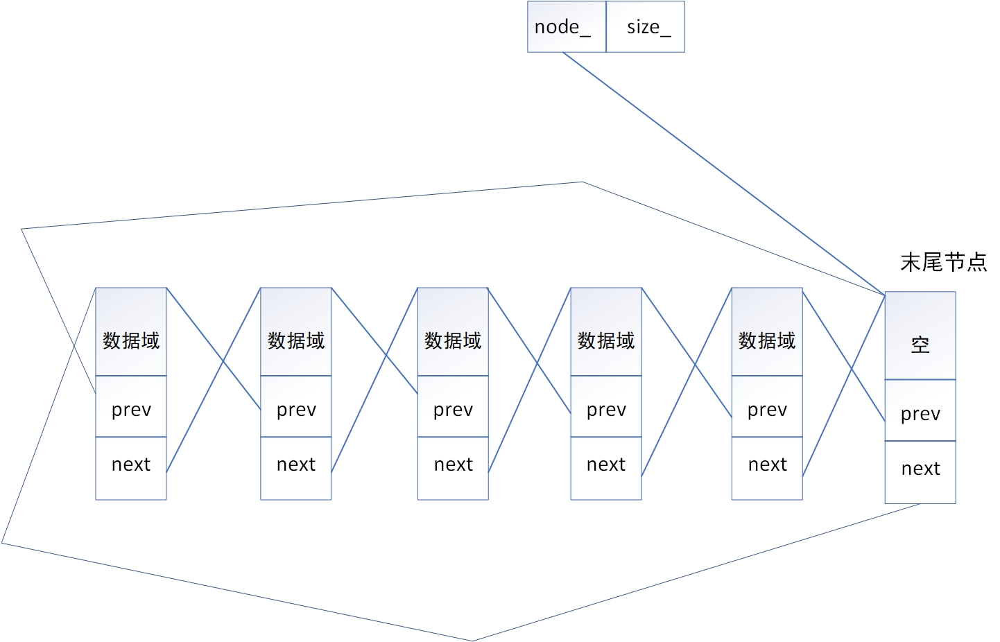

### list

代码仓库：`https://github.com/sjz-hub/mystl`

**简介**

+ list是列表，c++标准STL标准容器的一种
+ 特点
  + 双向链表结构
  + 非连续存储
  + 高效插入和删除：都是常数时间O(1)
  + 低效随机访问：需要按顺序遍历列表

**实现原理**

+ list的成员变量
  + `list_node* node_` 指针变量，指向末尾节点
  + `size_t size_` 表示list的大小
+ 末尾节点不存储内容，只是起到一个类似哨兵的作用，方便很多方法的编写
+ 这是一个循环双向列表
+ list_iterator
  + `list_node* node_`指向当前节点

+ list的其余操作增删改查和正常的列表没什么区别

**list实现public方法**

+ 

| 方法名                                                       | 含义                                                         |
| ------------------------------------------------------------ | ------------------------------------------------------------ |
| list()                                                       | 创建一个空的list                                             |
| explicit list(size_type n)                                   | 创建一个含有n个元素的list,并且每个元素的值都是该类型的默认值，也就是如果是类的话直接就调用类的空参构造函数 |
| list(size_type n, const value_type& value)                   | 创建一个含有n个元素的list,并且每个元素的值都是value          |
| template <class Iter, typename std::enable_if<   mystl::is_input_iterator<Iter>::value, int>::type = 0> list(Iter first, Iter last) | 使用一个输入迭代器的两个迭代值作为构造函数的参数，将这两个迭代值得中间部分设置为新得list的值，为[first,last) |
| list(std::initializer_list<T> ilist)                         | 使用一个list将其进行初始化，完全copy ilist的内容             |
| list(const list& rhs)                                        | 拷贝构造函数                                                 |
| list(list&& rhs) noexcept                                    | 移动构造函数                                                 |
| list& operator=(const list& rhs)                             | 赋值运算符                                                   |
| list& operator=(list&& rhs) noexcept                         | 右值赋值运算符                                               |
| list& operator=(std::initializer_list<T> ilist)              | 赋值运算符                                                   |
| ~list()                                                      | 析构函数，析构list中的每个元素，并将对应的node\_,size\_都重置 |
| iterator               begin()         noexcept              | 返回开始迭代器                                               |
| const_iterator         begin()   const noexcept              | 返回开始const迭代器                                          |
| iterator               end()           noexcept              | 返回结尾迭代器                                               |
| const_iterator         end()     const noexcept              | 返回结尾const迭代器                                          |
| reverse_iterator       rbegin()        noexcept              | 返回反向开始迭代器                                           |
| const_reverse_iterator rbegin()  const noexcept              | 返回反向开始const迭代器                                      |
| reverse_iterator       rend()          noexcept              | 返回反向结尾迭代器                                           |
| const_reverse_iterator rend()    const noexcept              | 返回反向结尾const迭代器                                      |
| const_iterator         cbegin()  const noexcept              | 返回开始const迭代器                                          |
| const_iterator         cend()    const noexcept              | 返回结束const迭代器                                          |
| const_reverse_iterator crbegin() const noexcept              | 返回开始反向const迭代器                                      |
| const_reverse_iterator crend()   const noexcept              | 返回结尾反向const迭代器                                      |
| bool      empty()    const noexcept                          | 判断list是否为空                                             |
| size_type size()     const noexcept                          | 返回list的大小                                               |
| size_type max_size() const noexcept                          | 返回list能存储的最大大小                                     |
| reference       front()                                      | 返回头节点的引用                                             |
| const_reference front() const                                | 返回头节点的const引用                                        |
| reference       back()                                       | 返回尾节点引用                                               |
| const_reference back()  const                                | 返回尾节点的const引用                                        |
| void     assign(size_type n, const value_type& value)        | 对list进行重新分配，使得list变为一个长度尾n，每个元素为value的list |
| template <class Iter, typename std::enable_if<   mystl::is_input_iterator<Iter>::value, int>::type = 0> void     assign(Iter first, Iter last) | 使用两个迭代器完成对list的重新分配                           |
| void     assign(std::initializer_list<T> ilist)              | 使用一个list完成对原先list的分配                             |
| template <class ...Args> void     emplace_front(Args&& ...args) | 在头节点前面插入一个新元素，这个元素的构造函数的参数给出     |
| template <class ...Args> void     emplace_back(Args&& ...args) | 在尾节点后面插入一个节点，这个元素的构造函数的参数给出       |
| template <class ...Args> iterator emplace(const_iterator pos, Args&& ...args) | 将新节点插入到pos位置的前面，返回新插入的节点                |
| iterator insert(const_iterator pos, const value_type& value) | 在pos的前面插入一个新节点，其值为value，返回插入节点的迭代器 |
| iterator insert(const_iterator pos, value_type&& value)      | 在pos的前面插入一个新节点，新节点的值是从一个右值得到的      |
| iterator insert(const_iterator pos, size_type n, const value_type& value) | 在pos前面插入n个值为value的节点,返回插入的第一个节点         |
| template <class Iter, typename std::enable_if<   mystl::is_input_iterator<Iter>::value, int>::type = 0> iterator insert(const_iterator pos, Iter first, Iter last) | 在pos前面插入两个迭代器之间的值，[first,last)                |
| void push_front(const value_type& value)                     | 在头节点前面插入一个新节点，节点的值为valule                 |
| void push_front(value_type&& value)                          | 在头节点前面插入一个右值                                     |
| void push_back(const value_type& value)                      | 在尾节点后面插入一个新节点                                   |
| void push_back(value_type&& value)                           | 在尾节点后面插入一个新节点                                   |
| void pop_front()                                             | 删除头节点                                                   |
| void pop_back()                                              | 删除尾节点                                                   |
| template <class T> typename list<T>::iterator  list<T>::erase(const_iterator pos) | 删除pos迭代器位置的元素，并返回pos下一个元素的迭代器，修改size_大小 |
| template <class T> typename list<T>::iterator  list<T>::erase(const_iterator first, const_iterator last) | 删除[first,last)位置的元素,返回last                          |
| template <class T> void list<T>::clear()                     | 清空list                                                     |
| void     resize(size_type new_size)                          | 调整容器大小，如果容器大小大于new_size,则删除尾部指定数量的节点；如果容器大小小于new_size则在尾节点后面添加指定数量的节点 插入节点为T() |
| template <class T> void list<T>::resize(size_type new_size, const value_type& value) | 调整容器大小，如果容器大小大于new_size,则删除尾部指定数量的节点；如果容器大小小于new_size则在尾节点后面添加指定数量的节点 |
| template <class T> void list<T>::splice(const_iterator pos, list& x) | 将x的所有内容接合在pos前面，这里不是copy,而是真的就直接将x的所有内容接在pos的前面 |
| template <class T> void list<T>::splice(const_iterator pos, list& x, const_iterator it) | 将x的it节点接合在pos的前面，那么此时x中则不会再有it这个节点  |
| template <class T> void list<T>::splice(const_iterator pos, list& x, const_iterator first, const_iterator last) | 将x的[first,last)接合在pos的前面                             |
| void remove(const value_type& value)                         | 删除指定元素                                                 |
| template <class T> template <class UnaryPredicate> void list<T>::remove_if(UnaryPredicate pred) | 移除所有使得pred尾true的元素                                 |
| void unique()                                                | 删除重复元素，不过只是删除相邻重复元素                       |
| template <class T> template <class BinaryPredicate> void list<T>::unique(BinaryPredicate pred) | 移除list的重复元素，其实也是将pred为true的元素移除，不过这里是pred就是判断两个元素是否相同 |
| void merge(list& x)                                          | 合并两个list，按照从小到大的顺序进行合并，并删除x            |
| template <class T> template <class Compare> void list<T>::merge(list& x, Compare comp) | 将list域x进行合并，按照comp为true的顺序进行合并              |
| template <class T> void list<T>::reverse()                   | 将list进行反转                                               |
| void swap(list& rhs);                                        | 交换两个list                                                 |
| void sort()                                                  | 排序                                                         |
| template<class Compared> void sort(Compared comp)            | 按照指定规则进行排序                                         |

**list的private帮助函数**

| 方法名                                                       | 作用                                                         |
| ------------------------------------------------------------ | ------------------------------------------------------------ |
| template <class T> template <class ...Args> typename list<T>::node_ptr  list<T>::create_node(Args&& ...args) | 创建一个新节点，并返回这个节点的node_ptr指针                 |
| template <class T> typename list<T>::node_ptr list<T>::create_node(const T& value){ | 创建一个新节点，并返回这个节点的node_ptr指针                 |
| template <class T> void list<T>::destroy_node(node_ptr p)    | 销毁一个指定的节点                                           |
| template <class T> void list<T>::fill_init(size_type n, const value_type& value) | 使用n个元素value初始化一个容器                               |
| template <class T> template <class Iter> void list<T>::copy_init(Iter first, Iter last) | 使用[first,last)初始化容器，将这些值拷贝到容器中             |
| template <class T> typename list<T>::iterator  list<T>::link_iter_node(const_iterator pos, base_ptr link_node) | 在pos的前面连接一个节点,返回插入的节点的迭代器               |
| template <class T> void list<T>::link_nodes(base_ptr pos, base_ptr first, base_ptr last) | 在pos前面连接[first,last]节点                                |
| template <class T> void list<T>::link_nodes_at_front(base_ptr first, base_ptr last) | 在头节点前面连接[first,last]节点                             |
| template <class T> void list<T>::link_nodes_at_back(base_ptr first, base_ptr last) | 在尾节点后面连接[first,last]节点                             |
| template <class T> void list<T>::unlink_nodes(base_ptr first, base_ptr last) | 断开[first,last]与容器的连接                                 |
| template <class T> void list<T>::fill_assign(size_type n, const value_type& value) | 用n个value为容器重新赋值，如果容器的大小大于n则删除尾部指定元素；如果小于n则在尾部后面添加指定数量的元素 |
| template <class T> template <class Iter> void list<T>::copy_assign(Iter f2, Iter l2) | copy[f2,l2)元素为容器赋值，如果容器的大小大于n则删除尾部指定元素；如果小于n则在尾部后面添加指定数量的元素 |
| template <class T> typename list<T>::iterator  list<T>::fill_insert(const_iterator pos, size_type n, const value_type& value) | 在pos前面插入n个value值节点，返回插入的n个节点的第一个节点，如果插入0个节点，则返回pos |
| template <class T> template <class Iter> typename list<T>::iterator  list<T>::copy_insert(const_iterator pos, size_type n, Iter first) | 在pos前面插入[first,last)的值节点，返回插入的n个节点的第一个节点，如果插入0个节点，则返回pos |
| template <class T> template <class Compared> typename list<T>::iterator  list<T>::list_sort(iterator f1, iterator l2, size_type n, Compared comp) | 对list进行归并排序，并返回一个迭代器指向区间的最小元素的位置，使用comp进行排序，排序[f2,l2) |

代码仓库：`https://github.com/sjz-hub/mystl`

