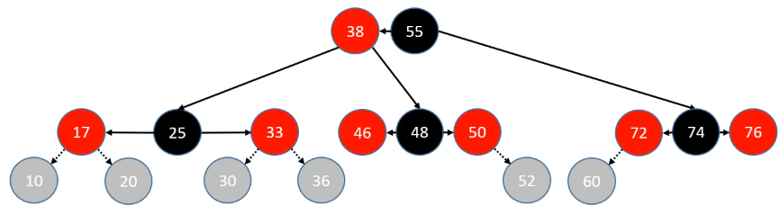

所有留有疑问的地方都使用疑问二字进行标注，可以直接搜索疑问


### 01 type_traits.h

+ 这个头文件主要用于提取类型信息

```c++
//传递一个类型，以及类型值，使得对应的value为这个类型值
template <class T, T v>
    struct m_integral_constant{
        static constexpr T value = v;
    };

template <bool b>
using m_bool_constant = m_integral_constant<bool,b>;

//创建了两个结构体，其对应的value分别为true和false
typedef m_bool_constant<true> m_true_type;
typedef m_bool_constant<false> m_false_type;
```


### 02 exceptdef.h

+ 会包含两个库头文件
  + `cassert` 
    + 关于断言的头文件
    + `assert(n==1)` 条件返回false，代码会终止运行，并且会把源文件，错误代码以及行号都输出出来
    + 只需要在源文件其实位置加上`#define NDEBUG`就可以停用assert
  + `stdexcept`
    + 定义了一些标准的异常类，分为两大类
      + 逻辑错误
      + 运行时错误

+ 这个头文件定义了集中常见错误

```c++
//定义常见的不满足条件的assert
#define MYSTL_DEBUG(expr) assert(expr)

//抛出长度错误
#define THROW_LENGTH_ERROR_IF(expr, what) if((expr)) throw std::length_error(what)

//抛出越界错误
#define THROW_OUT_OF_RANGE_IF(expr, what) if((expr)) throw std::out_of_range(what)

//抛出运行时错误
#define THROW_RUNTIME_ERROR_IF(expr, what) if((expr)) throw std::runtime_error(what)
```


### 03 iterator.h

+ 包含的库头文件
  + `cstddef`
    + 定义常用的常量、宏、类型和函数
+ 这个头文件主要用于迭代器设计，包含了一些模板结构与全局函数


**五种常用迭代器**

+ 定义了五种常用迭代器类型，这里只是为了定义这种类型，所以里面并不会包含任何内容

```c++
//五种迭代器类型
struct input_iterator_tag{};
struct output_iterator_tag{};
struct forward_iterator_tag:public input_iterator_tag{};
struct bidirectional_iterator_tag:public forward_iterator_tag{};
struct random_access_iterator_tag:public bidirectional_iterator_tag{};
```

+ **疑问**:这里为什么前向迭代器不是继承自输入迭代器和输出迭代器，而是只继承输入迭代器呢

| 迭代器类型                           | 作用                             |
| ------------------------------------ | -------------------------------- |
| input iterator输入迭代器             | 读，不能写；只支持自增运算       |
| output iterator输出迭代器            | 写，不能读；只支持自增运算       |
| forward iterator前向迭代器           | 读和写；只支持自增运算           |
| bidirectional iterator双向迭代器     | 读和写；支持自增和自减运算       |
| random access iterator随机访问迭代器 | 读和写；支持完整的迭代器算数运算 |


**输入迭代器**

+ 输入迭代器可用于读取容器中的元素，但是不保证支持容器的写入操作
+ 支持的操作
  + 相等和不相等操作符(==和!=),比较两个迭代器
  + 前置和后置的自增运算(++),使迭代器向前递进指向下一个元素
  + 用于读取元素的解引用操作符(\*),此操作符只能出现在赋值运算符的右操作数上
  + 箭头操作符(->)，对迭代器进行解引用来获取所关联的对象的成员
+ 输入迭代器只能顺序使用；一旦迭代器自增，就无法再用它检查之前的元素。
+ 要求在这个层次上提供支持的泛型算法包括find和accumulate

**输出迭代器**

+ 输出迭代器可用于向容器写入元素，但是不保证支持容器的读操作
+ 支持的操作
  + 前置和后置自增运算符(++)，使迭代器向前递进指向下一个元素
  + 解引用运算符(\*),只能出现在赋值运算的左操作数上，给解引用的输出迭代器赋值，对指向的元素执行写入操作
+ 输出迭代器一般用作泛型算法的第三个实参，标记起始写入位置


**前向迭代器**

+ 前向迭代器用于读写指定的容器。只会以一个方向遍历序列
+ 支持输入迭代器和输出迭代器的所有操作
+ 支持对同一个元素的多次读写


**双向迭代器**

+ 可以从两个方向读写容器
+ 除了支持前向迭代器的所有操作，还支持前置和后置的自减运算符(--)
+ 所有标准库容器提供的迭代器都至少达到了双向迭代器的要求
+ map,set,list是双向迭代器


**随机访问迭代器**

+ 支持在常量时间内访问容器任意位置的功能
+ 除了支持双向迭代器的所有功能外，还支持
  + 关系操作符`<  <=  >  >=`，比较两个迭代器的相对位置
  + 迭代器与整型数值n之间的加法和减法操作符`+ += - -=`，结果是迭代器在容器中向前（或退后）n个元素
  + 两个迭代器之间的减法操作符(-)，得到两个迭代器间的距离
  + 下表操作符iter[n]，等价于`*(iter+n)`
+ sort算法需要随机访问迭代器
+ vector,deque,string迭代器都是随机访问迭代器，用于访问内置数组元素的指针也是随机访问迭代器


**迭代器萃取器**


```c++
//迭代器萃取

//判断T是否有iterator_category这个成员，如果有则静态变量value为true，否则为false
//这里加了一个U目的就是为了防止出现T没有iterator_category的情况
template <class T>
    struct has_iterator_cat{
        private:
        struct two{char a;char b;};
        template <class U> static two test(...){}
        template <class U> static char test(typename U::iterator_category* = 0){}
        public:
        static const bool value = sizeof(test<T>(0)) == sizeof(char);
    };

template<class Iterator,bool>
    struct iterator_traits_impl{};

template<class Iterator>
    struct iterator_traits_impl<Iterator,true>{
        typedef typename Iterator::iterator_category    iterator_category;
        typedef typename Iterator::value_type           value_type;
        typedef typename Iterator::pointer              pointer;
        typedef typename Iterator::reference            reference;
        typedef typename Iterator::difference_type      difference_type;
    };

template<class Iterator,bool>
    struct iterator_traits_helper{};

//std::is_convertible<from,to>表明from类型是否可以隐式转换为to类型
template<class Iterator>
    struct iterator_traits_helper<Iterator,true>:public iterator_traits_impl<Iterator,
std::is_convertible<typename Iterator::iterator_category,input_iterator_tag>::value ||
    std::is_convertible<typename Iterator::iterator_category,output_iterator_tag>::value>{
    };

//迭代器萃取器的特性
template<class Iterator>
    struct iterator_traits:public iterator_traits_helper<Iterator,has_iterator_cat<Iterator>::value>{};
```

```c++
//针对原生指针的偏特化版本
template<class T>
    struct iterator_traits<T*>{
        typedef random_access_iterator_tag        iterator_category;
        typedef T                                 value_type;
        typedef T*                                pointer;
        typedef T&                                reference;
        typedef ptrdiff_t                         difference_type;
    };

template<class T>
    struct iterator_traits<const T*>{
        typedef random_access_iterator_tag        iterator_category;
        typedef T                                 value_type;
        typedef const T*                          pointer;
        typedef const T&                          reference;
        typedef ptrdiff_t                         difference_type;
    };
```


**一堆萃取器**

+ 萃取迭代器的元素
+ 判断迭代器是否属于五类的某一种
+ 计算迭代器的距离
+ 迭代器前进n步


### 04 util.h

+ 包含一些通用工具，包括move,forward,swap等函数以及pair等


+ pair包含两个成员变量
  + first
  + second


pair的方法

| 方法名                                                       | 含义                   | 是否完成 | 是否测试完成 |
| ------------------------------------------------------------ | ---------------------- | -------- | ------------ |
| constexpr pair()                                             | first,second默认初始化 | 是       |              |
| constexpr pair(const first_type& a, const second_type& b)    | 使用对应值初始化       | 是       |              |
| pair(const pair& rhs)                                        | 拷贝构造函数           | 是       |              |
| air(const pair&& rhs)                                        | 移动构造函数           | 是       |              |
| constexpr pair(first_type&& a, second_type&& b)              | 构造函数               | 是       |              |
| pair& operator=(const pair& rhs)                             | 赋值运算符             | 是       |              |
| pair& operator=(pair&& rhs)                                  | 赋值运算符             | 是       |              |
| template <class Other1, class Other2> pair& operator=(const pair<Other1, Other2>& other) | 赋值运算符             |          |              |
| template <class Other1, class Other2> pair& operator=(pair<Other1, Other2>&& other) | 赋值运算符             |          |              |
| ~pair() = default;                                           | 析构函数               | 是       |              |
| void swap(pair& other)                                       | 交换                   |          |              |
| template <class Ty1, class Ty2> bool operator==(const pair<Ty1, Ty2>& lhs, const pair<Ty1, Ty2>& rhs) | 比较运算符             |          |              |

全局函数

| 方法名                                                       | 含义     | 是否完成 | 是否测试完成 |
| ------------------------------------------------------------ | -------- | -------- | ------------ |
| template <class Ty1, class Ty2> pair<Ty1, Ty2> make_pair(Ty1&& first, Ty2&& second) | 返回pair |          |              |
| template <class Ty1, class Ty2> void swap(pair<Ty1, Ty2>& lhs, pair<Ty1, Ty2>& rhs) | 交换     |          |              |
| template <class Ty1, class Ty2> bool operator<(const pair<Ty1, Ty2>& lhs, const pair<Ty1, Ty2>& rhs) |          |          |              |
| template <class Ty1, class Ty2> bool operator!=(const pair<Ty1, Ty2>& lhs, const pair<Ty1, Ty2>& rhs) |          |          |              |
| template <class Ty1, class Ty2> bool operator>(const pair<Ty1, Ty2>& lhs, const pair<Ty1, Ty2>& rhs) |          |          |              |
| template <class Ty1, class Ty2> bool operator<=(const pair<Ty1, Ty2>& lhs, const pair<Ty1, Ty2>& rhs) |          |          |              |
| template <class Ty1, class Ty2> bool operator>=(const pair<Ty1, Ty2>& lhs, const pair<Ty1, Ty2>& rhs) |          |          |              |
| template <class Ty1, class Ty2> void swap(pair<Ty1, Ty2>& lhs, pair<Ty1, Ty2>& rhs) |          |          |              |


### 05 algobase.h

+ 这个头文件包含mystl的基本算法


### 06 construct.h

+ 这个头文件主要包含两个函数
  + `construct` 负责对象的构造,在已有的内存空间上调用构造函数
  + `destroy`负责对象的析构，只是调用析构函数，不释放空间
+ 这里的构造释放都是对对象而言，并不涉及内存的申请和释放


### 07 uninitialized.h

+ 这个头文件用于对未初始化空间构造元素


### 08 allocator.h

+ 这个头文件包含一个模板类 allocator,用于管理内存的分配，释放，对象的构造、析构


### 09 memory.h

+ 这个头文件负责更高级的动态内存管理
+ 包含一些基本函数、空间配置器、未初始化的储存空间管理，以及一个模板类 auto_ptr


### 10 list.h

+ 存在两个结构体
  + list_node_base 只包含两个自身类型的指针，分别指向前和后
  + list_node,继承自list_node_base,还多存在一个value值，这个是一个完整的list节点
+ 两个类模板
  + `list_iterator`
  + `list_const_iterator`


+ list的成员


+ list类模板具备的函数

| 方法名                                                       | 含义                                                         | 是否完成 | 是否测试完成 |
| ------------------------------------------------------------ | ------------------------------------------------------------ | -------- | ------------ |
| list()                                                       | 创建一个空的list                                             | 是       | 是           |
| explicit list(size_type n)                                   | 创建一个含有n个元素的list,并且每个元素的值都是该类型的默认值，也就是如果是类的话直接就调用类的空参构造函数 | 是       | 是           |
| list(size_type n, const value_type& value)                   | 创建一个含有n个元素的list,并且每个元素的值都是value          | 是       | 是           |
| template <class Iter, typename std::enable_if<   mystl::is_input_iterator<Iter>::value, int>::type = 0> list(Iter first, Iter last) | 使用一个输入迭代器的两个迭代值作为构造函数的参数，将这两个迭代值得中间部分设置为新得list的值，为[first,last) | 是       | 是           |
| list(std::initializer_list<T> ilist)                         | 使用一个list将其进行初始化，完全copy ilist的内容             | 是       | 是           |
| list(const list& rhs)                                        | 拷贝构造函数                                                 | 是       | 是           |
| list(list&& rhs) noexcept                                    | 移动构造函数                                                 | 是       |              |
| list& operator=(const list& rhs)                             | 赋值运算符                                                   | 是       | 是           |
| list& operator=(list&& rhs) noexcept                         | 右值赋值运算符                                               | 是       |              |
| list& operator=(std::initializer_list<T> ilist)              | 赋值运算符                                                   | 是       | 是           |
| ~list()                                                      | 析构函数，析构list中的每个元素，并将对应的node\_,size\_都重置 | 是       |              |
| iterator               begin()         noexcept              | 返回开始迭代器                                               | 是       | 是           |
| const_iterator         begin()   const noexcept              | 返回开始const迭代器                                          | 是       | 是           |
| iterator               end()           noexcept              | 返回结尾迭代器                                               | 是       | 是           |
| const_iterator         end()     const noexcept              | 返回结尾const迭代器                                          | 是       | 是           |
| reverse_iterator       rbegin()        noexcept              | 返回反向开始迭代器                                           | 是       |              |
| const_reverse_iterator rbegin()  const noexcept              | 返回反向开始const迭代器                                      | 是       |              |
| reverse_iterator       rend()          noexcept              | 返回反向结尾迭代器                                           | 是       |              |
| const_reverse_iterator rend()    const noexcept              | 返回反向结尾const迭代器                                      | 是       |              |
| const_iterator         cbegin()  const noexcept              | 返回开始const迭代器                                          | 是       |              |
| const_iterator         cend()    const noexcept              | 返回结束const迭代器                                          | 是       |              |
| const_reverse_iterator crbegin() const noexcept              | 返回开始反向const迭代器                                      | 是       |              |
| const_reverse_iterator crend()   const noexcept              | 返回结尾反向const迭代器                                      | 是       |              |
| bool      empty()    const noexcept                          | 判断list是否为空                                             | 是       | 是           |
| size_type size()     const noexcept                          | 返回list的大小                                               | 是       | 是           |
| size_type max_size() const noexcept                          | 返回list能存储的最大大小                                     | 是       | 是           |
| reference       front()                                      | 返回头节点的引用                                             | 是       | 是           |
| const_reference front() const                                | 返回头节点的const引用                                        | 是       |              |
| reference       back()                                       | 返回尾节点引用                                               | 是       | 是           |
| const_reference back()  const                                | 返回尾节点的const引用                                        | 是       |              |
| void     assign(size_type n, const value_type& value)        | 对list进行重新分配，使得list变为一个长度尾n，每个元素为value的list | 是       | 是           |
| template <class Iter, typename std::enable_if<   mystl::is_input_iterator<Iter>::value, int>::type = 0> void     assign(Iter first, Iter last) | 使用两个迭代器完成对list的重新分配                           | 是       | 是           |
| void     assign(std::initializer_list<T> ilist)              | 使用一个list完成对原先list的分配                             | 是       | 是           |
| template <class ...Args> void     emplace_front(Args&& ...args) | 在头节点前面插入一个新元素，这个元素的构造函数的参数给出     | 是       | 是           |
| template <class ...Args> void     emplace_back(Args&& ...args) | 在尾节点后面插入一个节点，这个元素的构造函数的参数给出       | 是       | 是           |
| template <class ...Args> iterator emplace(const_iterator pos, Args&& ...args) | 将新节点插入到pos位置的前面，返回新插入的节点                | 是       | 是           |
| iterator insert(const_iterator pos, const value_type& value) | 在pos的前面插入一个新节点，其值为value，返回插入节点的迭代器 | 是       | 是           |
| iterator insert(const_iterator pos, value_type&& value)      | 在pos的前面插入一个新节点，新节点的值是从一个右值得到的      | 是       |              |
| iterator insert(const_iterator pos, size_type n, const value_type& value) | 在pos前面插入n个值为value的节点,返回插入的第一个节点         | 是       | 是           |
| template <class Iter, typename std::enable_if<   mystl::is_input_iterator<Iter>::value, int>::type = 0> iterator insert(const_iterator pos, Iter first, Iter last) | 在pos前面插入两个迭代器之间的值，[first,last)                | 是       | 是           |
| void push_front(const value_type& value)                     | 在头节点前面插入一个新节点，节点的值为valule                 | 是       | 是           |
| void push_front(value_type&& value)                          | 在头节点前面插入一个右值                                     | 是       |              |
| void push_back(const value_type& value)                      | 在尾节点后面插入一个新节点                                   | 是       | 是           |
| void push_back(value_type&& value)                           | 在尾节点后面插入一个新节点                                   | 是       |              |
| void pop_front()                                             | 删除头节点                                                   | 是       | 是           |
| void pop_back()                                              | 删除尾节点                                                   | 是       | 是           |
| template <class T> typename list<T>::iterator  list<T>::erase(const_iterator pos) | 删除pos迭代器位置的元素，并返回pos下一个元素的迭代器，修改size_大小 | 是       | 是           |
| template <class T> typename list<T>::iterator  list<T>::erase(const_iterator first, const_iterator last) | 删除[first,last)位置的元素,返回last                          | 是       | 是           |
| template <class T> void list<T>::clear()                     | 清空list                                                     | 是       | 是           |
| void     resize(size_type new_size)                          | 调整容器大小，如果容器大小大于new_size,则删除尾部指定数量的节点；如果容器大小小于new_size则在尾节点后面添加指定数量的节点 插入节点为T() |          |              |
| template <class T> void list<T>::resize(size_type new_size, const value_type& value) | 调整容器大小，如果容器大小大于new_size,则删除尾部指定数量的节点；如果容器大小小于new_size则在尾节点后面添加指定数量的节点 | 是       | 是           |
| template <class T> void list<T>::splice(const_iterator pos, list& x) | 将x的所有内容接合在pos前面，这里不是copy,而是真的就直接将x的所有内容接在pos的前面 | 是       | 是           |
| template <class T> void list<T>::splice(const_iterator pos, list& x, const_iterator it) | 将x的it节点接合在pos的前面，那么此时x中则不会再有it这个节点  | 是       | 是           |
| template <class T> void list<T>::splice(const_iterator pos, list& x, const_iterator first, const_iterator last) | 将x的[first,last)接合在pos的前面                             | 是       | 是           |
| void remove(const value_type& value)                         | 删除指定元素                                                 | 是       | 是           |
| template <class T> template <class UnaryPredicate> void list<T>::remove_if(UnaryPredicate pred) | 移除所有使得pred尾true的元素                                 | 是       | 是           |
| void unique()                                                | 删除重复元素，不过只是删除相邻重复元素                       | 是       | 是           |
| template <class T> template <class BinaryPredicate> void list<T>::unique(BinaryPredicate pred) | 移除list的重复元素，其实也是将pred为true的元素移除，不过这里是pred就是判断两个元素是否相同 | 是       | 是           |
| void merge(list& x)                                          | 合并两个list，按照从小到大的顺序进行合并，并删除x            | 是       | 是           |
| template <class T> template <class Compare> void list<T>::merge(list& x, Compare comp) | 将list域x进行合并，按照comp为true的顺序进行合并              | 是       | 是           |
| template <class T> void list<T>::reverse()                   | 将list进行反转                                               | 是       | 是           |
| void swap(list& rhs);                                        | 交换两个list                                                 | 是       | 是           |
| void sort()                                                  | 排序                                                         | 是       | 是           |
| template<class Compared> void sort(Compared comp)            | 按照指定规则进行排序                                         | 是       | 是           |

+ 帮助函数

| 方法名                                                       | 作用                                                         | 是否完成 | 是否完成测试 | 是否是自己新创建的函数 |
| ------------------------------------------------------------ | ------------------------------------------------------------ | -------- | ------------ | ---------------------- |
| template <class T> template <class ...Args> typename list<T>::node_ptr  list<T>::create_node(Args&& ...args) | 创建一个新节点，并返回这个节点的node_ptr指针                 | 是       |              |                        |
| template <class T> typename list<T>::node_ptr list<T>::create_node(const T& value){ | 创建一个新节点，并返回这个节点的node_ptr指针                 | 是       | 是           | 是                     |
| template <class T> void list<T>::destroy_node(node_ptr p)    | 销毁一个指定的节点                                           |          |              |                        |
| template <class T> void list<T>::fill_init(size_type n, const value_type& value) | 使用n个元素value初始化一个容器                               | 是       | 是           |                        |
| template <class T> template <class Iter> void list<T>::copy_init(Iter first, Iter last) | 使用[first,last)初始化容器，将这些值拷贝到容器中             | 是       | 是           |                        |
| template <class T> typename list<T>::iterator  list<T>::link_iter_node(const_iterator pos, base_ptr link_node) | 在pos的前面连接一个节点,返回插入的节点的迭代器               | 是       | 是           |                        |
| template <class T> void list<T>::link_nodes(base_ptr pos, base_ptr first, base_ptr last) | 在pos前面连接[first,last]节点                                | 是       | 是           |                        |
| template <class T> void list<T>::link_nodes_at_front(base_ptr first, base_ptr last) | 在头节点前面连接[first,last]节点                             |          |              |                        |
| template <class T> void list<T>::link_nodes_at_back(base_ptr first, base_ptr last) | 在尾节点后面连接[first,last]节点                             |          |              |                        |
| template <class T> void list<T>::unlink_nodes(base_ptr first, base_ptr last) | 断开[first,last]与容器的连接                                 | 是       | 是           |                        |
| template <class T> void list<T>::fill_assign(size_type n, const value_type& value) | 用n个value为容器重新赋值，如果容器的大小大于n则删除尾部指定元素；如果小于n则在尾部后面添加指定数量的元素 | 是       | 是           |                        |
| template <class T> template <class Iter> void list<T>::copy_assign(Iter f2, Iter l2) | copy[f2,l2)元素为容器赋值，如果容器的大小大于n则删除尾部指定元素；如果小于n则在尾部后面添加指定数量的元素 | 是       | 是           |                        |
| template <class T> typename list<T>::iterator  list<T>::fill_insert(const_iterator pos, size_type n, const value_type& value) | 在pos前面插入n个value值节点，返回插入的n个节点的第一个节点，如果插入0个节点，则返回pos | 是       | 是           |                        |
| template <class T> template <class Iter> typename list<T>::iterator  list<T>::copy_insert(const_iterator pos, size_type n, Iter first) | 在pos前面插入[first,last)的值节点，返回插入的n个节点的第一个节点，如果插入0个节点，则返回pos | 是       | 是           |                        |
| template <class T> template <class Compared> typename list<T>::iterator  list<T>::list_sort(iterator f1, iterator l2, size_type n, Compared comp) | 对list进行归并排序，并返回一个迭代器指向区间的最小元素的位置，使用comp进行排序，排序[f2,l2) | 是       | 是           |                        |

+ 重载运算符

| template <class T> bool operator==(const list<T>& lhs, const list<T>& rhs) | 重载比较操作符，从开始节点比较到结束节点，按照T的==运算符进行比较 |
| ------------------------------------------------------------ | ------------------------------------------------------------ |
| template <class T> bool operator<(const list<T>& lhs, const list<T>& rhs) | 重载小于运算符                                               |
| template <class T> bool operator!=(const list<T>& lhs, const list<T>& rhs) | 重载不等运算符                                               |
| template <class T> bool operator>(const list<T>& lhs, const list<T>& rhs) | 重载大于运算符                                               |
| template <class T> bool operator<=(const list<T>& lhs, const list<T>& rhs) | 重载小于等于运算符                                           |
| template <class T> bool operator>=(const list<T>& lhs, const list<T>& rhs) | 重载大于等于运算符                                           |
| template <class T> void swap(list<T>& lhs, list<T>& rhs) noexcept | 重载mystl的swap方法                                          |


**收获**

+ 如果没有什么必须，函数方法参数能设为const就设为const,这样会很方便，否则后面一旦传递进来一个const,而你不是const就会报错
+ 在写list_sort的时候需要注意要合并两个[f1,l1),[f2,l2)的时候，请记得在将其分别进行排序前，需要对l1进行特殊处理，在f2前面插入一个哨兵节点作为l1，否则后续f2可能会被改变，因此l1也会发生改变，而这是不允许的

**大体总结**

+ 主要是对于所有的插入而言，都是插入到迭代器的前面
+ 说明list的node_这个本身，类似于哨兵


### 11 test.h

+ 单元测试框架，定义了两个类以及一系列用于测试的宏
  + TestCase
  + UnitTest


+ 宏定义


+ 在这里面自己加了一个将容器数据写入到文件的宏

+ 设置了一个随机种子宏


### 12 functional.h


### 13 vector.h

**网络查询原理**

+ vector实际上是一个动态数组，预先指向一段连续的已分配号的内存空间
+ 当在vectoe中插入元素且vector当前的容量不足以存放时，vector会重新开辟一段新的内存空间，将原有的数据全部拷贝到新空间后并插入新数据后，再将原有的空间端进行释放
+ vector内部主要实现了三个迭代器，分别指向实际头尾、最大容量的尾部
+ size()是实际大小，capicity()是实际容量，max_size()是理论支持的最大容量
+ 增加新元素时，如果超过当时的容量，则容量会扩充至两倍，如果两倍容量仍不足，就扩张至足够大的容量


**代码结构**

+ 有一个vector模板
+ 里面包含三个迭代器
  + begin_ 使用空间的头部
  + end_使用空间的尾部
  + cap_存储空间的尾部
+ 需要注意的是这个的iterator直接就是指针类型，和list还是有区别的

```c++
template <class T>
    class vector{
    public:
        typedef T value_type;
        typedef T* pointer;
        typedef const T& const_pointer;
        typedef T& reference;
        typedef const T& const_reference;
        typedef value_type* iterator;
        typedef const value_type* const_iterator;
        typedef mystl::reverse_iterator<iterator> reverse_iterator;
        typedef mystl::reverse_iterator<const_iterator> const_reverse_iterator;
        typedef size_t size_type;

    private:
        //begin_==end_表示当前内容为空，end_为实际元素的后一个节点
        //cap_实际的值等于begin_+cap 也就是cap_的位置并不在真实数组中，而是在数组的结尾的下一个节点位置
        iterator begin_;//表示目前使用空间的头部
        iterator end_;//表示目前使用空间的尾部
        iterator cap_; //表示目前存储空间的尾部
    };
```


vector模板函数

| 方法名                                                       | 含义                                                         | 是否完成 | 是否测试完成 |
| ------------------------------------------------------------ | ------------------------------------------------------------ | -------- | ------------ |
| vector()                                                     | 尝试初始化一块16内存空间                                     | 是       | 是           |
| explicit vector(size_type n)                                 | 创建包含n个元素的vector,调用默认构造函数                     | 是       | 是           |
| vector(size_type n, const value_type& value)                 | 创建包含n个指定元素的vector                                  | 是       | 是           |
| template <class Iter, typename std::enable_if<   mystl::is_input_iterator<Iter>::value, int>::type = 0> | 使用[first,last)初始化容器                                   | 是       | 是           |
| vector(const vector& rhs)                                    | 拷贝构造函数                                                 | 是       | 是           |
| vector(vector&& rhs) noexcept                                | 移动构造函数                                                 | 是       |              |
| vector(std::initializer_list<value_type> ilist)              | 使用列表的方式初始化容器                                     | 是       | 是           |
| vector& operator=(const vector& rhs)                         | 拷贝运算符                                                   | 是       | 是           |
| vector& operator=(vector&& rhs) noexcept                     | 移动运算符                                                   | 是       |              |
| vector& operator=(std::initializer_list<value_type> ilist)   | 接收列表的等于运算符                                         | 是       |              |
| ~vector()                                                    | 析构函数                                                     | 是       |              |
| iterator               begin()         noexcept              | 返回开始迭代器                                               | 是       |              |
| const_iterator         begin()   const noexcept              | 返回const_iterator开始迭代器                                 | 是       |              |
| iterator               end()           noexcept              | 返回尾迭代器                                                 | 是       |              |
| const_iterator         end()     const noexcept              | 返回尾const_iterator                                         | 是       |              |
| reverse_iterator       rbegin()        noexcept              | 返回反向开始迭代器                                           | 是       |              |
| const_reverse_iterator rbegin()  const noexcept              | 返回const_reverse_iterator开始迭代器                         | 是       |              |
| reverse_iterator       rend()          noexcept              | 返回reverse_iterator尾迭代器                                 | 是       |              |
| const_reverse_iterator rend()    const noexcept              | 返回const_reverse_iterator尾迭代器                           | 是       |              |
| const_iterator         cbegin()  const noexcept              |                                                              | 是       |              |
| const_iterator         cend()    const noexcept              |                                                              | 是       |              |
| const_reverse_iterator crbegin() const noexcept              |                                                              | 是       |              |
| const_reverse_iterator crend()   const noexcept              |                                                              | 是       |              |
| bool      empty()    const noexcep                           | 判断容器是否为空                                             | 是       |              |
| size_type size()     const noexcept                          | 返回容器存储元素的个数                                       | 是       |              |
| size_type max_size() const noexcept                          | 返回容器的最大大小                                           | 是       |              |
| size_type capacity() const noexcept                          | 返回容器的开辟空间大小                                       | 是       |              |
| void      reserve(size_type n)                               | 当原容量大小小于n时会重新分配，新的容量应该大于等于n         | 是       |              |
| void      shrink_to_fit();                                   | 放弃多余的容量，使得容器容量变为和size一样的大小             | 是       | 是           |
| reference operator[](size_type n)                            | 访问元素，返回的是引用                                       | 是       |              |
| const_reference operator[](size_type n) const                | 访问元素，返回的是const引用                                  | 是       |              |
| reference at(size_type n)                                    | 返回指定索引的引用                                           | 是       |              |
| const_reference at(size_type n) const                        | 返回指定索引的const引用                                      | 是       |              |
| reference front()                                            | 返回第一个元素的引用                                         | 是       |              |
| const_reference front() const                                | 返回第一个元素的const引用                                    | 是       |              |
| reference back()                                             | 返回最后一个元素的引用                                       | 是       |              |
| const_reference back() const                                 | 返回最后一个元素的const引用                                  | 是       |              |
| pointer       data()       noexcept                          | 返回第一个元素的指针                                         | 是       |              |
| const_pointer data() const noexcept                          | 返回第一个元素的const指针                                    | 是       |              |
| void assign(size_type n, const value_type& value)            | 重新分配空间，包含n个内容为value的元素                       | 是       | 是           |
| template <class Iter, typename std::enable_if<   mystl::is_input_iterator<Iter>::value, int>::type = 0> void assign(Iter first, Iter last) | 重新分配，使用[first,last)赋值                               | 是       | 是           |
| void assign(std::initializer_list<value_type> il)            | 使用列表的形式进行重新分配                                   | 是       | 是           |
| template <class T> template <class ...Args> typename vector<T>::iterator vector<T>::emplace(const_iterator pos, Args&& ...args) | 如果pos是尾迭代器，直接在这个位置构造元素，并且尾迭代器后移；在pos位置构造元素，原先的元素和后面的都统一后移 | 是       | 是           |
| template <class... Args> void emplace_back(Args&& ...args)   | 在最后的位置添加一个元素                                     | 是       | 是           |
| void push_back(const value_type& value)                      | 在最后的位置添加一个元素                                     | 是       | 是           |
| void push_back(value_type&& value)                           | 在最后的位置添加一个元素                                     | 是       | 是           |
| void pop_front()                                             | 删除第一个元素                                               | 是       | 是           |
| void pop_back()                                              | 删除最后一个元素                                             | 是       | 是           |
| template <class T> typename vector<T>::iterator vector<T>::insert(const_iterator pos, const value_type& value) | 在pos前面插入一个元素，并返回这个元素的迭代器                | 是       | 是           |
| iterator insert(const_iterator pos, value_type&& value)      | 在pos前面插入一个元素，并返回这个元素的迭代器                | 是       | 是           |
| iterator insert(const_iterator pos, size_type n, const value_type& value) | 在pos前面插入n个元素，并返回这n个元素中第一个元素的迭代器    | 是       |              |
| template <class Iter, typename std::enable_if<   mystl::is_input_iterator<Iter>::value, int>::type = 0> void     insert(const_iterator pos, Iter first, Iter last) | 在pos前面插入[first,last)的内容                              | 是       |              |
| iterator erase(const_iterator pos);                          | 删除指定位置的元素，使得后面的元素前移一位，并且返回删除位置的迭代器 | 是       | 是           |
| template <class T> typename vector<T>::iterator vector<T>::erase(const_iterator first, const_iterator last) | 删除指定范围的元素，并返回删除元素后的first的迭代器          | 是       | 是           |
| template <class T> void vector<T>::resize(size_type new_size, const value_type& value) | 重置容器大小，如果size大于new_size删除对应的元素即可，如果小于new_size,则在后面使用value进行填充 | 是       | 是           |
| void     resize(size_type new_size)                          | 重置容器大小，如果size大于new_size删除对应的元素即可，如果小于new_size,则在后面使用T()进行填充 | 是       |              |
| template <class T> void vector<T>::swap(vector<T>& rhs) noexcept | 与另一个vector进行交换                                       | 是       |              |
| void     reverse()                                           | 容器元素反转                                                 | 是       | 是           |
| void     clear()                                             | 清空容器，对容器中的每个元素调用析构函数，但是不释放内存     | 是       | 是           |


帮助函数

| 方法名                                                       | 含义                                                         | 是否完成 | 是否测试完成 |
| ------------------------------------------------------------ | ------------------------------------------------------------ | -------- | ------------ |
| template <class T> void vector<T>::try_init() noexcept       | 尝试分配初始空间16，初始化三个迭代器                         | 是       | 是           |
| template <class T> void vector<T>::init_space(size_type size, size_type cap) | 初始化空间大小为cap，并且此时已经有了size个大小，这里只需要初始化三个迭代器，这里只是先确定了end_的大小，在调用这个函数的位置肯定会把前size个位置进行一个填充的；（调用这个函数的时候需要释放原先的空间，因为进行重新分配了） | 是       | 是           |
| template <class T> void vector<T>:: fill_init(size_type n, const value_type& value) | 初始化包含n个value的的vector,如果小于16就开辟16个元素空间，如果大于16，则开辟n个空间，然后将前n个元素进行初始化 | 是       | 是           |
| template <class T> template <class Iter> void vector<T>:: range_init(Iter first, Iter last) | 这个和fill_init(size_type n, const value_type& value)函数一样，只不过每个元素的值为两个迭代器之间的值，这里面可以通过两个迭代器获得m | 是       |              |
| template <class T> typename vector<T>::size_type  vector<T>:: get_new_cap(size_type add_size) | 根据给出的增加的大小返回一个新的容器的大小；如果old_size*1.5>max_size() 此时返回的是 old_size+add_size（+16）如果加上16之后没有超过max_size()的话；如果old_size * 1.5< max_size() 此时会根据old_size是否为0，如果为0则返回16 和add_size的最大值，如果不为0，则返回1.5old_size和old_size+add_size的最大值 | 是       |              |
| template <class T> void vector<T>:: fill_assign(size_type n, const value_type& value) | 对vector进行重新分配，如果n>capacity()则重新分配一个新空间的为n,然后为其进行赋值为value;如果只是大于size()则只需要将其前n个进行填充替换即可;如果n<size()，则填充前n个后面的则删除 | 是       |              |
| template <class T> template <class IIter> void vector<T>:: copy_assign(IIter first, IIter last, input_iterator_tag) | 使用迭代器间的值进行重新分配[first,last)                     | 是       |              |
| template <class T> template <class FIter> void vector<T>:: copy_assign(FIter first, FIter last, forward_iterator_tag) | 双向迭代器的拷贝重新分配，这个和上面的那个输入迭代器没感觉出来应该有啥区别啊，所以这里暂时只将输入迭代器的方式实现，其实也不是输入迭代器的方式，而是直接实现，不管迭代器的类型 |          |              |
| template <class T> template <class ...Args> void vector<T>:: reallocate_emplace(iterator pos, Args&& ...args) | 这个暂时有点没看懂                                           |          |              |
| template <class T> void vector<T>::reallocate_insert(iterator pos, const value_type& value) | 这个暂时没看啥意思                                           |          |              |
| template <class T> typename vector<T>::iterator  vector<T>:: fill_insert(iterator pos, size_type n, const value_type& value) | 就是在pos前面插入n个value,返回插入元素的迭代器               | 是       |              |
| template <class T> template <class IIter> void vector<T>:: copy_insert(iterator pos, IIter first, IIter last) | 和fill_insert(iterator pos, size_type n, const value_type& value)类似，只是使用两个迭代器之间的值进行赋值[first,last) | 是       |              |
| template <class T> void vector<T>::reinsert(size_type size)  | 申请vector大小为size,然后将原先的内容move过来新的数组空间    | 是       |              |


重载比较操作符


| 方法名                                                       | 含义                                               | 是否完成 | 是否测试完成 |
| ------------------------------------------------------------ | -------------------------------------------------- | -------- | ------------ |
| template <class T> bool operator==(const vector<T>& lhs, const vector<T>& rhs) | 比较两个容器是否相等，就是比较容器内的元素是否一样 |          |              |
| template <class T> bool operator<(const vector<T>& lhs, const vector<T>& rhs) | 小于运算符                                         |          |              |
| template <class T> bool operator!=(const vector<T>& lhs, const vector<T>& rhs) | 不等运算符                                         |          |              |
| template <class T> bool operator>(const vector<T>& lhs, const vector<T>& rhs) | 大于运算符                                         |          |              |
| template <class T> bool operator<=(const vector<T>& lhs, const vector<T>& rhs) | 小于等于运算符                                     |          |              |
| template <class T> bool operator>=(const vector<T>& lhs, const vector<T>& rhs) | 大于等于运算符                                     |          |              |
| template <class T> void swap(vector<T>& lhs, vector<T>& rhs) | 重载mystl的swap                                    |          |              |


**疑问**

+ `static_assert(!std::is_same<bool, T>::value, "vector<bool> is abandoned in mystl");`
+ 


**精彩**

+ 需要重新分配空间的时候

```c++
vector<T> temp(rhs.begin(),rhs.end());
swap(temp);
```

+ 直接这样，很nice,不用考虑将原先的空间自己删除掉了

+ 因为vector底层是数组，例如在做insert的时候，如果直接传入一个iterator pos,但是发现此时需要重新分配空间，因为不够了，此时原先的iterator就会失效，所以此时应该存下pos-begin\_这个值，然后之后对pos进行更新即可，让新的begin_+之前算出的数值

+ 这里面因为是数组，所以移动的时候很多时候都是直接使用的move


### 14 deque.h

**网络查询原理**

+ deque是一种双端队列数据结构，支持在队列头尾快速插入和删除元素，同时也支持随机访问元素
+ deque底层实现和vector类似，都是使用连续的内存块来存储元素，但是deque内部维护了多个内存块，也就是deque的内存是分段的，而不是一段连续的内存块
+ deque的实现方式一般采用两端开口的环形缓冲区，可以快速地在队列头尾进行插入和删除操作。deque内部会维护一个控制块，其中记录了所有内存块的位置、大小以及数据存储情况。当需要访问某个元素时，deque会根据元素的索引计算出它所在的内存块的位置，然后再在相应的内存块中进行访问
+ deque容器会用一个数组存储各个连续空间的首地址


**deque为什么要采用多段连续空间存储的方式**

+ 快速的头部和尾部插入删除。使用多段连续空间，可以在两端进行常数时间的插入和删除操作，而不需要移动大量的元素，因为在多段连续空间中，只需对首尾两个内存块进行插入或删除操作，而不会影响其他内存块
+ 动态大小调整。deque允许动态调整其大小，而无需重新分配整个内存块。


**自己实现的原理**

+ 多段连续空间，中间段肯定是满的，最后一段可能后面不是满的，第一段可能前面不是满的

+ 有一个结构体deque_buf_size，确定每个内存块的大小,确保每个内存块的最小可以存储16个元素，并且最小占用4096个字节，也就是4kb

```c++
template <class T>
struct deque_buf_size
{
  static constexpr size_t value = sizeof(T) < 256 ? 4096 / sizeof(T) : 16;
};
```

+ deque的迭代器是随机访问迭代器，存在一个迭代器结构体：deque_iterator,里面包含一个静态的内存块的大小，包含成员变量有
  + `T* cur` 指向所在缓冲区的当前元素
  + `T* first` 指向所在缓冲区的头部,不是该缓冲区真实存放的头部，而是缓冲区开辟的头部
  + `T* last` 指向所在缓冲区的尾部
  + `T** node` 缓冲区所在节点 


deque_iterator

| 方法名                                         | 含义                                                         | 是否完成 | 是否测试完成 |
| ---------------------------------------------- | ------------------------------------------------------------ | -------- | ------------ |
| deque_iterator() noexcept                      | 构造函数，四个成员置为nullptr                                | 是       |              |
| deque_iterator(value_pointer v, map_pointer n) | 构造函数，cur=v,first=*n,last=*n+buff_size,node=n            | 是       |              |
| deque_iterator(const iterator& rhs)            | 拷贝构造函数                                                 | 是       |              |
| deque_iterator(iterator&& rhs) noexcept        | 移动构造函数                                                 | 是       |              |
| deque_iterator(const const_iterator& rhs)      | 拷贝构造函数                                                 | 是       |              |
| self& operator=(const iterator& rhs)           | 拷贝赋值运算符                                               | 是       |              |
| void set_node(map_pointer new_node)            | 转到另一个缓冲区，对node,first,last进行重置，但是不理解为什么不对cur重置 | 是       |              |
| reference operator*() const                    | 重载运算符                                                   | 是       |              |
| pointer   operator->() const                   | 重载运算符                                                   | 是       |              |
| difference_type operator-(const self& x) const | 重载运算符                                                   | 是       |              |
| self& operator++()                             | 重载运算符                                                   | 是       |              |
| self operator++(int)                           | 重载运算符                                                   | 是       |              |
| self& operator--()                             | 重载运算符                                                   | 是       |              |
| self operator--(int)                           | 重载运算符                                                   | 是       |              |
| self& operator+=(difference_type n)            | 重载运算符                                                   | 是       |              |
| self operator+(difference_type n) const        | 重载运算符                                                   | 是       |              |
| self& operator-=(difference_type n)            | 重载运算符                                                   | 是       |              |
| self operator-(difference_type n) const        | 重载运算符                                                   | 是       |              |
| reference operator[](difference_type n) const  | 重载运算符                                                   | 是       |              |
| bool operator==(const self& rhs) const         | 重载运算符                                                   | 是       |              |
| bool operator< (const self& rhs) const         | 重载运算符                                                   | 是       |              |
| bool operator!=(const self& rhs) const         | 重载运算符                                                   | 是       |              |
| bool operator> (const self& rhs) const         | 重载运算符                                                   | 是       |              |
| bool operator<=(const self& rhs) const         | 重载运算符                                                   | 是       |              |
| bool operator>=(const self& rhs) const         | 重载运算符                                                   | 是       |              |


deque

+ 四个成员变量
  + `iterator begin_` 指向第一个节点
  + `iterator end_` 指向最后一个节点
  + `map_pointer map_` 指向一块map,mao中每个元素都是一个指针，指向一个缓冲区
  + `size_type map_size_` map内指针的数目

  

| 方法名                                                       | 含义                                                | 是否完成 | 是否测试完成 |
| ------------------------------------------------------------ | --------------------------------------------------- | -------- | ------------ |
| deque()                                                      | 创建包含0个元素的deque                              | 是       | 是           |
| explicit deque(size_type n)                                  | 创建包含n个默认值的deque                            | 是       | 是           |
| deque(size_type n, const value_type& value)                  | 创建包含n个指定值的deque                            | 是       | 是           |
| template <class IIter, typename std::enable_if<   mystl::is_input_iterator<IIter>::value, int>::type = 0> deque(IIter first, IIter last) | 使用两个迭代器之间的值进行初始化                    | 是       | 是           |
| deque(std::initializer_list<value_type> ilist)               | 使用列表的方式进行初始化                            | 是       | 是           |
| deque(const deque& rhs)                                      | 拷贝构造函数                                        | 是       | 是           |
| deque(deque&& rhs) noexcept                                  | 移动构造函数                                        | 是       |              |
| deque& operator=(const deque& rhs);                          | 拷贝赋值运算符                                      | 是       |              |
| deque& operator=(deque&& rhs)                                | 移动赋值运算符                                      | 是       |              |
| deque& operator=(std::initializer_list<value_type> ilist)    | 列表的形式赋值                                      | 是       | 是           |
| ~deque()                                                     | 析构函数，释放所有空间                              |          |              |
| iterator               begin()         noexcept              |                                                     | 是       |              |
| const_iterator         begin()   const noexcept              |                                                     | 是       |              |
| iterator               end()           noexcept              |                                                     | 是       |              |
| const_iterator         end()     const noexcept              |                                                     | 是       |              |
| reverse_iterator       rbegin()        noexcept              |                                                     | 是       |              |
| const_reverse_iterator rbegin()  const noexcept              |                                                     | 是       |              |
| reverse_iterator       rend()          noexcept              |                                                     | 是       |              |
| const_reverse_iterator rend()    const noexcept              |                                                     | 是       |              |
| const_iterator         cbegin()  const noexcept              |                                                     | 是       |              |
| const_iterator         cend()    const noexcept              |                                                     | 是       |              |
| const_reverse_iterator crbegin() const noexcept              |                                                     | 是       |              |
| const_reverse_iterator crend()   const noexcept              |                                                     | 是       |              |
| bool      empty()    const noexcept                          | 判断容器是否为空                                    | 是       | 是           |
| size_type size()     const noexcept                          | 返回容器元素的个数                                  | 是       | 是           |
| size_type max_size() const noexcept                          | 返回容器包含元素的最大个数                          | 是       |              |
| void      resize(size_type new_size)                         | 重置容器大小，不足的填充默认值                      | 是       | 是           |
| void      resize(size_type new_size, const value_type& value); | 重置容器大小，不足的填充value                       | 是       | 是           |
| void      shrink_to_fit() noexcept;                          | 减少容器容量，其实就是减少缓冲区的数量              | 是       |              |
| reference       operator[](size_type n)                      | 访问元素，返回引用                                  | 是       |              |
| const_reference operator[](size_type n) const                | 访问元素，返回const引用                             | 是       |              |
| reference       at(size_type n)                              | 访问元素                                            | 是       |              |
| const_reference at(size_type n) const                        | 访问元素                                            | 是       |              |
| reference       front()                                      | 返回队头                                            | 是       | 是           |
| const_reference front() const                                | 返回const队头                                       | 是       | 是           |
| reference       back()                                       | 返回队尾                                            | 是       | 是           |
| const_reference back() const                                 | 返回const队尾                                       | 是       | 是           |
| void     assign(size_type n, const value_type& value)        | 重新分配容器，变为n个value,并且重置缓冲区           | 是       | 是           |
| template <class IIter, typename std::enable_if<   mystl::is_input_iterator<IIter>::value, int>::type = 0> void     assign(IIter first, IIter last) | 重置容器，变为两个迭代器之间的值                    | 是       | 是           |
| void     assign(std::initializer_list<value_type> ilist)     | 使用列表的方式重置容器                              | 是       |              |
| template <class ...Args> void     emplace_front(Args&& ...args); | 在最前面创建元素                                    | 是       | 是           |
| template <class ...Args> void     emplace_back(Args&& ...args); | 在最后面创建元素                                    | 是       |              |
| template <class ...Args> iterator emplace(iterator pos, Args&& ...args); | 在position前面插入一个元素，返回插入位置的迭代器    | 是       |              |
| void     push_front(const value_type& value);                | 在头部插入元素                                      | 是       | 是           |
| void     push_back(const value_type& value);                 | 在尾部插入元素                                      | 是       | 是           |
| void     push_front(value_type&& value)                      | 在头部插入元素                                      | 是       | 是           |
| void     push_back(value_type&& value)                       | 在尾部插入元素                                      | 是       | 是           |
| void     pop_front();                                        | 弹出头部元素                                        | 是       | 是           |
| void     pop_back();                                         | 弹出尾部元素                                        | 是       | 是           |
| iterator insert(iterator position, const value_type& value); | 在position前面插入value,返回插入元素的迭代器        | 是       | 是           |
| iterator insert(iterator position, value_type&& value)       | 在position前面插入value，返回插入元素的迭代器       | 是       | 是           |
| void     insert(iterator position, size_type n, const value_type& value); | 在position前面插入n个value                          | 是       | 是           |
| template <class IIter, typename std::enable_if<   mystl::is_input_iterator<IIter>::value, int>::type = 0> void     insert(iterator position, IIter first, IIter last) | 在position前面插入两个迭代器之间的值                | 是       | 是           |
| iterator erase(iterator position);                           | 删除该迭代器的值，并返回该位置新的迭代器            | 是       | 是           |
| iterator erase(iterator first, iterator last);               | 删除[first,last)的值，并返回新的first迭代器         | 是       | 是           |
| void     clear();                                            | 删除整个容器，并且调用shrink_to_fit()放弃多余的空间 | 是       | 是           |
| void     swap(deque& rhs) noexcept;                          | 交换两个迭代器                                      | 是       |              |

帮助函数

| 方法名                                                       | 含义                                                         | 是否完成 | 是否测试完成 |
| ------------------------------------------------------------ | ------------------------------------------------------------ | -------- | ------------ |
| map_pointer create_map(size_type size);                      | 创建一个含有size个T*的数组，返回这个数组的首地址             | 是       |              |
| void        create_buffer(map_pointer nstart, map_pointer nfinish); | 为[nstart,nfinsh] 中的每一个元素都赋值一个大小为buffer_size的数组首地址，都是new出来的 | 是       |              |
| void        destroy_buffer(map_pointer nstart, map_pointer nfinish) | 释放[nstart,nfinsh]中每个元素对应的数组空间，并都置为nullptr | 是       |              |
| void        map_init(size_type nelem);                       | deque应该可以包含eElem个元素，分配合适数量的缓冲区（最小一般不能小于8），算出来的缓冲区个数需要向上取整，并且最后还要+2，在和8取最大值。定义nstart,nfinsh都是map_pointer,实际指向的分别是应该是正好缓冲区的开始和缓冲区的结束，并对这个[nstart,nfinsh]进行new,然后赋值begin\_和end_的四个成员 | 是       |              |
| void        fill_init(size_type n, const value_type& value); | 调用map_init(n)进行初始化，并将对应位置都赋值为value         | 是       |              |
| template <class IIter> void        copy_init(IIter, IIter);  | 创建缓冲区，并将对应[first,last)的内容拷贝过来               | 是       |              |
| void        fill_assign(size_type n, const value_type& value); | 重新分配缓冲区，并将值都变为value                            | 是       |              |
| template <class IIter> void        copy_assign(IIter first, IIter last); | 重新分配缓冲区，并将值变为[first,last)                       | 是       |              |
| template <class... Args> iterator    insert_aux(iterator position, Args&& ...args); | 在position前面插入一个值，如果position在前半段，就将前面的值向前移动，如果在后半段，就将后面的值向后移动，返回插入的元素的迭代器 | 是       |              |
| void        fill_insert(iterator position, size_type n, const value_type& x); | 在position前面插入n个x,如果postion在前半段，则前面元素前移，如果在后半段，则后面元素后移。 | 是       |              |
| template <class FIter> void        copy_insert(iterator, FIter, FIter); | 在position前面插入两个迭代器之间的值,如果postion在前半段，则前面元素前移，如果在后半段，则后面元素后移 | 是       |              |
| template <class IIter> void        insert_dispatch(iterator, IIter, IIter); | 在iterator前面插入两个迭代器之间的值，左闭右开，如果要插入的位置在前半段，就保证开头位置空间有n个空闲，如果插在后半段，九保证结尾位置空间有n个空闲空间，n是两个迭代器之间元素的个数 | 是       |              |
| void        require_capacity(size_type n, bool front);       | front为true表示在队头，为false表示在队尾，看看是否还有n个元素的空间，如果没有，则创建新的缓冲区来确保可以添加n个元素 | 是       |              |
| void        reallocate_map_at_front(size_type need);         | 重新分配map,map_size的大小变为了原先的2倍和原先大小+need_buffer+DEQUE_MAP_INIT_SIZE的最大值，并且将begin\_和end\_分别指向中间的部分，并且对新的区域进行重新分配新的buffer,并将原先的buffer复制过来，删除原先的map,更新成员变量 | 是       |              |
| void        reallocate_map_at_back(size_type need);          | 和void        reallocate_map_at_front(size_type need);差不多只不过是在后面加而已 | 是       |              |


+ 这里的思路都很有意思，例如查看前面是否有n个空闲位置，首先看当前缓冲区前面是否有n个空闲位置，如果没有的话，则计算前面应该再加入几个缓冲区，此时缓冲区如果大于原先前面的缓冲区，则进行开辟


### 15 stack.h

+ stack是一种容器适配器，提供了一种简化和封装底层容器操作的方式，以便使用特定的数据结构和功能

对于适配器而言，push就是按照对应的结构解决放在前面还是后面，而对于容器而言,没有push,只有push_front() push_back()


```c++
template <class T, class Container = mystl::deque<T>>
class stack{
    
}
```

+ stack的成员是一个`Container c_` 用底层容器表现stack


stack的public方法

| 方法名                                                       | 含义                                     | 是否完成 | 是否测试完成 |
| ------------------------------------------------------------ | ---------------------------------------- | -------- | ------------ |
| stack() = default;                                           | 默认构造函数                             | 是       |              |
| explicit stack(size_type n)                                  | 构造函数，构造包含n个默认值              | 是       |              |
| stack(size_type n, const value_type& value)                  | 构造函数，构造包含n个指定值              | 是       |              |
| template <class IIter> stack(IIter first, IIter last)        | 构造函数，使用两个迭代器之间的值进行构造 | 是       |              |
| stack(std::initializer_list<T> ilist)                        | 使用列表的方式构造                       | 是       |              |
| stack(const Container& c)                                    | 使用本身容器对象的方式构造               | 是       |              |
| stack(Container&& c) noexcept(std::is_nothrow_move_constructible<Container>::value) | 移动构造函数                             | 是       |              |
| stack(const stack& rhs)                                      | 拷贝构造函数                             | 是       |              |
| stack(stack&& rhs) noexcept(std::is_nothrow_move_constructible<Container>::value) | 移动构造函数                             | 是       |              |
| stack& operator=(const stack& rhs)                           | 拷贝赋值运算符                           | 是       |              |
| stack& operator=(stack&& rhs) noexcept(std::is_nothrow_move_assignable<Container>::value) | 移动赋值运算符                           | 是       |              |
| stack& operator=(std::initializer_list<T> ilist)             | 赋值运算符                               | 是       |              |
| ~stack() = default;                                          | 析构函数                                 | 是       |              |
| reference       top()                                        | 返回栈顶元素                             | 是       |              |
| const_reference top() const                                  | 返回栈顶元素                             | 是       |              |
| bool      empty() const noexcept                             | 判断是否为空                             | 是       |              |
| size_type size()  const noexcept                             | 返回容器大小                             | 是       |              |
| template <class... Args> void emplace(Args&& ...args)        | 在栈顶构造一个元素                       | 是       |              |
| void push(const value_type& value)                           | 向栈顶添加一个元素                       | 是       |              |
| void push(value_type&& value)                                | 向栈顶添加一个元素                       | 是       |              |
| void pop()                                                   | 弹出栈顶元素                             | 是       |              |
| void clear()                                                 | 清空                                     | 是       |              |
| void swap(stack& rhs) noexcept(noexcept(mystl::swap(c_, rhs.c_))) | 两个stack交换                            | 是       |              |
| friend bool operator==(const stack& lhs, const stack& rhs)   |                                          | 是       |              |
| friend bool operator< (const stack& lhs, const stack& rhs)   |                                          | 是       |              |

重载操作符

| 方法名                                                       | 含义 | 是否完成 | 是否测试完成 |
| ------------------------------------------------------------ | ---- | -------- | ------------ |
| template <class T, class Container> bool operator==(const stack<T, Container>& lhs, const stack<T, Container>& rhs) |      | 是       |              |
| template <class T, class Container> bool operator<(const stack<T, Container>& lhs, const stack<T, Container>& rhs) |      | 是       |              |
| template <class T, class Container> bool operator!=(const stack<T, Container>& lhs, const stack<T, Container>& rhs) |      | 是       |              |
| template <class T, class Container> bool operator>(const stack<T, Container>& lhs, const stack<T, Container>& rhs) |      | 是       |              |
| template <class T, class Container> bool operator<=(const stack<T, Container>& lhs, const stack<T, Container>& rhs) |      | 是       |              |
| template <class T, class Container> bool operator>=(const stack<T, Container>& lhs, const stack<T, Container>& rhs) |      | 是       |              |


### 16 queue.h

+ 这里面有两个模板，都是容器适配器
  + queue:队列，先进先出
  + priority_queue: 按照权重排队


+ queue只包含一个成员
  + 就是底层实现容器的对象

queue的public方法

| 方法                                                         | 含义             | 是否完成 | 是否完成测试 |
| ------------------------------------------------------------ | ---------------- | -------- | ------------ |
| queue() = default                                            | 默认构造函数     | 是       |              |
| explicit queue(size_type n)                                  | 构造函数         | 是       |              |
| queue(size_type n, const value_type& value)                  | 构造函数         | 是       |              |
| template <class IIter> queue(IIter first, IIter last)        | 构造函数         | 是       |              |
| queue(std::initializer_list<T> ilist)                        | 构造函数         | 是       |              |
| queue(const Container& c)                                    | 构造函数         | 是       |              |
| queue(Container&& c) noexcept(std::is_nothrow_move_constructible<Container>::value) | 构造函数         | 是       |              |
| queue(const queue& rhs)                                      | 构造函数         | 是       |              |
| queue(queue&& rhs) noexcept(std::is_nothrow_move_constructible<Container>::value) | 构造函数         | 是       |              |
| queue& operator=(const queue& rhs)                           | 拷贝赋值运算符   | 是       |              |
| queue& operator=(queue&& rhs) noexcept(std::is_nothrow_move_assignable<Container>::value) | 移动赋值运算符   | 是       |              |
| queue& operator=(std::initializer_list<T> ilist)             | 赋值运算符       | 是       |              |
| ~queue() = default;                                          | 析构函数         | 是       |              |
| reference       front()                                      | 返回队头元素     | 是       |              |
| const_reference front() const                                | 返回队头元素     | 是       |              |
| reference       back()                                       | 返回队尾元素     | 是       |              |
| const_reference back()  const                                | 返回队尾元素     | 是       |              |
| bool      empty() const noexcept                             | 是否为空         | 是       |              |
| size_type size()  const noexcept                             | 返回容器元素个数 | 是       |              |
| template <class ...Args> void emplace(Args&& ...args)        | 在队尾构造元素   | 是       |              |
| void push(const value_type& value)                           | 队尾添加元素     | 是       |              |
| void push(value_type&& value)                                | 队尾添加元素     | 是       |              |
| void pop()                                                   | 弹出队首元素     | 是       |              |
| void clear()                                                 | 清空操作         | 是       |              |
| void swap(queue& rhs) noexcept(noexcept(mystl::swap(c_, rhs.c_))) | 交换两个适配器   | 是       |              |
| friend bool operator==(const queue& lhs, const queue& rhs)   |                  | 是       |              |
| friend bool operator< (const queue& lhs, const queue& rhs)   |                  | 是       |              |

queue

重载运算符

| 方法名                                                       | 含义 | 是否完成 | 是否测试完成 |
| ------------------------------------------------------------ | ---- | -------- | ------------ |
| template <class T, class Container> bool operator==(const queue<T, Container>& lhs, const queue<T, Container>& rhs) |      | 是       |              |
| template <class T, class Container> bool operator!=(const queue<T, Container>& lhs, const queue<T, Container>& rhs) |      | 是       |              |
| template <class T, class Container> bool operator<(const queue<T, Container>& lhs, const queue<T, Container>& rhs) |      | 是       |              |
| template <class T, class Container> bool operator>(const queue<T, Container>& lhs, const queue<T, Container>& rhs) |      | 是       |              |
| template <class T, class Container> bool operator<=(const queue<T, Container>& lhs, const queue<T, Container>& rhs) |      | 是       |              |
| template <class T, class Container> bool operator>=(const queue<T, Container>& lhs, const queue<T, Container>& rhs) |      | 是       |              |


**priority_queue**

+ 也是容器适配器
+ 使用堆完成，可以用vector组成的完全树（因为完全树层序遍历的时候用向量也可以完美表现）。思想就是先构建出堆，然后会出现一个顶点一定为（最大或最小）的偏序，每次把顶点拿走之后再下滤

+ 包含两个成员变量
  + `Container c_` 用底层容器c_来表现优先队列
  + `value_compare comp_` 全值比较的标准

```c++
template <class T, class Container = mystl::vector<T>,
  class Compare = mystl::less<typename Container::value_type>>
class priority_queue{};
```


priority_queue的public方法

| 方法名                                                       | 含义                                                         | 是否完成 | 是否测试完成 |
| ------------------------------------------------------------ | ------------------------------------------------------------ | -------- | ------------ |
| priority_queue() = default;                                  | 默认构造函数                                                 | 是       |              |
| priority_queue(const Compare& c)                             | 构造函数，c_使用默认构造函数，comp\_使用c来构造              | 是       |              |
| explicit priority_queue(size_type n)                         | c_使用n来进行构造                                            | 是       |              |
| priority_queue(size_type n, const value_type& value)         | c_使用n和value进行构造                                       | 是       |              |
| template <class IIter> priority_queue(IIter first, IIter last) | c_使用两个迭代器进行构造，并生成堆调用make_heap              | 是       |              |
| priority_queue(std::initializer_list<T> ilist)               | c_使用ilist,并生成堆调用make_heap                            | 是       |              |
| priority_queue(const Container& s)                           | c_使用s构造，并生成堆调用make_heap                           | 是       |              |
| priority_queue(Container&& s)                                | c_使用s构造，并生成堆调用make_heap                           | 是       |              |
| priority_queue(const priority_queue& rhs)                    | c\_,comp\_使用rhs对应元素构造，并生成堆调用make_heap         | 是       |              |
| priority_queue(priority_queue&& rhs)                         | c\_,comp\_使用rhs对应元素构造，并生成堆调用make_heap         | 是       |              |
| priority_queue& operator=(const priority_queue& rhs)         | 赋值运算符，并调用make_heap生成堆（但是这里不应该是优先队列一定是堆了吗，为什么还要再生成堆呢） | 是       |              |
| priority_queue& operator=(priority_queue&& rhs)              | 赋值运算符，并调用make_heap生成堆（但是这里不应该是优先队列一定是堆了吗，为什么还要再生成堆呢） | 是       |              |
| priority_queue& operator=(std::initializer_list<T> ilist)    | 赋值运算符，comp_使用默认的，并调用make_heap生成堆           | 是       |              |
| ~priority_queue() = default;                                 | 默认析构函数                                                 | 是       |              |
| const_reference top() const                                  | 返回堆顶元素                                                 | 是       |              |
| bool      empty() const noexcept                             | 判断是否为空                                                 | 是       |              |
| size_type size()  const noexcept                             | 返回容器元素大小                                             | 是       |              |
| template <class... Args> void emplace(Args&& ...args)        | 再容器最后面生成一个元素，然后调用push_heap再次构建为堆      | 是       |              |
| void push(const value_type& value)                           | 将元素添加到容器后面，然后调用push_heap再次构建为堆          | 是       |              |
| void push(value_type&& value)                                | 将元素添加到容器后面，然后调用push_heap再次构建为堆          | 是       |              |
| void pop()                                                   | 调用pop_heap()将堆顶元素放在最后一位，剩余元素重新形成堆，然后删除最后一个元素 | 是       |              |
| void clear()                                                 | 清空容器，循环调用pop()                                      | 是       |              |
| void swap(priority_queue& rhs) noexcept(noexcept(mystl::swap(c_, rhs.c_)) &&                                         noexcept(mystl::swap(comp_, rhs.comp_))) | 交换两个优先队列                                             | 是       |              |
| friend bool operator==(const priority_queue& lhs, const priority_queue& rhs) |                                                              | 是       |              |
| friend bool operator!=(const priority_queue& lhs, const priority_queue& rhs) |                                                              | 是       |              |

重载运算符

| 方法名                                                       | 含义 | 是否完成 | 是否测试完成 |
| ------------------------------------------------------------ | ---- | -------- | ------------ |
| template <class T, class Container, class Compare> bool operator==(priority_queue<T, Container, Compare>& lhs,                 priority_queue<T, Container, Compare>& rhs) |      | 是       |              |
| template <class T, class Container, class Compare> bool operator!=(priority_queue<T, Container, Compare>& lhs,                 priority_queue<T, Container, Compare>& rhs) |      | 是       |              |


**疑问**

+ `priority_queue(const priority_queue& rhs)`  `priority_queue(priority_queue&& rhs)`  `priority_queue& operator=(const priority_queue& rhs)` `priority_queue& operator=(priority_queue&& rhs)` 都是使用另一个优先队列构造或者赋值，肯定是一个堆了，为什么还要再调用过一次make_heap()呢，很不理解

+ clear() 但是这里为什么不直接调用c_.clear() 速度还快，每次调用pop() 都需要维持一个堆，比较耗时


### 17 heap_algo.h

+ 这个是关于堆的一些代码
+ 堆的特点
  + 每个节点最多可以有两个子节点
  + 根节点的键值是所有堆节点键值中最大的，并且每个节点的值都比其孩子的值大
  + 除了根节点没有兄弟节点，最后一个左子节点可以没有兄弟节点，其他节点必须有兄弟节点
+ 


+ 维护一个堆，其实就是相当于明白几点即可

  + 在一个堆中插入一个节点
    + 将新插入的节点放到容器最后，为新的最后一个节点x
    + 向上一路找x的父节点，如果该节点和x相比不符合此时堆的定义，就让二者交换位置即可，一直找到一个适合的位置
  + 删除堆顶元素
    + 将堆顶元素和容器最后一个元素互换
    + 然后让新堆顶元素一直向下找，进行交换，找到一个合适的位置即可
  + 堆排序
    + 让堆顶元素和最后一个元素交换，剩下元素再维护成一个堆，其实就是删除堆顶元素，只不过每次的last会向前一位，这样遍历到所有节点，顺序容器此时就是有序的了
  + 生成堆
    + 从最后一个节点的父亲节点开始，然后编号依次减小，处理每一个节点，知道处理完根节点
    + 每个节点的处理方式是一直向下找，进行交换找到一个合适的位置为止

  


| 方法名                                                       | 含义                                                         | 是否完成 | 是否测试完成 |
| ------------------------------------------------------------ | ------------------------------------------------------------ | -------- | ------------ |
| template <class RandomIter, class Distance, class T> void push_heap_aux(RandomIter first, Distance holeIndex, Distance topIndex, T value) | first表示容器的开始迭代器；holeIndex表示当前索引，也就是对其进行上溯的索引节点；topIndex表示的0号节点，也就是堆顶；value表示最后一个节点，也就是新插入的节点<br />此时新插入的节点已经在最后一个，因此需要将最后一个节点往上提，使其仍旧是一个大顶堆 | 是       |              |
| template <class RandomIter, class Distance> void push_heap_d(RandomIter first, RandomIter last, Distance*) | 调用mystl::push_heap_aux(first, (last - first) - 1, static_cast<Distance>(0), *(last - 1)); | 是       |              |
| template <class RandomIter> void push_heap(RandomIter first, RandomIter last) | 此时新元素已经置于容器最后一个节点，开始进行重新排序，也就是将最后一个节点放在应该在的位置上，调用mystl::push_heap_d(first, last, distance_type(first)); | 是       |              |
| template <class RandomIter, class Distance, class T, class Compared> void push_heap_aux(RandomIter first, Distance holeIndex, Distance topIndex, T value,                    Compared comp) | 重载版本使用函数对象 comp 代替比较操作                       | 是       |              |
| template <class RandomIter, class Compared, class Distance> void push_heap_d(RandomIter first, RandomIter last, Distance*, Compared comp) | 重载版本使用函数对象 comp 代替比较操作                       | 是       |              |
| template <class RandomIter, class Compared> void push_heap(RandomIter first, RandomIter last, Compared comp) | 重载版本使用函数对象 comp 代替比较操作                       | 是       |              |
| template <class RandomIter, class T, class Distance> void adjust_heap(RandomIter first, Distance holeIndex, Distance len, T value) | 先进行下溯，使得堆顶元素沾满，然后用之前的最后一个元素，进行上溯，使得其重新成为一个堆 | 是       |              |
| template <class RandomIter, class T, class Distance> void pop_heap_aux(RandomIter first, RandomIter last, RandomIter result, T value,                   Distance*) | 将堆顶放在最后一个元素，并重新排列                           | 是       |              |
| template <class RandomIter> void pop_heap(RandomIter first, RandomIter last) | 将堆顶放在最后一个元素，并重新排列heap                       | 是       |              |
| template <class RandomIter, class T, class Distance, class Compared> void adjust_heap(RandomIter first, Distance holeIndex, Distance len, T value,                  Compared comp) | 重载版本使用函数对象 comp 代替比较操作                       | 是       |              |
| template <class RandomIter, class T, class Distance, class Compared> void pop_heap_aux(RandomIter first, RandomIter last, RandomIter result,                    T value, Distance*, Compared comp) | 重载版本使用函数对象 comp 代替比较操作                       | 是       |              |
| template <class RandomIter, class Compared> void pop_heap(RandomIter first, RandomIter last, Compared comp) | 重载版本使用函数对象 comp 代替比较操作                       | 是       |              |
| template <class RandomIter> void sort_heap(RandomIter first, RandomIter last) | 堆排序                                                       | 是       |              |
| template <class RandomIter, class Compared> void sort_heap(RandomIter first, RandomIter last, Compared comp) | 堆排序                                                       | 是       |              |
| template <class RandomIter, class Distance> void make_heap_aux(RandomIter first, RandomIter last, Distance*) | 生成堆                                                       | 是       |              |
| template <class RandomIter> void make_heap(RandomIter first, RandomIter last) | 生成堆                                                       | 是       |              |
| template <class RandomIter, class Distance, class Compared> void make_heap_aux(RandomIter first, RandomIter last, Distance*, Compared comp) | 生成堆                                                       | 是       |              |
| template <class RandomIter, class Compared> void make_heap(RandomIter first, RandomIter last, Compared comp) | 生成堆                                                       | 是       |              |


### 18 hashtable.h

+ hashtable是数据结构的一种，不是一个容器，而是一些容器所使用的数据结构


+ hashtable的目的是为了提供任何操作都是常数级别的
+ 使用开链法解决冲突
  + 开链法就是发生冲突的时候，该位置使用一个单链表进行存储
+ 实现的过程中，hashtable是由vector组成，每个vector节点又都是一个单链表
+ 这里设计的vector的长度是质数
+ 这个文件有很多结构体、类
  + `struct hashtable_node`
    + `hashtable_node* next;`指向下一个节点
    + `T value;` 存储节点的值


+ 是否允许插入重复值是一个很重要的需要考虑的点，这里面既有允许重复的函数，也有不允许重复的函数
+ 如果相同的元素一定是在单链表中相邻的


**疑问**

```c++
template <class Iter, typename std::enable_if<
    mystl::is_input_iterator<Iter>::value, int>::type = 0>
    hashtable(Iter first, Iter last,
              size_type bucket_count,
              const Hash& hash = Hash(),
              const KeyEqual& equal = KeyEqual())
    :size_(mystl::distance(first, last)), mlf_(1.0f), hash_(hash), equal_(equal)
  {
    init(mystl::max(bucket_count, static_cast<size_type>(mystl::distance(first, last))));
  }
//hashtable这个初始化应该是不对的，这肯定并没有对[first,last)进行复制
```


```c++
// value traits
template <class T, bool>
struct ht_value_traits_imp
{
  typedef T key_type;
  typedef T mapped_type;
  typedef T value_type;

  template <class Ty>
  static const key_type& get_key(const Ty& value)
  {
    return value;
  }

  template <class Ty>
  static const value_type& get_value(const Ty& value)
  {
    return value;
  }
};
//偏特化
//此时T应该是一个pair
template <class T>
struct ht_value_traits_imp<T, true>
{
    //remove_cv 返回const和volatile的类型
  typedef typename std::remove_cv<typename T::first_type>::type key_type;
  typedef typename T::second_type                               mapped_type;
  typedef T                                                     value_type;

  template <class Ty>
  static const key_type& get_key(const Ty& value)
  {
    return value.first;
  }

  template <class Ty>
  static const value_type& get_value(const Ty& value)
  {
    return value;
  }
};

template <class T>
struct ht_value_traits
{
  static constexpr bool is_map = mystl::is_pair<T>::value;

  typedef ht_value_traits_imp<T, is_map> value_traits_type;

  typedef typename value_traits_type::key_type    key_type;
  typedef typename value_traits_type::mapped_type mapped_type;
  typedef typename value_traits_type::value_type  value_type;

  template <class Ty>
  static const key_type& get_key(const Ty& value)
  {
    return value_traits_type::get_key(value);
  }

  template <class Ty>
  static const value_type& get_value(const Ty& value)
  {
    return value_traits_type::get_value(value);
  }
};
```


+ 除了上述模板，还有五个主要模板

  + ```c++
    template <class T, class Hash, class KeyEqual>
    struct ht_iterator_base :public mystl::iterator<mystl::forward_iterator_tag, T>
    ```

    + 主要包含两个成员
      + `node_ptr node` 迭代器当前所指节点  ，`typedef hashtable_node<T>* node_ptr;`
      + `contain_ptr ht` 保持与容器的连结  `typedef hashtable* contain_ptr;`

  + ```c++
    template <class T, class Hash, class KeyEqual>
    struct ht_iterator :public ht_iterator_base<T, Hash, KeyEqual>
    ```

    + 这个只是通过using引入了ht_iterator_base的两个成员，并没有增加新的成员，不过多了一些方法

    + ```c++
      typedef ht_iterator_base<T, Hash, KeyEqual> base;
      using base::node;
      using base::ht;
      ```

  + ```c++
    template <class T, class Hash, class KeyEqual>
    struct ht_const_iterator :public ht_iterator_base<T, Hash, KeyEqual>
    ```

    + 这个只是在上一个基础上加了一个const而已，其余的没有太大的变化

  + ```c++
    template <class T>
    struct ht_local_iterator :public mystl::iterator<mystl::forward_iterator_tag, T>
    ```

    + 只有一个成员变量
      + `node_ptr node;` `typedef hashtable_node<T>* node_ptr;`
    + 这个就是只在本单链表内部使用，超出则报错

  + ```c++
    template <class T>
    struct ht_const_local_iterator :public mystl::iterator<mystl::forward_iterator_tag, T>
    ```

    + 这个就是在上一个基础上的const

  + ```c++
    // 参数一代表数据类型，参数二代表哈希函数，参数三代表键值相等的比较函数
    template <class T, class Hash, class KeyEqual>
    class hashtable
    ```

    + 有六个成员变量
      + `bucket_type buckets_;`  `typedef mystl::vector<node_ptr> bucket_type; ` 表示hashtable的主体数组部分
      + `size_type   bucket_size_;` 这个应该是vector的大小
      + `size_type   size_;` 这个可能是存储元素的个数
      + `float       mlf_;`  负载因子，表示当前hashtable最多应该转发`bucket_size_*mlf_`个数目，如果大于这个数目，则重新分配更大的vector,并且将所有元素重新hash放到指定的位置
      + `hasher      hash_;`    `typedef Hash hasher;` 表示对应的hash函数
      + `key_equal   equal_;` `typedef KeyEqual key_equal;`  判断键值相等的函数


  

+ 全局函数

```c++
// 找出最接近并大于等于 n 的那个质数
inline size_t ht_next_prime(size_t n);

// bucket 使用的大小

#if (_MSC_VER && _WIN64) || ((__GNUC__ || __clang__) &&__SIZEOF_POINTER__ == 8)
#define SYSTEM_64 1
#else
#define SYSTEM_32 1
#endif

#ifdef SYSTEM_64

#define PRIME_NUM 99

// 1. start with p = 101
// 2. p = next_prime(p * 1.7)
// 3. if p < (2 << 63), go to step 2, otherwise, go to step 4
// 4. end with p = prev_prime(2 << 63 - 1)
static constexpr size_t ht_prime_list[] = {
  101ull, 173ull, 263ull, 397ull, 599ull, 907ull, 1361ull, 2053ull, 3083ull,
  4637ull, 6959ull, 10453ull, 15683ull, 23531ull, 35311ull, 52967ull, 79451ull,
  119179ull, 178781ull, 268189ull, 402299ull, 603457ull, 905189ull, 1357787ull,
  2036687ull, 3055043ull, 4582577ull, 6873871ull, 10310819ull, 15466229ull,
  23199347ull, 34799021ull, 52198537ull, 78297827ull, 117446801ull, 176170229ull,
  264255353ull, 396383041ull, 594574583ull, 891861923ull, 1337792887ull,
  2006689337ull, 3010034021ull, 4515051137ull, 6772576709ull, 10158865069ull,
  15238297621ull, 22857446471ull, 34286169707ull, 51429254599ull, 77143881917ull,
  115715822899ull, 173573734363ull, 260360601547ull, 390540902329ull, 
  585811353559ull, 878717030339ull, 1318075545511ull, 1977113318311ull, 
  2965669977497ull, 4448504966249ull, 6672757449409ull, 10009136174239ull,
  15013704261371ull, 22520556392057ull, 33780834588157ull, 50671251882247ull,
  76006877823377ull, 114010316735089ull, 171015475102649ull, 256523212653977ull,
  384784818980971ull, 577177228471507ull, 865765842707309ull, 1298648764060979ull,
  1947973146091477ull, 2921959719137273ull, 4382939578705967ull, 6574409368058969ull,
  9861614052088471ull, 14792421078132871ull, 22188631617199337ull, 33282947425799017ull,
  49924421138698549ull, 74886631708047827ull, 112329947562071807ull, 168494921343107851ull,
  252742382014661767ull, 379113573021992729ull, 568670359532989111ull, 853005539299483657ull,
  1279508308949225477ull, 1919262463423838231ull, 2878893695135757317ull, 4318340542703636011ull,
  6477510814055453699ull, 9716266221083181299ull, 14574399331624771603ull, 18446744073709551557ull
};

#else

#define PRIME_NUM 44

// 1. start with p = 101
// 2. p = next_prime(p * 1.7)
// 3. if p < (2 << 31), go to step 2, otherwise, go to step 4
// 4. end with p = prev_prime(2 << 31 - 1)
static constexpr size_t ht_prime_list[] = {
  101u, 173u, 263u, 397u, 599u, 907u, 1361u, 2053u, 3083u, 4637u, 6959u, 
  10453u, 15683u, 23531u, 35311u, 52967u, 79451u, 119179u, 178781u, 268189u,
  402299u, 603457u, 905189u, 1357787u, 2036687u, 3055043u, 4582577u, 6873871u,
  10310819u, 15466229u, 23199347u, 34799021u, 52198537u, 78297827u, 117446801u,
  176170229u, 264255353u, 396383041u, 594574583u, 891861923u, 1337792887u,
  2006689337u, 3010034021u, 4294967291u,
};

#endif


```


ht_iterator_base

| 方法名                                 | 含义                     | 是否完成 | 是否测试完成 |
| -------------------------------------- | ------------------------ | -------- | ------------ |
| ht_iterator_base() = default;          | 默认构造函数             | 是       |              |
| bool operator==(const base& rhs) const | 重载运算符，判断node的值 | 是       |              |
| bool operator!=(const base& rhs) const | 重载运算符，判断node的值 | 是       |              |


ht_iterator

| 方法名                                         | 含义                                                         | 是否完成 | 是否测试完成 |
| ---------------------------------------------- | ------------------------------------------------------------ | -------- | ------------ |
| ht_iterator() = default;                       | 默认构造函数                                                 | 是       |              |
| ht_iterator(node_ptr n, contain_ptr t)         | 构造函数，对应进行赋值                                       | 是       |              |
| ht_iterator(const iterator& rhs)               | 拷贝构造函数                                                 | 是       |              |
| ht_iterator(const const_iterator& rhs)         | 拷贝构造函数                                                 | 是       |              |
| iterator& operator=(const iterator& rhs)       | 拷贝赋值运算符                                               | 是       |              |
| iterator& operator=(const const_iterator& rhs) | 拷贝赋值运算符                                               | 是       |              |
| reference operator*()  const                   | 重载运算符，获得其value值                                    | 是       |              |
| pointer   operator->() const                   | 重载运算符，获得其value的地址                                | 是       |              |
| iterator& operator++()                         | 前置++，找到单链表的下一个节点，如果为空，则跳到hash表的下一个节点 | 是       |              |
| iterator operator++(int)                       | 后置++                                                       | 是       |              |


ht_const_iterator

| 方法名                                               | 含义           | 是否完成 | 是否测试完成 |
| ---------------------------------------------------- | -------------- | -------- | ------------ |
| ht_const_iterator() = default;                       | 默认构造函数   | 是       |              |
| ht_const_iterator(node_ptr n, contain_ptr t)         | 构造函数       | 是       |              |
| ht_const_iterator(const iterator& rhs)               | 拷贝构造函数   | 是       |              |
| ht_const_iterator(const const_iterator& rhs)         | 拷贝构造函数   | 是       |              |
| const_iterator& operator=(const iterator& rhs)       | 拷贝赋值运算符 | 是       |              |
| const_iterator& operator=(const const_iterator& rhs) | 拷贝赋值运算符 | 是       |              |
| reference operator*()  const                         | 重载运算符     | 是       |              |
| pointer   operator->() const                         | 重载运算符     | 是       |              |
| const_iterator& operator++()                         | 前置++         | 是       |              |
| const_iterator operator++(int)                       | 后置++         | 是       |              |


ht_local_iterator

| 方法名                                             | 含义                                   | 是否完成 | 是否测试完成 |
| -------------------------------------------------- | -------------------------------------- | -------- | ------------ |
| ht_local_iterator(node_ptr n)                      | 构造函数                               | 是       |              |
| ht_local_iterator(const local_iterator& rhs)       | 拷贝构造函数                           | 是       |              |
| ht_local_iterator(const const_local_iterator& rhs) | 拷贝构造函数                           | 是       |              |
| reference operator*()  const                       | 重载运算符                             | 是       |              |
| pointer   operator->() const                       | 重载运算符                             | 是       |              |
| self& operator++()                                 | 前置++，这个只在本单链表++，超出则报错 | 是       |              |
| self operator++(int)                               | 后置++                                 | 是       |              |
| bool operator==(const self& other) const           | 重载运算符                             | 是       |              |
| bool operator!=(const self& other) const           | 重载运算符                             | 是       |              |


ht_const_local_iterator

| 方法名                                                   | 含义         | 是否完成 | 是否测试完成 |
| -------------------------------------------------------- | ------------ | -------- | ------------ |
| ht_const_local_iterator(node_ptr n)                      | 构造函数     | 是       |              |
| ht_const_local_iterator(const local_iterator& rhs)       | 拷贝构造函数 | 是       |              |
| ht_const_local_iterator(const const_local_iterator& rhs) | 拷贝构造函数 | 是       |              |
| reference operator*()  const                             | 重载运算符   | 是       |              |
| pointer   operator->() const                             | 重载运算符   | 是       |              |
| self& operator++()                                       | 前置++       | 是       |              |
| self operator++(int)                                     | 后置++       | 是       |              |
| bool operator==(const self& other) const                 | 重载运算符   | 是       |              |
| bool operator!=(const self& other) const                 | 重载运算符   | 是       |              |


hashtable private方法

| 方法名                                                       | 含义                                                         | 是否完成 | 是否测试完成 |
| ------------------------------------------------------------ | ------------------------------------------------------------ | -------- | ------------ |
| bool is_equal(const key_type& key1, const key_type& key2)    | 判断两个key值是否相等，使用equal_进行判断                    | 是       |              |
| bool is_equal(const key_type& key1, const key_type& key2) const | 判断两个key值是否相等，使用equal_进行判断                    | 是       |              |
| const_iterator M_cit(node_ptr node) const noexcept           | 返回一个新创建的const_iterator,其调用的构造函数分别为node和当前this | 是       |              |
| iterator M_begin() noexcept                                  | 找到vector中按顺序遍历，第一个找到的元素的迭代器，如果找不到，则返回一个nullptr,this的构造函数的迭代器 | 是       |              |
| const_iterator M_begin() const noexcept                      | 找到vector中按顺序遍历，第一个找到的元素的迭代器，如果找不到，则返回一个nullptr,this的构造函数的迭代器 | 是       |              |
| void      init(size_type n);                                 | 令buckets_的容量大于等于 比 n大但最接近的质数，此时并且对bucket\_size\_根据实际情况进行赋值 | 是       |              |
| void      copy_init(const hashtable& ht);                    | 进行整个赋值                                                 | 是       |              |
| template  <class ...Args> node_ptr  create_node(Args&& ...args); | 根据传入的值，调用对应构造函数创建一个hash链表节点并返回     | 是       |              |
| void      destroy_node(node_ptr n);                          | 销毁一个节点n                                                | 是       |              |
| size_type next_size(size_type n) const;                      | 返回最接近并且大于等于n的那个质数                            | 是       |              |
| size_type hash(const key_type& key, size_type n) const;      | 对key调用hash_函数，并将结果对n取余                          | 是       |              |
| size_type hash(const key_type& key) const;                   | 对key调用hash_函数，并将结果对buckets\_size\_取余            | 是       |              |
| void      rehash_if_need(size_type n);                       | 判断如果当前元素的个数加上n大于bucket_size\_*mlf\_，则重新分配vector,并重新进行hash,重新分配的vector的大小要大于等于size_+n | 是       |              |
| template <class Iter> void copy_insert_multi(Iter first, Iter last); | 同时将两个迭代器之间的值插入到hash表中；首先查看是否需要扩充vector（也就是是否需要重新rehash）;<br />上述问题解决之后，则将两个迭代器之间的值插入到hash表中，允许键值重复 | 是       |              |
| template <class Iter> void copy_insert_unique(Iter first, Iter last); | 同时将两个迭代器之间的值插入到hash表中；首先查看是否需要扩充vector（也就是是否需要重新rehash）;<br />上述问题解决之后，则将两个迭代器之间的值插入到hash表中，不允许键值重复 | 是       |              |
| pair<iterator, bool> insert_node_unique(node_ptr np);        | 向hash表中插入一个节点，不允许该节点和已有的节点重复，并返回插入节点（或重复节点）的iterator，如果不重复，则为true,否则为false | 是       |              |
| iterator             insert_node_multi(node_ptr np);         | 向hash表中插入一个节点，允许该节点和已有的节点重复，并返回插入节点的iterator | 是       |              |
| void replace_bucket(size_type bucket_count);                 | 重新生成了一个bucket_count大小的vector,并且将原先的元素重新hash之后拷贝了过来，然后让新的vector和原先的vector交换即可，因为原先的vector交换后，等函数的声明周期结束，该变量自动释放了 | 是       |              |
| void erase_bucket(size_type n, node_ptr first, node_ptr last); | 在第 n 个 bucket 内，删除 [first, last) 的节点,如果last==nullptr就是这条链表的后面都删除 | 是       |              |
| void erase_bucket(size_type n, node_ptr last);               | 在第 n 个 bucket 内，删除 [buckets_[n], last) 的节点，如果last==nullptr就是这条链表的后面都删除 | 是       |              |
| bool equal_to_multi(const hashtable& other);                 | 判断两个hashtable是否相等，也就是存储的元素是否相同，需要考虑重复值 | 是       |              |
| bool equal_to_unique(const hashtable& other);                | 判断两个hashtable是否相等，也就是存储的元素是否相同，不需要考虑重复值 | 是       |              |

hashtable的public方法

| 方法名                                                       | 含义                                                         | 是否完成                                                     | 是否测试完成 |
| ------------------------------------------------------------ | ------------------------------------------------------------ | ------------------------------------------------------------ | ------------ |
| explicit hashtable(size_type bucket_count,                    const Hash& hash = Hash(),                    const KeyEqual& equal = KeyEqual()) | mlf_初始化为1.0，创建至少包含n个长度的hash表                 | 是                                                           |              |
| template <class Iter, typename std::enable_if<   mystl::is_input_iterator<Iter>::value, int>::type = 0>   hashtable(Iter first, Iter last,             size_type bucket_count,             const Hash& hash = Hash(),             const KeyEqual& equal = KeyEqual()) | mlf_初始化为1.0，初始化一个max(bucket_count,last-first)的vector | 是                                                           |              |
| hashtable(const hashtable& rhs)                              | 拷贝构造函数                                                 | 是                                                           |              |
| hashtable(hashtable&& rhs) noexcept                          | 移动构造函数                                                 | 是                                                           |              |
| hashtable& operator=(const hashtable& rhs);                  | 复制赋值运算符                                               | 是                                                           |              |
| hashtable& operator=(hashtable&& rhs) noexcept;              | 移动赋值运算符                                               | 是                                                           |              |
| ~hashtable()                                                 | 析构函数，也就是调用clear()                                  | 是                                                           |              |
| iterator       begin()        noexcept                       |                                                              | 是                                                           |              |
| const_iterator begin()  const noexcept                       |                                                              | 是                                                           |              |
| iterator       end()          noexcept                       |                                                              | 是                                                           |              |
| const_iterator end()    const noexcept                       |                                                              | 是                                                           |              |
| const_iterator cbegin() const noexcept                       |                                                              | 是                                                           |              |
| const_iterator cend()   const noexcept                       |                                                              | 是                                                           |              |
| bool      empty()    const noexcept                          | 判断是否为空                                                 | 是                                                           |              |
| size_type size()     const noexcept                          | 返回元素个数                                                 | 是                                                           |              |
| size_type max_size() const noexcept                          | 返回可以包含的最大元素个数                                   | 是                                                           |              |
| template <class ...Args> iterator emplace_multi(Args&& ...args); | 构造元素，并插入允许重复                                     | 是                                                           |              |
| template <class ...Args> pair<iterator, bool> emplace_unique(Args&& ...args); | 构造元素，并插入不允许重复,如果可以插入则为true              | 是                                                           |              |
| template <class ...Args> iterator emplace_multi_use_hint(const_iterator /*hint*/, Args&& ...args) |                                                              | 好像没有意义，因为在hashtable中并不只能进行指定位置的插入<br />是 |              |
| template <class ...Args> iterator emplace_unique_use_hint(const_iterator /*hint*/, Args&& ...args) |                                                              | 好像没有意义，因为在hashtable中并不只能进行指定位置的插入<br />是 |              |
| iterator             insert_multi_noresize(const value_type& value); | 插入一个新节点，允许重复，返回插入节点的iterator             | 是                                                           |              |
| pair<iterator, bool> insert_unique_noresize(const value_type& value); | 插入一个新节点，不允许重复,返回插入元素的迭代器或者重复元素的迭代器 | 是                                                           |              |
| iterator insert_multi(const value_type& value)               | 在插入一个新节点之前，先执行rehash_if_need(1),再调用 insert_multi_noresize | 是                                                           |              |
| iterator insert_multi(value_type&& value)                    | 插入一个节点，注意是移动的                                   | 是                                                           |              |
| pair<iterator, bool> insert_unique(const value_type& value)  | 在插入一个新节点之前，先执行rehash_if_need(1),再调用 insert_unique_noresize | 是                                                           |              |
| pair<iterator, bool> insert_unique(value_type&& value)       | 插入一个节点，注意是移动的                                   | 是                                                           |              |
| iterator insert_multi_use_hint(const_iterator /*hint*/, const value_type& value) |                                                              | 没有意义；是                                                 |              |
| iterator insert_multi_use_hint(const_iterator /*hint*/, value_type&& value) |                                                              | 没有意义；是                                                 |              |
| iterator insert_unique_use_hint(const_iterator /*hint*/, const value_type& value) |                                                              | 没有意义；是                                                 |              |
| iterator insert_unique_use_hint(const_iterator /*hint*/, value_type&& value) |                                                              | 没有意义；是                                                 |              |
| template <class InputIter> void insert_multi(InputIter first, InputIter last) | 插入两个迭代器之间的值，允许重复                             | 是                                                           |              |
| template <class InputIter> void insert_unique(InputIter first, InputIter last) | 插入两个迭代器之间的值，不允许重复                           | 是                                                           |              |
| void      erase(const_iterator position);                    | 删除迭代器所指的节点                                         | 是                                                           |              |
| void      erase(const_iterator first, const_iterator last);  | 删除[first, last)内的节点                                    | 是                                                           |              |
| size_type erase_multi(const key_type& key);                  | 删除键值为 key 的节点，返回删除的个数                        | 是                                                           |              |
| size_type erase_unique(const key_type& key);                 | 删除键值为 key 的节点，返回删除的个数                        | 是                                                           |              |
| void      clear();                                           | 清空hashtable,释放所有节点                                   | 是                                                           |              |
| void      swap(hashtable& rhs) noexcept;                     | 交换两个hashtable                                            | 是                                                           |              |
| size_type                            count(const key_type& key) const; | 查找键值为key出现的次数                                      | 是                                                           |              |
| iterator                             find(const key_type& key); | 查找键值为 key 的节点，返回其迭代器，如果没有，则返回一个内部元素为空的迭代器,找不到返回end() | 是                                                           |              |
| const_iterator                       find(const key_type& key) const; | 和上一个类似，只不过这里的都是const的                        | 是                                                           |              |
| pair<iterator, iterator>             equal_range_multi(const key_type& key); | 返回一个pair,两个元素都是迭代器，分别表示键值等于key的区间的开始和结束，都是左闭右开，如果当前链表结尾都是相等，则需要看下一个bucket,直到找到下一个不为空的bucket,否则就是使用end();如果没有这个值，则直接返回两个end() end() | 是                                                           |              |
| pair<const_iterator, const_iterator> equal_range_multi(const key_type& key) const; | 和上一个函数类似，只不过返回的迭代器都是const的              | 是                                                           |              |
| pair<iterator, iterator>             equal_range_unique(const key_type& key); | 这个和上一个类似，只不过查找的是不允许重复的，也就是前提就已经确定不会重复了 | 是                                                           |              |
| pair<const_iterator, const_iterator> equal_range_unique(const key_type& key) const; | 和上一个函数类似，只不过返回的迭代器都是const的              | 是                                                           |              |
| local_iterator       begin(size_type n)        noexcept      | buckets_[n]的局部iterator                                    | 是                                                           |              |
| const_local_iterator begin(size_type n)  const noexcept      |                                                              | 是                                                           |              |
| const_local_iterator cbegin(size_type n) const noexcept      |                                                              | 是                                                           |              |
| local_iterator       end(size_type n)          noexcept      |                                                              | 是                                                           |              |
| const_local_iterator end(size_type n)    const noexcept      |                                                              | 是                                                           |              |
| const_local_iterator cend(size_type n)   const noexcept      |                                                              | 是                                                           |              |
| size_type bucket_count()                 const noexcept      | 返回vector的大小                                             | 是                                                           |              |
| size_type max_bucket_count()             const noexcept      | 返回允许的vector的最大大小，也就是质数数组的最后一个元素     | 是                                                           |              |
| size_type bucket_size(size_type n)       const noexcept;     | 在vector[n]上节点的个数                                      | 是                                                           |              |
| size_type bucket(const key_type& key)    const               | 返回对key的hash值                                            | 是                                                           |              |
| float load_factor() const noexcept                           | 返回size\_/bucket_size\_,如果bucket_size_为0则直接返回0.0f   | 是                                                           |              |
| float max_load_factor() const noexcept                       | 也就是返回mlf_                                               | 是                                                           |              |
| void max_load_factor(float ml)                               | 将mlf_=ml                                                    | 是                                                           |              |
| void rehash(size_type count);                                | 按照传入的count找到大于等于count的最小的质数n为vector的长度，然后重新创建vector并重新hash内容；前提是n大于bucket\_size\_或者((float)size_ / (float)n < max_load_factor() - 0.25f &&     (float)n < (float)bucket_size_ * 0.75) | 是                                                           |              |
| void reserve(size_type count)                                | 重新分派hash表，使得其刚好满足可以存储count个元素，并且刚好不超过mlf_ | 是                                                           |              |
| hasher    hash_fcn() const                                   | 返回hash_                                                    | 是                                                           |              |
| key_equal key_eq()   const                                   | 返回equal_                                                   | 是                                                           |              |


+ 这个的end比较有意思，直接就是iterator(nullptr,this)
+ 插入是插入到单链表的开始


### 19 unordered_map.h

+ unordered_map 就是无序的map
+ 底层使用哈希表结构，使用开链法解决冲突
+ 每个元素包含一个key和value,元素之间没有顺序关系。

+ 包含了两个模板
  + unordered_map
    + 包含一个hashtable的成员变量 
  + unordered_multimap
    + 包含一个hashtabled的成员变量
    + 可以存储键值相等的元素


+ 存储的是key,value,每一个节点都是(key,value)，也就是pair,然后根据key的值存储到不同的桶，根据key不同则认为是不同的


unordered_map的public方法

| 方法名                                                       | 含义                                                 | 是否完成 | 是否测试完成 |
| ------------------------------------------------------------ | ---------------------------------------------------- | -------- | ------------ |
| unordered_map()                                              | 构造函数,对ht_构造，100，Hash(),KeyEqual()           | 是       |              |
| explicit unordered_map(size_type bucket_count,                        const Hash& hash = Hash(),                        const KeyEqual& equal = KeyEqual()) | 使用三个值对ht_进行构造                              | 是       |              |
| template <class InputIterator> unordered_map(InputIterator first, InputIterator last,               const size_type bucket_count = 100,               const Hash& hash = Hash(),               const KeyEqual& equal = KeyEqual())   : ht_(mystl::max(bucket_count, static_cast<size_type>(mystl::distance(first, last))), hash, equal) | 构造函数，使用[first,last)填充                       | 是       |              |
| unordered_map(std::initializer_list<value_type> ilist,               const size_type bucket_count = 100,               const Hash& hash = Hash(),               const KeyEqual& equal = KeyEqual())   :ht_(mystl::max(bucket_count, static_cast<size_type>(ilist.size())), hash, equal) | 使用{}格式初始化                                     | 是       |              |
| unordered_map(const unordered_map& rhs)                      | 拷贝构造函数                                         | 是       |              |
| unordered_map(unordered_map&& rhs) noexcept   :ht_(mystl::move(rhs.ht_)) | 移动构造函数                                         | 是       |              |
| unordered_map& operator=(const unordered_map& rhs)           | 拷贝赋值运算符                                       | 是       |              |
| unordered_map& operator=(unordered_map&& rhs)                | 移动赋值运算符                                       | 是       |              |
| unordered_map& operator=(std::initializer_list<value_type> ilist) | 赋值运算符                                           | 是       |              |
| ~unordered_map() = default;                                  | 默认析构函数                                         | 是       |              |
| iterator       begin()        noexcept                       | 返回ht_的开始迭代器                                  | 是       |              |
| const_iterator begin()  const noexcept                       |                                                      | 是       |              |
| iterator       end()          noexcept                       |                                                      | 是       |              |
| const_iterator end()    const noexcept                       |                                                      | 是       |              |
| const_iterator cbegin() const noexcept                       |                                                      | 是       |              |
| const_iterator cend()   const noexcept                       |                                                      | 是       |              |
| bool      empty()    const noexcept                          | 判断是否为空                                         | 是       |              |
| size_type size()     const noexcept                          | 返回元素个数                                         | 是       |              |
| size_type max_size() const noexcept                          | 返回可以存储的元素的最大个数                         | 是       |              |
| template <class ...Args> pair<iterator, bool> emplace(Args&& ...args) | 插入一个元素                                         | 是       |              |
| template <class ...Args> iterator emplace_hint(const_iterator hint, Args&& ...args) | 插入一个元素                                         | 是       |              |
| pair<iterator, bool> insert(const value_type& value)         | 插入一个元素                                         | 是       |              |
| pair<iterator, bool> insert(value_type&& value)              | 插入一个元素                                         | 是       |              |
| template <class InputIterator> void insert(InputIterator first, InputIterator last) | 插入[first,last)                                     | 是       |              |
| iterator insert(const_iterator hint, const value_type& value) |                                                      | 是       |              |
| iterator insert(const_iterator hint, value_type&& value)     |                                                      | 是       |              |
| void      erase(iterator it)                                 | 删除一个元素                                         | 是       |              |
| void      erase(iterator first, iterator last)               | 删除[first,last)                                     | 是       |              |
| size_type erase(const key_type& key)                         | 删除指定值，并返回删除的个数，这里应该是使用唯一删除 | 是       |              |
| void      clear()                                            | 清空                                                 | 是       |              |
| void      swap(unordered_map& other) noexcept                | 交换                                                 | 是       |              |
| mapped_type& at(const key_type& key)                         | 返回key对应的value                                   | 是       |              |
| const mapped_type& at(const key_type& key) const             | 返回key对应的value                                   | 是       |              |
| mapped_type& operator[](const key_type& key)                 | 返回key对应的value                                   | 是       |              |
| mapped_type& operator[](key_type&& key)                      | 返回key对应的value                                   | 是       |              |
| size_type      count(const key_type& key) const              | 返回key的个数                                        | 是       |              |
| iterator       find(const key_type& key)                     | 返回key对应节点的迭代器                              | 是       |              |
| const_iterator find(const key_type& key)  const              | 返回key对应节点的迭代器                              | 是       |              |
| pair<iterator, iterator> equal_range(const key_type& key)    | 返回等于key的迭代器范围                              | 是       |              |
| pair<const_iterator, const_iterator> equal_range(const key_type& key) const | 返回等于key的迭代器范围                              | 是       |              |
| local_iterator       begin(size_type n)        noexcept      | 返回的是local_iterator                               | 是       |              |
| const_local_iterator begin(size_type n)  const noexcept      |                                                      | 是       |              |
| const_local_iterator cbegin(size_type n) const noexcept      |                                                      | 是       |              |
| local_iterator       end(size_type n)          noexcept      |                                                      | 是       |              |
| const_local_iterator end(size_type n)    const noexcept      |                                                      | 是       |              |
| const_local_iterator cend(size_type n)   const noexcept      |                                                      | 是       |              |
| size_type bucket_count()                 const noexcept      | 返回桶的个数                                         | 是       |              |
| size_type max_bucket_count()                                 | 返回桶的最大个数                                     | 是       |              |
| size_type bucket_size(size_type n)       const noexcept      | 返回某个桶节点的个数                                 | 是       |              |
| size_type bucket(const key_type& key)    const               | 返回key所对应的桶的编号，其实也就是hash值            | 是       |              |
| float     load_factor()            const noexcept { return ht_.load_factor(); } | 返回当前的负载因子                                   | 是       |              |
| float     max_load_factor()        const noexcept { return ht_.max_load_factor(); } | 返回mlf_                                             | 是       |              |
| void      max_load_factor(float ml)                          | 设置mlf_                                             | 是       |              |
| void      rehash(size_type count)                            | rehash，使得桶的大小变味了大于等n的最小质数          | 是       |              |
| void      reserve(size_type count)                           | reverse，根据count和mlf_选择一个合适大小的桶的个数   | 是       |              |
| hasher    hash_fcn()               const                     | 返回hash函数                                         | 是       |              |
| key_equal key_eq()                 const                     | 返回值比较                                           | 是       |              |
| friend bool operator==(const unordered_map& lhs, const unordered_map& rhs) |                                                      | 是       |              |
| friend bool operator!=(const unordered_map& lhs, const unordered_map& rhs) |                                                      | 是       |              |


unordered_multimap的public方法

| 方法名                                                       | 含义                                | 是否完成 | 是否测试完成 |
| ------------------------------------------------------------ | ----------------------------------- | -------- | ------------ |
| unordered_multimap()    :ht_(100, Hash(), KeyEqual())        | 构造函数                            | 是       |              |
| explicit unordered_multimap(size_type bucket_count,                             const Hash& hash = Hash(),                             const KeyEqual& equal = KeyEqual())   :ht_(bucket_count, hash, equal) | 构造函数                            | 是       |              |
| template <class InputIterator> unordered_multimap(InputIterator first, InputIterator last,                    const size_type bucket_count = 100,                    const Hash& hash = Hash(),                    const KeyEqual& equal = KeyEqual())   :ht_(mystl::max(bucket_count, static_cast<size_type>(mystl::distance(first, last))), hash, equal) | 使用迭代器范围的值进行初始化        | 是       |              |
| unordered_multimap(std::initializer_list<value_type> ilist,                    const size_type bucket_count = 100,                    const Hash& hash = Hash(),                    const KeyEqual& equal = KeyEqual())   :ht_(mystl::max(bucket_count, static_cast<size_type>(ilist.size())), hash, equal) | 使用{}方式进行初始化                | 是       |              |
| unordered_multimap(const unordered_multimap& rhs)            | 拷贝构造函数                        | 是       |              |
| unordered_multimap(unordered_multimap&& rhs) noexcept        | 移动构造函数                        | 是       |              |
| unordered_multimap& operator=(const unordered_multimap& rhs) | 拷贝赋值运算符                      | 是       |              |
| unordered_multimap& operator=(unordered_multimap&& rhs)      | 移动赋值运算符                      | 是       |              |
| unordered_multimap& operator=(std::initializer_list<value_type> ilist) | 赋值运算符                          | 是       |              |
| ~unordered_multimap() = default;                             | 析构函数                            | 是       |              |
| iterator       begin()        noexcept                       |                                     | 是       |              |
| const_iterator begin()  const noexcept                       |                                     | 是       |              |
| iterator       end()          noexcept                       |                                     | 是       |              |
| const_iterator end()    const noexcept                       |                                     | 是       |              |
| const_iterator cbegin() const noexcept                       |                                     | 是       |              |
| const_iterator cend()   const noexcept                       |                                     | 是       |              |
| bool      empty()    const noexcept                          | 返回是否为空                        | 是       |              |
| size_type size()     const noexcept                          | 返回元素个数                        | 是       |              |
| size_type max_size() const noexcept                          | 返回可以存储的元素的最大个数        | 是       |              |
| template <class ...Args> iterator emplace(Args&& ...args)    | 插入元素                            | 是       |              |
| template <class ...Args> iterator emplace_hint(const_iterator hint, Args&& ...args) | 插入一个元素                        | 是       |              |
| iterator insert(const value_type& value)                     | 插入元素                            | 是       |              |
| iterator insert(value_type&& value)                          | 插入元素                            | 是       |              |
| iterator insert(const_iterator hint, const value_type& value) | 插入元素                            | 是       |              |
| iterator insert(const_iterator hint, value_type&& value)     | 插入元素                            | 是       |              |
| template <class InputIterator> void     insert(InputIterator first, InputIterator last) | 插入两个迭代器范围的值              | 是       |              |
| void      erase(iterator it)                                 | 删除一个值                          | 是       |              |
| void      erase(iterator first, iterator last)               | 删除两个迭代器范围内的值            | 是       |              |
| size_type erase(const key_type& key)                         | 根据值进行删除，并返回删除的个数    | 是       |              |
| void      clear()                                            | 清空                                | 是       |              |
| void      swap(unordered_multimap& other) noexcept           | 交换                                | 是       |              |
| size_type      count(const key_type& key) const              | 返回键值的个数                      | 是       |              |
| iterator       find(const key_type& key)                     | 返回键值的迭代器                    | 是       |              |
| const_iterator find(const key_type& key)  const              | 返回键值的迭代器                    | 是       |              |
| pair<iterator, iterator> equal_range(const key_type& key)    | 找到key的范围的两个迭代器           | 睡觉哦   |              |
| pair<const_iterator, const_iterator> equal_range(const key_type& key) const | 找到key的范围的两个迭代器           | 是       |              |
| local_iterator       begin(size_type n)        noexcept      |                                     | 是       |              |
| const_local_iterator begin(size_type n)  const noexcept      |                                     | 是       |              |
| const_local_iterator cbegin(size_type n) const noexcept      |                                     | 是       |              |
| local_iterator       end(size_type n)          noexcept      |                                     | 是       |              |
| const_local_iterator end(size_type n)    const noexcept      |                                     | 是       |              |
| const_local_iterator cend(size_type n)   const noexcept      |                                     | 是       |              |
| size_type bucket_count()                 const noexcept      | 返回桶的个数                        | 是       |              |
| size_type max_bucket_count()             const noexcept      | 返回桶的最大个数                    | 是       |              |
| size_type bucket_size(size_type n)       const noexcept      | 返回某个桶节点的个数                | 是       |              |
| size_type bucket(const key_type& key)    const               | 返回某个key所在的桶号，也就是hash值 | 是       |              |
| float     load_factor()            const noexcept            | 返回当前负载因子                    | 是       |              |
| float     max_load_factor()        const noexcept            | 返回mlf_                            | 是       |              |
| void      max_load_factor(float ml)                          | 设置mlf_                            | 是       |              |
| void      rehash(size_type count)                            | rehash                              | 是       |              |
| void      reserve(size_type count)                           | reverse                             | 是       |              |
| hasher    hash_fcn()               const                     | 返回hash函数                        | 是       |              |
| key_equal key_eq()                 const                     | 返回键值相等函数                    | 是       |              |
| friend bool operator==(const unordered_multimap& lhs, const unordered_multimap& rhs) |                                     | 是       |              |
| friend bool operator!=(const unordered_multimap& lhs, const unordered_multimap& rhs) |                                     | 是       |              |


### 20 unordered_set.h

+ 是一个无序容器，可以存储一组唯一的元素，不保证元素的顺序
+ 这个里面有两个模板
  + unordered_set
    + 包含一个hashtable表成员变量
  + unordered_multiset
    + 包含一个hashtable表成员变量


unordered_set的public方法

| 方法名                                                       | 含义                                 | 是否完成 | 是否测试完成 |
| ------------------------------------------------------------ | ------------------------------------ | -------- | ------------ |
| unordered_set()   :ht_(100, Hash(), KeyEqual())              | 构造函数                             | 是       |              |
| explicit unordered_set(size_type bucket_count,                        const Hash& hash = Hash(),                        const KeyEqual& equal = KeyEqual())   :ht_(bucket_count, hash, equal) | 构造函数                             | 是       |              |
| template <class InputIterator> unordered_set(InputIterator first, InputIterator last,               const size_type bucket_count = 100,               const Hash& hash = Hash(),               const KeyEqual& equal = KeyEqual())   : ht_(mystl::max(bucket_count, static_cast<size_type>(mystl::distance(first, last))), hash, equal) | 构造函数                             | 是       |              |
| unordered_set(std::initializer_list<value_type> ilist,               const size_type bucket_count = 100,               const Hash& hash = Hash(),               const KeyEqual& equal = KeyEqual())   :ht_(mystl::max(bucket_count, static_cast<size_type>(ilist.size())), hash, equal) | 构造函数                             | 是       |              |
| unordered_set(const unordered_set& rhs)   :ht_(rhs.ht_)      | 构造函数                             | 是       |              |
| unordered_set(unordered_set&& rhs) noexcept   : ht_(mystl::move(rhs.ht_)) | 构造函数                             | 是       |              |
| unordered_set& operator=(const unordered_set& rhs)           | 重载运算符                           | 是       |              |
| unordered_set& operator=(unordered_set&& rhs)                | 重载运算符                           | 是       |              |
| unordered_set& operator=(std::initializer_list<value_type> ilist) | 重载运算符                           | 是       |              |
| ~unordered_set() = default;                                  | 析构函数                             | 是       |              |
| iterator       begin()        noexcept                       |                                      | 是       |              |
| const_iterator begin()  const noexcept                       |                                      | 是       |              |
| iterator       end()          noexcept                       |                                      | 是       |              |
| const_iterator end()    const noexcept                       |                                      | 是       |              |
| const_iterator cbegin() const noexcept                       |                                      | 是       |              |
| const_iterator cend()   const noexcept                       |                                      | 是       |              |
| bool      empty()    const noexcept                          | 判断是否为空                         | 是       |              |
| size_type size()     const noexcept                          | 返回元素个数                         | 是       |              |
| size_type max_size() const noexcept                          | 返回最大元素个数                     | 是       |              |
| template <class ...Args> pair<iterator, bool> emplace(Args&& ...args) | 插入元素                             | 是       |              |
| template <class ...Args> iterator emplace_hint(const_iterator hint, Args&& ...args) | 插入元素                             | 是       |              |
| pair<iterator, bool> insert(const value_type& value)         | 插入元素                             | 是       |              |
| pair<iterator, bool> insert(value_type&& value)              | 插入元素                             | 是       |              |
| iterator insert(const_iterator hint, const value_type& value) | 插入元素                             | 是       |              |
| iterator insert(const_iterator hint, value_type&& value)     | 插入元素                             | 是       |              |
| template <class InputIterator> void insert(InputIterator first, InputIterator last) | 插入元素                             | 是       |              |
| void      erase(iterator it)                                 | 删除元素                             | 是       |              |
| void      erase(iterator first, iterator last)               | 删除元素                             | 是       |              |
| size_type erase(const key_type& key)                         | 删除元素                             | 是       |              |
| void      clear()                                            | 清空                                 | 是       |              |
| void      swap(unordered_set& other) noexcept                | 交换                                 | 是       |              |
| size_type      count(const key_type& key) const              | 返回个数                             | 是       |              |
| iterator       find(const key_type& key)                     | 查找元素                             | 是       |              |
| const_iterator find(const key_type& key)  const              | 查找元素                             | 是       |              |
| pair<iterator, iterator> equal_range(const key_type& key)    | 范围查找                             | 是       |              |
| pair<const_iterator, const_iterator> equal_range(const key_type& key) const | 范围查找                             | 是       |              |
| local_iterator       begin(size_type n)        noexcept      |                                      | 是       |              |
| const_local_iterator begin(size_type n)  const noexcept      |                                      | 是       |              |
| const_local_iterator cbegin(size_type n) const noexcept      |                                      | 是       |              |
| local_iterator       end(size_type n)          noexcept      |                                      | 是       |              |
| const_local_iterator end(size_type n)    const noexcept      |                                      | 是       |              |
| const_local_iterator cend(size_type n)   const noexcept      |                                      | 是       |              |
| size_type bucket_count()                 const noexcept      | 返回桶个数                           | 是       |              |
| size_type max_bucket_count()             const noexcept      | 返回最大桶的个数                     | 是       |              |
| size_type bucket_size(size_type n)       const noexcept      | 返回某个桶的节点的个数               | 是       |              |
| size_type bucket(const key_type& key)    const               | 返回某个值的桶的编号，也就是其hash值 | 是       |              |
| float     load_factor()            const noexcept            | 返回当前负载因子                     | 是       |              |
| float     max_load_factor()        const noexcept            | 返回mlf_                             | 是       |              |
| void      max_load_factor(float ml)                          | 设置mlf_                             | 是       |              |
| void      rehash(size_type count)                            | rehash                               | 是       |              |
| void      reserve(size_type count)                           | reserve                              | 是       |              |
| hasher    hash_fcn()               const                     | 返回hash函数                         | 是       |              |
| key_equal key_eq()                 const                     | 返回键比较函数                       | 是       |              |
| friend bool operator==(const unordered_set& lhs, const unordered_set& rhs) |                                      | 是       |              |
| friend bool operator!=(const unordered_set& lhs, const unordered_set& rhs) |                                      | 是       |              |

unordered_set的全局函数

| 方法名                                                       | 含义       | 是否完成 | 是否测试完成 |
| ------------------------------------------------------------ | ---------- | -------- | ------------ |
| template <class Key, class Hash, class KeyEqual> bool operator==(const unordered_set<Key, Hash, KeyEqual>& lhs,                 const unordered_set<Key, Hash, KeyEqual>& rhs) | 重载运算符 | 是       |              |
| template <class Key, class Hash, class KeyEqual> bool operator!=(const unordered_set<Key, Hash, KeyEqual>& lhs,                 const unordered_set<Key, Hash, KeyEqual>& rhs) | 重载运算符 | 是       |              |
| template <class Key, class Hash, class KeyEqual> void swap(unordered_set<Key, Hash, KeyEqual>& lhs,           unordered_set<Key, Hash, KeyEqual>& rhs) | 重载交换   | 是       |              |


unordered_multiset的public方法

| 方法名                                                       | 含义                                 | 是否完成 | 是否测试完成 |
| ------------------------------------------------------------ | ------------------------------------ | -------- | ------------ |
| unordered_multiset()   :ht_(100, Hash(), KeyEqual())         | 构造函数                             | 是       |              |
| explicit unordered_multiset(size_type bucket_count,                             const Hash& hash = Hash(),                             const KeyEqual& equal = KeyEqual())   :ht_(bucket_count, hash, equal) | 构造函数                             | 是       |              |
| template <class InputIterator> unordered_multiset(InputIterator first, InputIterator last,                    const size_type bucket_count = 100,                    const Hash& hash = Hash(),                    const KeyEqual& equal = KeyEqual())   : ht_(mystl::max(bucket_count, static_cast<size_type>(mystl::distance(first, last))), hash, equal) | 构造函数                             | 是       |              |
| unordered_multiset(std::initializer_list<value_type> ilist,                    const size_type bucket_count = 100,                    const Hash& hash = Hash(),                    const KeyEqual& equal = KeyEqual())   :ht_(mystl::max(bucket_count, static_cast<size_type>(ilist.size())), hash, equal) | 构造函数                             | 是       |              |
| unordered_multiset(const unordered_multiset& rhs)   :ht_(rhs.ht_) | 构造函数                             | 是       |              |
| unordered_multiset(unordered_multiset&& rhs) noexcept   : ht_(mystl::move(rhs.ht_)) | 构造函数                             | 是       |              |
| unordered_multiset& operator=(const unordered_multiset& rhs) | 重载运算符                           | 是       |              |
| unordered_multiset& operator=(unordered_multiset&& rhs)      | 重载运算符                           | 是       |              |
| unordered_multiset& operator=(std::initializer_list<value_type> ilist) | 重载运算符                           | 是       |              |
| ~unordered_multiset() = default;                             | 析构函数                             | 是       |              |
| iterator       begin()        noexcept                       |                                      | 是       |              |
| const_iterator begin()  const noexcept                       |                                      | 是       |              |
| iterator       end()          noexcept                       |                                      | 是       |              |
| const_iterator end()    const noexcept                       |                                      | 是       |              |
| const_iterator cbegin() const noexcept                       |                                      | 是       |              |
| const_iterator cend()   const noexcept                       |                                      | 是       |              |
| bool      empty()    const noexcept                          | 判断是否为空                         | 是       |              |
| size_type size()     const noexcept                          | 返回元素个数                         | 是       |              |
| size_type max_size() const noexcept                          | 返回最大个数                         | 是       |              |
| template <class ...Args> iterator emplace(Args&& ...args)    | 插入元素                             | 是       |              |
| template <class ...Args> iterator emplace_hint(const_iterator hint, Args&& ...args) | 插入元素                             | 是       |              |
| iterator insert(const value_type& value)                     | 插入元素                             | 是       |              |
| iterator insert(value_type&& value)                          | 插入元素                             | 是       |              |
| iterator insert(const_iterator hint, const value_type& value) | 插入元素                             | 是       |              |
| iterator insert(const_iterator hint, value_type&& value)     | 插入元素                             | 是       |              |
| template <class InputIterator> void     insert(InputIterator first, InputIterator last) | 插入元素                             | 是       |              |
| void      erase(iterator it)                                 | 删除元素                             | 是       |              |
| void      erase(iterator first, iterator last)               | 删除元素                             | 是       |              |
| size_type erase(const key_type& key)                         | 删除元素                             | 是       |              |
| void      clear()                                            | 清空                                 | 是       |              |
| void      swap(unordered_multiset& other) noexcept           | 交换                                 | 是       |              |
| size_type      count(const key_type& key) const              | 返回个数                             | 是       |              |
| iterator       find(const key_type& key)                     | 查找元素                             | 是       |              |
| const_iterator find(const key_type& key)  const              | 查找元素                             | 是       |              |
| pair<iterator, iterator> equal_range(const key_type& key)    | 范围查询                             | 是       |              |
| pair<const_iterator, const_iterator> equal_range(const key_type& key) const | 范围查询                             | 是       |              |
| local_iterator       begin(size_type n)        noexcept      |                                      | 是       |              |
| const_local_iterator begin(size_type n)  const noexcept      |                                      | 是       |              |
| const_local_iterator cbegin(size_type n) const noexcept      |                                      | 是       |              |
| local_iterator       end(size_type n)          noexcept      |                                      | 是       |              |
| const_local_iterator end(size_type n)    const noexcept      |                                      | 是       |              |
| const_local_iterator cend(size_type n)   const noexcept      |                                      | 是       |              |
| size_type bucket_count()                                     | 返回桶个数                           | 是       |              |
| size_type max_bucket_count()                                 | 返回最大桶个数                       | 是       |              |
| size_type bucket_size(size_type n)                           | 返回某个桶的节点个数                 | 是       |              |
| size_type bucket(const key_type& key)                        | 返回key所在的桶，也急速hikey的hash值 | 是       |              |
| float     load_factor()                                      | 返回当前负载因子                     | 是       |              |
| float     max_load_factor()                                  | 返回mlf_                             | 是       |              |
| void      max_load_factor(float ml)                          | 设置mlf_                             | 是       |              |
| void      rehash(size_type count)                            | rehash                               | 是       |              |
| void      reserve(size_type count)                           | reserve                              | 是       |              |
| hasher    hash_fcn()               const                     | 返回hash函数                         | 是       |              |
| key_equal key_eq()                 const                     | 返回键比较函数                       | 是       |              |
| friend bool operator==(const unordered_multiset& lhs, const unordered_multiset& rhs) |                                      | 是       |              |
| friend bool operator!=(const unordered_multiset& lhs, const unordered_multiset& rhs) |                                      | 是       |              |


| 方法名                                                       | 含义       | 是否完成 | 是否测试完成 |
| ------------------------------------------------------------ | ---------- | -------- | ------------ |
| template <class Key, class Hash, class KeyEqual> bool operator==(const unordered_multiset<Key, Hash, KeyEqual>& lhs,                 const unordered_multiset<Key, Hash, KeyEqual>& rhs) | 重载运算符 | 是       |              |
| template <class Key, class Hash, class KeyEqual> bool operator!=(const unordered_multiset<Key, Hash, KeyEqual>& lhs,                 const unordered_multiset<Key, Hash, KeyEqual>& rhs) | 重载运算符 | 是       |              |
| template <class Key, class Hash, class KeyEqual> void swap(unordered_multiset<Key, Hash, KeyEqual>& lhs,           unordered_multiset<Key, Hash, KeyEqual>& rhs) | 交换       | 是       |              |


### 21 rb_tree.h

+ 红黑树结构，是一颗二叉查找树（任何一个结点的左子树上的点，都必须小于当前结点，任何一个结点上的右子树上的点，都必须大于当前结点；二叉查找树中不存在重复结点）
+ 结构特点:（这里的叶子结点指的是空结点，也就是某个结点如果其子节点为空，那么这个子节点就是叶子结点）
  + 结点是红色或黑色
  + 根节点是黑色
  + 所有叶子都是黑色
  + 每个红色结点的两个子节点都是黑色
  + 从任一结点到其每个叶子的所有路径都包含相同数目的黑色结点
+ 上述约束强制了红黑树的关键性质：从根到叶子的最长可能路径不多于最短的可能路径的两倍长
+ 红黑树一种接近平衡的二叉树，并没有平衡因子
+ 红黑树效率
  + 可以在O(logN)时间内完成查找、增加、删除等操作
  + 查询操作和普通的平衡二叉搜索树相同，都是使用相同的方式进行查找，没有用到红黑树特有的特性
  + 插入和删除时，由于红黑树的每次操作平均要旋转一次和变换颜色，所以比普通的二叉搜索树效率要低，不过时间复杂度仍然时O(logN)

+ 红黑树和AVL树的比较
  + AVL树时间复杂度虽然优于红黑树，但是对于现在的计算机，cpu太快，可以忽略性能差异
  + 红黑树的插入删除比AVL树更便于控制操作
  + 红黑树整体性能略优于AVL树（红黑树旋转情况少于AVL树）

**红黑树的等价变换**


+ 上面这棵红黑树，将所有的红色结点上移到和他们的父结点同一个高度，会形成下面的结构


+ 也就是一棵四阶B树


+ 可以得出结论
  + 红黑树和4阶B树具有等价性
  + 黑色结点与它的红色子节点融合在一起，形成一个B树节点
  + 红黑树的黑色节点个数与4阶B树的结点总个数相等
  + 在所有B树节点中，永远是黑色节点是红黑树中的父节点，红色节点是子节点。
  + 在b树节点中，黑色节点在中间，红色节点在两边

+ 将红黑树转换为B树之后的节点进行一个分类


 


**查找操作**

+ 和正常的二叉查找树一样

**旋转操作**

+ 旋转操作分为左旋和右旋
  + 左旋：将某个节点旋转为其右孩子的左孩子
  + 右旋：将某个节点旋转为其左孩子的右孩子


+ 右旋节点步骤
  + 将节点M的左孩子引用指向节点E的右孩子
  + 将节点E的右孩子引用指向节点M，完成旋转


  

**插入操作**

+ 代码中编写的原理
  + case1 : 新增节点是根节点，令新增节点为黑
  + case2 :新增节点的父节点为黑，没有破坏平衡，直接返回
  + case3 :父节点和叔叔节点都为红，令父节点和叔叔节点为黑，祖父节点为红，然后令祖父节点为当前节点，继续处理
  + case4 :父节点为红，叔叔节点为黑或nullptr,父节点为左（右）孩子，当前节点为左（右）孩子，让父节点变为黑色，祖父节点变为红色，然后以父节点为当前节点，进行右（左）旋，不需要递归向上处理
  + case5 :父节点为红，叔叔节点为黑或nullptr,父节点为左（右孩子），当前节点为右（左）孩子，插入节点变为黑色，grand变为红色，parent左（右）旋，grand右（左）选，不需要递归向上处理
  + 


+ 插入的新节点应该是红色，因为如果插入的是黑节点，那么这个节点所在的路径比其他路径多出一个黑色节点来
  + 如果是增加根节点，则增加的是黑色节点
+ 红黑树转换为B树节点有四种情况，在进行插入操作时，会将节点插入到所有的叶子节点中，总共就会有12中情况，其中四种情况满足红黑树的性质，8种情况不满足红黑树性质


+ 上图就是四种节点情况，一共可以插入12种节点

**满足红黑树性质4的四种插入情况**

+ 有四种情况满足红黑树的性质4，插入节点的父亲节点时黑色节点，这四种情况不需要做额外的处理


**不满足红黑树性质4的八种插入情况**

+ 当插入节点的父亲节点是红色节点的情况，则不满足红黑树性质4
+ 其中左面4种属于B树节点上溢，因为4阶B树叶子节点最多只有三个元素


**LL和RR插入情况**


+ RR情况：父节点为祖父节点的右节点，插入节点为父节点的右节点
+ LL情况：父节点为祖父节点的左节点，插入节点为父节点的左节点

+ 这两种情况很明显不满足性质4，而且没有uncle节点

+ 修复方法
  + RR:中间节点50变为黑色，两边节点46 52 变为红色，并且按照祖父节点46进行左旋
  + LL:中间节点72变为黑色，两边节点60 76 变为红色，并且按照祖父节点76进行右旋
+ 修复情况


+ 修复步骤总结
  + parent染成黑色，grand染成红色
  + grand进行单旋操作
    + LL:右旋转
    + RR:左旋转


**LR和RL插入情况**


+ RL情况：父节点为祖父节点的右节点，插入节点为父节点的左节点
+ LR情况：父节点为祖父节点的左节点，插入节点为父节点的右节点
+ 这两种情况很明显不满足性质4，而且没有uncle节点
+ 修复步骤
  + 插入节点染成黑色，grand染成红色
  + 进行双旋操作
    + RL: parent右旋，grand左旋
    + LR: parent左旋，grand右旋




**上溢的四种插入情况**

+ 此时只需要将父亲节点和uncle节点变为黑色，grand节点变为红色即可，此时如果grand的父亲节点为红色，只需要递归向上即可


**删除操作**

+ 无子节点时，删除节点可能为红色或者黑色
  + 如果为红色，直接删除即可，不会影响黑色节点的数量
  + 如果为黑色，则需要进行删除平衡操作
+ 只有一个子节点时，删除节点只能是黑色，其子节点为红色，否则无法满足红黑树的性质。
  + 此时删除节点的子节点接到父节点，且将子节点颜色涂黑，保证黑色数量
+ 有两个子节点时，与二叉搜索树一样，使用后继节点作为替换的删除节点，情形转换为1或者2进行处理
  + 后继节点可以是左子树的最大值或者右子树的最小值
  + 如果是右子树的最小值，这个最小值可能是叶子节点，也可能是只有一个右孩子的节点


所以目前只需要考虑的就是删除黑色无子节点的节点的情况即可，所以下面讨论的删除黑色节点都是无子节点的

+ 如果这个黑色节点为根节点，说明这棵树只有一个节点，直接删除即可
+ 删除节点的兄弟节点为黑色
+ 删除节点的兄弟节点为红色


**1 删除节点的兄弟节点为黑色**

**1.1 兄弟节点至少有一个红色子节点**

+ 因为删除节点没有黑色节点，所以此时兄弟节点不可能会有孙子节点，因此不用考虑这一点

**1.1.1 兄弟节点有一个右子节点**

+ 此时让这个右子节点x直接放到删除节点的父节点位置上（此时x的颜色变为删除节点父节点的颜色），然后让父节点成为此时删除节点的位置（此时删除节点的父节点变为删除节点的颜色，也就是黑色）


**1.1.2 兄弟节点有一个左子节点**

+ 此时让删除节点的父亲节点放到删除节点的位置并变为黑色
+ 让删除节点的兄弟节点放到父亲节点的位置，并变为父亲节点的颜色
+ 让删除节点的兄弟节点的左子节点放到删除节点的兄弟节点位置，变为黑色


**1.1.3 兄弟节点有两个子节点**

+ 删除节点是父节点的右（左）节点
+ 让删除节点的父节点放到删除节点的位置并变为黑色
+ 让删除节点的兄弟节点放到删除节点的父亲接待那位置，并变为删除节点父亲节点的颜色
+ 让删除节点的兄弟节点的左（右）子节点放到删除节点的兄弟节点上并变为黑色
+ 让删除节点的兄弟节点的右（左）子节点放到原删除节点（先删除节点的父节点）的左（右）节点上变为红色


**1.2 兄弟节点没有红色子节点**

**1.2.1 父节点为红色**

+ 直接让父节点变为黑色，兄弟节点变为红色即可


**1.2.2 父节点为黑色**


+ 这个时候把76变为红色，然后将父节点80当作删除的节点向上进行操作即可


**2 删除节点的兄弟节点为红色**

+ 删除节点是右（左）节点
+ 删除节点的父亲节点放到删除节点的位置并变为黑色
+ 删除节点的兄弟节点放到删除节点的父亲节点位置并变为和父节点的颜色相同
+ 删除节点的兄弟节点的右（左）子节点放到原删除节点（先删除节点的父节点）的左（右）子节点上并变为红色


**红黑树和AVL树选择**

+ 搜索的次数远远大于插入和删除，选择AVL树；搜索、插入、删除次数几乎差不多，选择红黑树
+ 相对于AVL树来说，红黑树牺牲了部分平衡性以还去插入/删除操作时少量的旋转操作，整体来说性能要优于AVL树
+ 红黑树的平均统计性能优于AVL树，实际应用中更多选择使用红黑树


**re_tree结构**

提取属性的结构

```c++
template <class T, bool>
struct rb_tree_value_traits_imp
{
  typedef T key_type;
  typedef T mapped_type;
  typedef T value_type;

  template <class Ty>
  static const key_type& get_key(const Ty& value)
  {
    return value;
  }

  template <class Ty>
  static const value_type& get_value(const Ty& value)
  {
    return value;
  }
};

template <class T>
struct rb_tree_value_traits_imp<T, true>
{
  typedef typename std::remove_cv<typename T::first_type>::type key_type;
  typedef typename T::second_type                               mapped_type;
  typedef T                                                     value_type;

  template <class Ty>
  static const key_type& get_key(const Ty& value)
  {
    return value.first;
  }

  template <class Ty>
  static const value_type& get_value(const Ty& value)
  {
    return value;
  }
};

template <class T>
struct rb_tree_value_traits
{
  static constexpr bool is_map = mystl::is_pair<T>::value;

  typedef rb_tree_value_traits_imp<T, is_map> value_traits_type;

  typedef typename value_traits_type::key_type    key_type;
  typedef typename value_traits_type::mapped_type mapped_type;
  typedef typename value_traits_type::value_type  value_type;

  template <class Ty>
  static const key_type& get_key(const Ty& value)
  {
    return value_traits_type::get_key(value);
  }

  template <class Ty>
  static const value_type& get_value(const Ty& value)
  {
    return value_traits_type::get_value(value);
  }
};
```


**感觉这些结构的设计，node_base都是指针，node才是存储的值，这是为了一些情况T可能会很大，导致一些不需要值只需要一些指针的地方空间占用就很大**


+ 存在几个常见结构体
  + rb_tree_node_traits
    + 这个都是进行typedef的
  + rb_tree_node_base
    + 红黑树节点
    + 有四个成员变量
      + `base_ptr parent` 父节点
      + `base_ptr left` 左子节点
      + `base_ptr right` 右子节点
      + `color_type color` 节点颜色
  + rb_tree_node
    + 继承自rb_tree_node_base
    + 还有一个自己的成员变量
      + `T value` 节点的值
  + rb_tree_iterator_base
    + 继承自双向迭代器
    + `base_ptr node` 指向节点本身
  + rb_tree_iterator
    + 继承自rb_tree_iterator_base
    + 增加一些函数方法
  + rb_tree_const_iterator
    + 继承自rb_tree_iterator_base
    + 增加了一些函数方法
  + rb_tree
    + `base_ptr header_` 特殊节点，与根节点互为对方的父节点  左子节点指向最小节点，右子节点指向最大节点，颜色为红色和root进行区分，红黑树为空的时候，则root为空，leftmost和rightmost为header_,
    + `size_type node_count_` 节点数
    + `key_compare key_comp_` 节点键值比较的准则
    + header_和root互为对象的父节点，header\_的左节点是最小节点，右节点是最大节点


rb_tree_iterator_base的方法

| 方法名                                            | 含义           | 是否完成 | 是否测试完成 |
| ------------------------------------------------- | -------------- | -------- | ------------ |
| rb_tree_iterator_base() :node(nullptr)            | 默认构造函数   | 是       |              |
| void inc()                                        | 迭代器前进一位 | 是       |              |
| void dec()                                        | 迭代器后退一位 | 是       |              |
| bool operator==(const rb_tree_iterator_base& rhs) | 重载运算符     | 是       |              |
| bool operator!=(const rb_tree_iterator_base& rhs) | 重载运算符     | 是       |              |


**全局方法**

| 方法名                                                       | 含义                                                         | 是否完成 | 是否测试完成 |
| ------------------------------------------------------------ | ------------------------------------------------------------ | -------- | ------------ |
| template <class NodePtr> NodePtr rb_tree_min(NodePtr x) noexcept | 返回以x为根节点的树的最小值，也就是返回这棵树的最左边        | 是       |              |
| template <class NodePtr> NodePtr rb_tree_max(NodePtr x) noexcept | 返回以x为根节点的树的最大值                                  | 是       |              |
| template <class NodePtr> bool rb_tree_is_lchild(NodePtr node) noexcept | 判断node是否是左子节点                                       | 是       |              |
| template <class NodePtr> bool rb_tree_is_red(NodePtr node) noexcept | 判断node是否是红色                                           | 是       |              |
| template <class NodePtr> void rb_tree_set_black(NodePtr& node) noexcept | 将node设置为黑色                                             | 是       |              |
| template <class NodePtr> void rb_tree_set_red(NodePtr& node) noexcept | 将node设置为红色                                             | 是       |              |
| template <class NodePtr> NodePtr rb_tree_next(NodePtr node) noexcept | 返回node的下一个节点，数值上的下一个节点                     | 是       |              |
| template <class NodePtr> void rb_tree_rotate_left(NodePtr x, NodePtr& root) noexcept | 左旋；参数一为左旋点；参数二为根节点                         | 是       |              |
| template <class NodePtr> void rb_tree_rotate_right(NodePtr x, NodePtr& root) noexcept | 右旋；参数一为右旋点；参数二为根节点                         | 是       |              |
| template <class NodePtr> void rb_tree_insert_rebalance(NodePtr x, NodePtr& root) noexcept | 插入节点x后重新平衡；参数一是插入节点；参数二是根节点        | 是       |              |
| template<class NodePtr> void rb_tree_swap_node(NodePtr x, NodePtr y) | 交换两个节点的位置，不考虑两个节点存在父子关系，以及两个节点有root的情况 |          |              |
| template <class NodePtr> NodePtr rb_tree_erase_rebalance(NodePtr z, NodePtr& root, NodePtr& leftmost, NodePtr& rightmost) | 删除节点x后重新平衡；参数一是删除节点；参数二是根节点；参数三是最小节点；参数四是最大节点<br />返回的是实际要删除的节点指针 |          |              |


rb_tree_iterator的方法

| 方法名                                      | 含义                         | 是否完成 | 是否测试完成 |
| ------------------------------------------- | ---------------------------- | -------- | ------------ |
| rb_tree_iterator()                          | 默认构造函数                 | 是       |              |
| rb_tree_iterator(base_ptr x)                | 构造函数指定node为x          | 是       |              |
| rb_tree_iterator(node_ptr x)                | 构造函数指定node为x          | 是       |              |
| rb_tree_iterator(const iterator& rhs)       | 构造函数，指定node为rhs.node | 是       |              |
| rb_tree_iterator(const const_iterator& rhs) | 构造函数，指定node为rhs.node | 是       |              |
| reference operator*()  const                | 重载运算符，返回value        | 是       |              |
| pointer   operator->() const                | 重载运算符，返回value的地址  | 是       |              |
| self& operator++()                          | 重载前置++运算符             | 是       |              |
| self operator++(int)                        | 重载后置++运算符             | 是       |              |
| self& operator--()                          | 重载前置--运算符             | 是       |              |
| self operator--(int)                        | 重载后置--运算符             | 是       |              |


rb_tree_const_iterator的方法

| 方法名                                            | 含义                         | 是否完成 | 是否测试完成 |
| ------------------------------------------------- | ---------------------------- | -------- | ------------ |
| rb_tree_const_iterator()                          | 默认构造函数                 | 是       |              |
| rb_tree_const_iterator(base_ptr x)                | 构造函数指定node为x          | 是       |              |
| rb_tree_const_iterator(node_ptr x)                | 构造函数指定node为x          | 是       |              |
| rb_tree_const_iterator(const iterator& rhs)       | 构造函数，指定node为rhs.node | 是       |              |
| rb_tree_const_iterator(const const_iterator& rhs) | 构造函数，指定node为rhs.node | 是       |              |
| reference operator*() const                       | 重载运算符，返回value        | 是       |              |
| pointer   operator->() const                      | 重载运算符，返回value的地址  | 是       |              |
| self& operator++()                                | 重载前置++运算符             | 是       |              |
| self operator++(int)                              | 重载后置++运算符             | 是       |              |
| self& operator--()                                | 重载前置--运算符             | 是       |              |
| self operator--(int)                              | 重载后置--运算符             | 是       |              |


rb_tree的private方法

| 方法名                      | 含义         | 是否完成 | 是否测试完成 |
| --------------------------- | ------------ | -------- | ------------ |
| base_ptr& root()      const | 返回根节点   | 是       |              |
| base_ptr& leftmost()  const | 返回最小节点 | 是       |              |
| base_ptr& rightmost() const | 返回最大节点 | 是       |              |


rb_tree的public方法

| 方法名                                                       | 含义                                                         | 是否完成 | 是否测试完成 |
| ------------------------------------------------------------ | ------------------------------------------------------------ | -------- | ------------ |
| rb_tree()                                                    | 构造函数，调用rb_tree_init()                                 | 是       |              |
| rb_tree(const rb_tree& rhs);                                 | 复制构造函数，调用rb_tree_init()就是对header_进行设置，然后将rhs的内容调用copy_from进行复制，将node\_count\_和key\_comp\_都进行复制 | 是       |              |
| rb_tree(rb_tree&& rhs) noexcept;                             | 将rhs的三个成员进行move,然后对rhs调用reset,也就是将其两个成员变量初始化为nullptr和0 | 是       |              |
| rb_tree& operator=(rb_tree& rhs)                             | 复制赋值运算符,首先调用clear清空原先的内容，然后设置root,最小节点，最大节点，将原先的内容复制过来 | 是       |              |
| rb_tree& operator=(rb_tree&& rhs)                            | 调用clear清空原先的内容，然后将rhs的内容move过来，然后对rhs进行reset | 是       |              |
| ~rb_tree()                                                   | 析构函数，调用clear清空rb_tree                               | 是       |              |
| iterator               begin()         noexcept              | 返回最小节点的迭代器                                         | 是       |              |
| const_iterator         begin()   const noexcept              | 返回最小节点的迭代器                                         | 是       |              |
| iterator               end()           noexcept              | 返回header_迭代器                                            | 是       |              |
| const_iterator         end()     const noexcept              | 返回header_迭代器                                            | 是       |              |
| reverse_iterator       rbegin()        noexcept              |                                                              | 是       |              |
| const_reverse_iterator rbegin()  const noexcept              |                                                              | 是       |              |
| reverse_iterator       rend()          noexcept              |                                                              | 是       |              |
| const_reverse_iterator rend()    const noexcept              |                                                              | 是       |              |
| const_iterator         cbegin()  const noexcept              |                                                              | 是       |              |
| const_iterator         cend()    const noexcept              |                                                              | 是       |              |
| const_reverse_iterator crbegin() const noexcept              |                                                              | 是       |              |
| const_reverse_iterator crend()   const noexcept              |                                                              | 是       |              |
| bool      empty()    const noexcept                          | 判断是否为空                                                 | 是       |              |
| size_type size()     const noexcept                          | 返回元素的个数                                               | 是       |              |
| size_type max_size() const noexcept                          | 返回可以包含的最大个数                                       | 是       |              |
| template <class ...Args> iterator  emplace_multi(Args&& ...args); | 构造插入一个节点，调用create_node,get_insert_multi_pos,insert_node_at | 是       |              |
| template <class ...Args> mystl::pair<iterator, bool> emplace_unique(Args&& ...args); | 构造插入一个节点，返回插入节点的迭代器以及是否插入成功       | 是       |              |
| template <class ...Args> iterator  emplace_multi_use_hint(iterator hint, Args&& ...args); | 就地插入元素，键值允许重复，当 hint 位置与插入位置接近时，插入操作的时间复杂度可以降低<br />当红黑树没有元素的时候，直接插入到header_下面即可<br />当hint为begin()且插入值小于hint值的时候，直接插入到hint左边下面即可<br />当hint为end()且插入的值大于hint的值的时候，直接插入到hint的右边即可<br />剩下的情况需要插入到具体的位置，自己寻找位置了 | 是       |              |
| template <class ...Args> iterator  emplace_unique_use_hint(iterator hint, Args&& ...args); | 就地插入元素，键值不允许重复，当 hint 位置与插入位置接近时，插入操作的时间复杂度可以降低<br />需要考虑的情况和multi一样 | 是       |              |
| iterator  insert_multi(const value_type& value);             | 插入到指定位置，返回插入节点的迭代器                         | 是       |              |
| iterator  insert_multi(value_type&& value)                   | 调用emplace_multi                                            | 是       |              |
| iterator  insert_multi(iterator hint, const value_type& value) | 调用emplace_multi_use_hint                                   | 是       |              |
| iterator  insert_multi(iterator hint, value_type&& value)    | 调用emplace_multi_use_hint                                   | 是       |              |
| template <class InputIterator> void      insert_multi(InputIterator first, InputIterator last) | 插入一个两个迭代器范围的值，其实就是循环调用insert_multi     | 是       |              |
| mystl::pair<iterator, bool> insert_unique(const value_type& value); | 插入到指定位置，返回pair,first是插入节点的位置，second表示是否插入成功 | 是       |              |
| mystl::pair<iterator, bool> insert_unique(value_type&& value) | 调用emplace_unique                                           | 是       |              |
| iterator  insert_unique(iterator hint, const value_type& value) | 调用emplace_unique_use_hint                                  | 是       |              |
| iterator  insert_unique(iterator hint, value_type&& value)   | 调用emplace_unique_use_hint                                  | 是       |              |
| template <class InputIterator> void      insert_unique(InputIterator first, InputIterator last) | 插入一个两个迭代器范围的值，其实就是循环调用insert_unique    | 是       |              |
| iterator  erase(iterator hint);                              | 删除hint位置，返回hint下一个位置的迭代器，主要调用了rb_tree_erase_rebalance | 是       |              |
| size_type erase_multi(const key_type& key);                  | 删除键值等于key的元素，返回删除的个数                        | 是       |              |
| size_type erase_unique(const key_type& key);                 | 删除键值等于 key 的元素，返回删除的个数，这个主要就是找到要删除节点的迭代器，直接调用erase()删除这个迭代器 | 是       |              |
| void      erase(iterator first, iterator last);              | 删除[first, last)区间内的元素，如果first和last是begin()和end()，直接调用clear(),否则就是循环调用erase()删除单个迭代器 | 是       |              |
| void      clear();                                           | 清空rb_tree,`erase_since(root()); leftmost() = header_; root() = nullptr; rightmost() = header_; node_count_ = 0;` | 是       |              |
| iterator       find(const key_type& key);                    | 查找键值为 k 的节点，返回指向它的迭代器，                    | 是       |              |
| const_iterator find(const key_type& key) const;              | 这个和上面的内容一模一样，只有返回的const_iterator是不同，上面是iterator | 是       |              |
| size_type      count_multi(const key_type& key) const        | 返回这个key的个数，其实就是调用equal_range_multi,和两个迭代器的插值 | 是       |              |
| size_type      count_unique(const key_type& key) const       | 调用find()查看是否能找到，以确定返回0还是1                   | 是       |              |
| iterator       lower_bound(const key_type& key);             | 返回键值不小于key的第一个位置的迭代器                        | 是       |              |
| const_iterator lower_bound(const key_type& key) const;       | 返回键值不小于key的第一个位置的const_iterator                | 是       |              |
| iterator       upper_bound(const key_type& key);             | 返回键值不小于 key 的最后一个位置的迭代器                    | 是       |              |
| const_iterator upper_bound(const key_type& key) const;       | 返回键值不小于 key 的最后一个位置的const_iterator            | 是       |              |
| mystl::pair<iterator, iterator>              equal_range_multi(const key_type& key) | 返回查找key的第一个位置和最后一个位置，都是闭区间            | 是       |              |
| mystl::pair<const_iterator, const_iterator> equal_range_multi(const key_type& key) const | 返回查找key的第一个位置和最后一个位置，都是闭区间            | 是       |              |
| mystl::pair<iterator, iterator>              equal_range_unique(const key_type& key) | 如果没有这个值，返回end(),end(),否则返回查找的迭代器和其下一个迭代器 | 是       |              |
| mystl::pair<const_iterator, const_iterator>  equal_range_unique(const key_type& key) const | 如果没有这个值，返回end(),end(),否则返回查找的迭代器和其下一个迭代器 | 是       |              |
| void swap(rb_tree& rhs) noexcept;                            | 对三个成员变量进行swap                                       | 是       |              |

rb_tree的private方法

| 方法名                                                       | 含义                                                         | 是否完成 | 是否测试完成 |
| ------------------------------------------------------------ | ------------------------------------------------------------ | -------- | ------------ |
| template <class ...Args> node_ptr create_node(Args&&... args); | 创建一个节点，其左右节点和父亲都设置为nullptr,将其value设置初始化,返回一个node_ptr，color默认为红色 | 是       |              |
| node_ptr clone_node(base_ptr x);                             | 克隆一个节点的值和颜色，其父亲和左右子节点都为nullptr        | 是       |              |
| void     destroy_node(node_ptr p);                           | 销毁一个节点，首先是调用value的析构函数，然后释放这个指针节点 | 是       |              |
| void     rb_tree_init();                                     | 创建header_，并将其颜色设置为红色，将root设置为空，header\_的左子节点和右子接待那设置为header\_,node_count设置为0 | 是       |              |
| void     reset();                                            | header_设置为nullptr,node\_count\_设置为0                    | 是       |              |
| mystl::pair<base_ptr, bool>           get_insert_multi_pos(const key_type& key); | 找到key应该存放的位置，返回一个pair,其first为要插入位置的父节点，second为true,表示是否应该插入父节点的左边，这里并没有真的插入只是获得插入的位置，如果是header_则直接返回true或者false无所谓，因为在真正插入的时候会判断插入父节点是否是header\_ | 是       |              |
| mystl::pair<mystl::pair<base_ptr, bool>, bool>           get_insert_unique_pos(const key_type& key); | 找到key应该存放的位置，返回一个pair,其first也是一个pair,first.first表示要插入节点的父节点，first.second表示是否要插入到左子节点，second表示插入节点是否没有重复，true表示没有重复，false表示重复 | 是       |              |
| iterator insert_value_at(base_ptr x, const value_type& value, bool add_to_left); | x插入节点的父节点，value要插入的值，add_to_left是否插入到左子节点<br />插入情况要考虑的情况和下面的函数差不多，返回插入节点的迭代器 | 是       |              |
| iterator insert_node_at(base_ptr x, node_ptr node, bool add_to_left); | x插入节点的父节点，node是要插入的节点，add_to_left表示是否要插入到父节点的左子节点<br />将node的父节点设置为x<br />如果x是header_说明此时插入的节点是root,也就是插入之前一个节点都没有，此时直接插入到header\_的下面即可<br />如果不是header\_就根据add_to_left确定其插入到左节点还是右节点<br />在插入后，需要同时更新最小节点和最大节点<br />返回插入节点的迭代器 | 是       |              |
| iterator insert_multi_use_hint(iterator hint, key_type key, node_ptr node); | 插入元素，键值允许重复，使用 hint                            | 是       |              |
| iterator insert_unique_use_hint(iterator hint, key_type key, node_ptr node); | 插入元素，键值不允许重复，使用 hint                          | 是       |              |
| base_ptr copy_from(base_ptr x, base_ptr p);                  | 递归复制以x为根节点的子树，p是x的parent,返回的是复制后子树的x根节点的base_ptr | 是       |              |
| void     erase_since(base_ptr x);                            | 删除x为根节点的子树，可以好好看看其实现，这个实现还是很绝的  | 是       |              |


全局重载运算符

| 方法名                                                       | 含义 | 是否完成 | 是否测试完成 |
| ------------------------------------------------------------ | ---- | -------- | ------------ |
| template <class T, class Compare> bool operator==(const rb_tree<T, Compare>& lhs, const rb_tree<T, Compare>& rhs) |      | 是       |              |
| template <class T, class Compare> bool operator<(const rb_tree<T, Compare>& lhs, const rb_tree<T, Compare>& rhs) |      | 是       |              |
| template <class T, class Compare> bool operator!=(const rb_tree<T, Compare>& lhs, const rb_tree<T, Compare>& rhs) |      | 是       |              |
| template <class T, class Compare> bool operator>(const rb_tree<T, Compare>& lhs, const rb_tree<T, Compare>& rhs) |      | 是       |              |
| template <class T, class Compare> bool operator<=(const rb_tree<T, Compare>& lhs, const rb_tree<T, Compare>& rhs) |      | 是       |              |
| template <class T, class Compare> bool operator>=(const rb_tree<T, Compare>& lhs, const rb_tree<T, Compare>& rhs) |      | 是       |              |
| template <class T, class Compare> void swap(rb_tree<T, Compare>& lhs, rb_tree<T, Compare>& rhs) noexcept |      | 是       |              |


### 22 map.h

+ 包含两个结构体
  + map
    + base_type tree_;//红黑树结构
  + multimap
    + base_type tree_;//红黑树结构
+ 底层使用红黑树完成


map的public方法

| 方法名                                                       | 含义                                                         | 是否完成 | 是否测试完成 |
| ------------------------------------------------------------ | ------------------------------------------------------------ | -------- | ------------ |
| map() = default;                                             | 默认构造函数                                                 | 是       |              |
| template <class InputIterator> map(InputIterator first, InputIterator last)   :tree_() | 将[first,last)插入进去                                       | 是       |              |
| map(std::initializer_list<value_type> ilist)    :tree_()     | 将ilist插入进去                                              | 是       |              |
| map(const map& rhs)    :tree_(rhs.tree_)                     | 拷贝赋值构造函数                                             | 是       |              |
| map(map&& rhs) noexcept   :tree_(mystl::move(rhs.tree_))     | 移动赋值构造函数                                             | 是       |              |
| map& operator=(const map& rhs)                               | 拷贝赋值运算符                                               | 是       |              |
| map& operator=(map&& rhs)                                    | 移动赋值运算符                                               | 是       |              |
| map& operator=(std::initializer_list<value_type> ilist)      | 赋值运算符                                                   | 是       |              |
| key_compare            key_comp()      const                 | 返回tree_的key\_comp\_                                       | 是       |              |
| iterator               begin()         noexcept              |                                                              | 是       |              |
| const_iterator         begin()   const noexcept              |                                                              | 是       |              |
| iterator               end()           noexcept              |                                                              | 是       |              |
| const_iterator         end()     const noexcept              |                                                              | 是       |              |
| reverse_iterator       rbegin()        noexcept              |                                                              | 是       |              |
| const_reverse_iterator rbegin()  const noexcept              |                                                              | 是       |              |
| reverse_iterator       rend()          noexcept              |                                                              | 是       |              |
| const_reverse_iterator rend()    const noexcept              |                                                              | 是       |              |
| const_iterator         cbegin()  const noexcept              |                                                              | 是       |              |
| const_iterator         cend()    const noexcept              |                                                              | 是       |              |
| const_reverse_iterator crbegin() const noexcept              |                                                              | 是       |              |
| const_reverse_iterator crend()   const noexcept              |                                                              | 是       |              |
| bool                   empty()    const noexcept             | 判断是否为空                                                 | 是       |              |
| size_type              size()     const noexcept             | 返回元素个数                                                 | 是       |              |
| size_type              max_size() const noexcept             | 返回最多元素个数                                             | 是       |              |
| mapped_type& at(const key_type& key)                         | 如果键值不存在，则抛出一个异常；存在返回对应的value          | 是       |              |
| const mapped_type& at(const key_type& key) const             | 如果键值不存在，则抛出一个异常；存在返回对应的value          | 是       |              |
| mapped_type& operator[](const key_type& key)                 | 返回对应的value,如果键值不存在，则插入这个键值（key,T{}），并返回这个value | 是       |              |
| mapped_type& operator[](key_type&& key)                      | 返回对应的value,如果键值不存在，则插入这个键值，并返回这个value | 是       |              |
| template <class ...Args> pair<iterator, bool> emplace(Args&& ...args) | 插入一个键值，first插入后得到iterator,bool是否插入成功       | 是       |              |
| template <class ...Args> iterator emplace_hint(iterator hint, Args&& ...args) | 会调用tree\_.emplace\_unique\_use\_hint                      | 是       |              |
| pair<iterator, bool> insert(const value_type& value)         | 插入一个元素，first插入后得到iterator,bool是否插入成功       | 是       |              |
| pair<iterator, bool> insert(value_type&& value)              | 插入一个元素，first插入后得到iterator,bool是否插入成功       | 是       |              |
| iterator insert(iterator hint, const value_type& value)      | 插入一个元素                                                 | 是       |              |
| iterator insert(iterator hint, value_type&& value)           | 插入一个元素                                                 | 是       |              |
| template <class InputIterator> void insert(InputIterator first, InputIterator last) | 插入一个范围的值                                             | 是       |              |
| void      erase(iterator position)                           | 删除一个迭代器                                               | 是       |              |
| size_type erase(const key_type& key)                         | 删除对应的键和值，返回删除的个数                             | 是       |              |
| void      erase(iterator first, iterator last)               | 删除一个范围                                                 | 是       |              |
| void      clear()                                            | 清空                                                         | 是       |              |
| iterator       find(const key_type& key)                     | 查找一个key                                                  | 是       |              |
| const_iterator find(const key_type& key) const               | 查找一个key                                                  | 是       |              |
| size_type      count(const key_type& key)       const        | 返回元素个数                                                 | 是       |              |
| iterator       lower_bound(const key_type& key)              | 返回大于等于key的第一个位置                                  | 是       |              |
| const_iterator lower_bound(const key_type& key) const        | 返回大于等于key的第一个位置                                  | 是       |              |
| iterator       upper_bound(const key_type& key)              | 返回大于等于key的最后一个位置                                | 是       |              |
| const_iterator upper_bound(const key_type& key) const        | 返回大于等于key的最后一个位置                                | 是       |              |
| pair<iterator, iterator>   equal_range(const key_type& key)  | 返回一个值的迭代器范围                                       | 是       |              |
| pair<const_iterator, const_iterator>   equal_range(const key_type& key) const | 返回一个值的迭代器范围                                       | 是       |              |
| void           swap(map& rhs) noexcept                       | 交换                                                         | 是       |              |
| friend bool operator==(const map& lhs, const map& rhs)       |                                                              | 是       |              |
| friend bool operator< (const map& lhs, const map& rhs)       |                                                              | 是       |              |

重载运算符

| 方法名                                                       | 韩式 | 是否完成 | 是否测试完成 |
| ------------------------------------------------------------ | ---- | -------- | ------------ |
| template <class Key, class T, class Compare> bool operator==(const map<Key, T, Compare>& lhs, const map<Key, T, Compare>& rhs) |      | 是       |              |
| template <class Key, class T, class Compare> bool operator<(const map<Key, T, Compare>& lhs, const map<Key, T, Compare>& rhs) |      | 是       |              |
| template <class Key, class T, class Compare> bool operator!=(const map<Key, T, Compare>& lhs, const map<Key, T, Compare>& rhs) |      | 是       |              |
| template <class Key, class T, class Compare> bool operator>(const map<Key, T, Compare>& lhs, const map<Key, T, Compare>& rhs) |      | 是       |              |
| template <class Key, class T, class Compare> bool operator<=(const map<Key, T, Compare>& lhs, const map<Key, T, Compare>& rhs) |      | 是       |              |
| template <class Key, class T, class Compare> bool operator>=(const map<Key, T, Compare>& lhs, const map<Key, T, Compare>& rhs) |      | 是       |              |
| template <class Key, class T, class Compare> void swap(map<Key, T, Compare>& lhs, map<Key, T, Compare>& rhs) noexcept |      | 是       |              |


multimap的public方法

| 方法名                                                       | 含义                                                 | 是否完成 | 是否测试完成 |
| ------------------------------------------------------------ | ---------------------------------------------------- | -------- | ------------ |
| multimap() = default;                                        | 默认构造函数                                         | 是       |              |
| template <class InputIterator> multimap(InputIterator first, InputIterator last)    :tree_() | 插入两个迭代器内的值                                 | 是       |              |
| multimap(std::initializer_list<value_type> ilist)    :tree_() | 将ilist插入到红黑树中                                | 是       |              |
| multimap(const multimap& rhs)   :tree_(rhs.tree_)            | 拷贝构造函数                                         | 是       |              |
| multimap(multimap&& rhs) noexcept   :tree_(mystl::move(rhs.tree_)) | 移动赋值函数                                         | 是       |              |
| multimap& operator=(const multimap& rhs)                     | 拷贝赋值运算符                                       | 是       |              |
| multimap& operator=(multimap&& rhs)                          | 移动赋值运算符                                       | 是       |              |
| multimap& operator=(std::initializer_list<value_type> ilist) | 赋值运算符                                           | 是       |              |
| key_compare            key_comp()      const                 | 返回tree_的key\_comp\_                               | 是       |              |
| iterator               begin()         noexcept              |                                                      | 是       |              |
| const_iterator         begin()   const noexcept              |                                                      | 是       |              |
| iterator               end()           noexcept              |                                                      | 是       |              |
| const_iterator         end()     const noexcept              |                                                      | 是       |              |
| reverse_iterator       rbegin()        noexcept              |                                                      | 是       |              |
| const_reverse_iterator rbegin()  const noexcept              |                                                      | 是       |              |
| reverse_iterator       rend()          noexcept              |                                                      | 是       |              |
| const_reverse_iterator rend()    const noexcept              |                                                      | 是       |              |
| const_iterator         cbegin()  const noexcept              |                                                      | 是       |              |
| const_iterator         cend()    const noexcept              |                                                      | 是       |              |
| const_reverse_iterator crbegin() const noexcept              |                                                      | 是       |              |
| const_reverse_iterator crend()   const noexcept              |                                                      | 是       |              |
| bool                   empty()    const noexcept             | 判断是否为空                                         | 是       |              |
| size_type              size()     const noexcept             | 返回元素个数                                         | 是       |              |
| size_type              max_size() const noexcept             | 返回最大元素个数                                     | 是       |              |
| template <class ...Args> iterator emplace(Args&& ...args)    | 构造插入元素                                         | 是       |              |
| template <class ...Args> iterator emplace_hint(iterator hint, Args&& ...args) | 构造插入元素                                         | 是       |              |
| iterator insert(const value_type& value)                     | 插入元素                                             | 是       |              |
| iterator insert(value_type&& value)                          | 插入元素                                             | 是       |              |
| iterator insert(iterator hint, const value_type& value)      | 插入元素                                             | 是       |              |
| iterator insert(iterator hint, value_type&& value)           | 插入元素                                             | 是       |              |
| template <class InputIterator> void insert(InputIterator first, InputIterator last) | 插入元素                                             | 是       |              |
| void           erase(iterator position)                      | 删除元素                                             | 是       |              |
| size_type      erase(const key_type& key)                    | 删除元素，返回删除个数                               | 是       |              |
| void           erase(iterator first, iterator last)          | 删除元素                                             | 是       |              |
| void           clear()                                       | 清空                                                 | 是       |              |
| iterator       find(const key_type& key)                     | 查找元素                                             | 是       |              |
| const_iterator find(const key_type& key)        const        | 查找元素                                             | 是       |              |
| size_type      count(const key_type& key)       const        | 返回对应元素个数                                     | 是       |              |
| iterator       lower_bound(const key_type& key)              | 大于等于key的第一个迭代器                            | 是       |              |
| const_iterator lower_bound(const key_type& key) const        | 大于等于key的第一个迭代器                            | 是       |              |
| iterator       upper_bound(const key_type& key)              | 返回大于等于key的最后一个迭代器                      | 是       |              |
| const_iterator upper_bound(const key_type& key) const        | 返回大于等于key的最后一个迭代器                      | 是       |              |
| pair<iterator, iterator>    equal_range(const key_type& key) | 返回该元素的第一个迭代器和最后一个迭代器，都是闭区间 | 是       |              |
| pair<const_iterator, const_iterator>   equal_range(const key_type& key) const | 返回该元素的第一个迭代器和最后一个迭代器，都是闭区间 | 是       |              |
| void swap(multimap& rhs) noexcept                            | 交换                                                 | 是       |              |
| friend bool operator==(const multimap& lhs, const multimap& rhs) |                                                      | 是       |              |
| friend bool operator< (const multimap& lhs, const multimap& rhs) |                                                      | 是       |              |

重载运算符

| 方法名                                                       | 含义 | 是否完成 | 是否测试完成 |
| ------------------------------------------------------------ | ---- | -------- | ------------ |
| template <class Key, class T, class Compare> bool operator==(const multimap<Key, T, Compare>& lhs, const multimap<Key, T, Compare>& rhs) |      | 是       |              |
| template <class Key, class T, class Compare> bool operator<(const multimap<Key, T, Compare>& lhs, const multimap<Key, T, Compare>& rhs) |      | 是       |              |
| template <class Key, class T, class Compare> bool operator!=(const multimap<Key, T, Compare>& lhs, const multimap<Key, T, Compare>& rhs) |      | 是       |              |
| template <class Key, class T, class Compare> bool operator>(const multimap<Key, T, Compare>& lhs, const multimap<Key, T, Compare>& rhs) |      | 是       |              |
| template <class Key, class T, class Compare> bool operator<=(const multimap<Key, T, Compare>& lhs, const multimap<Key, T, Compare>& rhs) |      | 是       |              |
| template <class Key, class T, class Compare> bool operator>=(const multimap<Key, T, Compare>& lhs, const multimap<Key, T, Compare>& rhs) |      | 是       |              |
| template <class Key, class T, class Compare> void swap(multimap<Key, T, Compare>& lhs, multimap<Key, T, Compare>& rhs) noexcept |      | 是       |              |


### 23 set.h

+ 包含两个结构
  + set
    + base_type tree_;
  + multiset
    + base_type tree_;
+ 底层用红黑树结构实现


set的public方法

| 方法名                                                       | 含义                            | 是否完成 | 是否测试完成 |
| ------------------------------------------------------------ | ------------------------------- | -------- | ------------ |
| set() = default;                                             | 默认构造函数                    | 是       |              |
| template <class InputIterator> set(InputIterator first, InputIterator last)    :tree_() | 插入两个[first,last)            | 是       |              |
| set(std::initializer_list<value_type> ilist)   :tree_()      | 构造函数                        | 是       |              |
| set(const set& rhs)    :tree_(rhs.tree_)                     | 拷贝构造函数                    | 是       |              |
| set(set&& rhs) noexcept   :tree_(mystl::move(rhs.tree_))     | 移动构造函数                    | 是       |              |
| set& operator=(const set& rhs)                               | 赋值运算符                      | 是       |              |
| set& operator=(set&& rhs)                                    | 赋值运算符                      | 是       |              |
| set& operator=(std::initializer_list<value_type> ilist)      | 赋值运算符                      | 是       |              |
| iterator               begin()         noexcept              |                                 | 是       |              |
| const_iterator         begin()   const noexcept              |                                 | 是       |              |
| iterator               end()           noexcept              |                                 | 是       |              |
| const_iterator         end()     const noexcept              |                                 | 是       |              |
| reverse_iterator       rbegin()        noexcept              |                                 | 是       |              |
| const_reverse_iterator rbegin()  const noexcept              |                                 | 是       |              |
| reverse_iterator       rend()          noexcept              |                                 | 是       |              |
| const_reverse_iterator rend()    const noexcept              |                                 | 是       |              |
| const_iterator         cbegin()  const noexcept              |                                 | 是       |              |
| const_iterator         cend()    const noexcept              |                                 | 是       |              |
| const_reverse_iterator crbegin() const noexcept              |                                 | 是       |              |
| const_reverse_iterator crend()   const noexcept              |                                 | 是       |              |
| bool                   empty()    const noexcept             |                                 | 是       |              |
| size_type              size()     const noexcept             |                                 | 是       |              |
| size_type              max_size() const noexcept             |                                 | 是       |              |
| template <class ...Args> pair<iterator, bool> emplace(Args&& ...args) | 构造插入元素                    | 是       |              |
| template <class ...Args> iterator emplace_hint(iterator hint, Args&& ...args) | 构造插入元素                    | 是       |              |
| pair<iterator, bool> insert(const value_type& value)         | 插入元素                        | 是       |              |
| pair<iterator, bool> insert(value_type&& value)              | 插入元素                        | 是       |              |
| iterator insert(iterator hint, const value_type& value)      | 插入元素                        | 是       |              |
| iterator insert(iterator hint, value_type&& value)           | 插入元素                        | 是       |              |
| template <class InputIterator> void insert(InputIterator first, InputIterator last) | 插入元素                        | 是       |              |
| void      erase(iterator position)                           | 删除元素                        | 是       |              |
| size_type erase(const key_type& key)                         | 删除元素                        | 是       |              |
| void      erase(iterator first, iterator last)               | 删除元素                        | 是       |              |
| void      clear()                                            | 清空                            | 是       |              |
| iterator       find(const key_type& key)                     | 查找元素                        | 是       |              |
| const_iterator find(const key_type& key)        const        | 查找元素                        | 是       |              |
| size_type      count(const key_type& key)       const        | 返回对应key的个数               | 是       |              |
| iterator       lower_bound(const key_type& key)              | 返回大于等于key的第一个迭代器   | 是       |              |
| const_iterator lower_bound(const key_type& key) const        | 返回大于等于key的第一个迭代器   | 是       |              |
| iterator       upper_bound(const key_type& key)              | 返回大于等于key的最后一个迭代器 | 是       |              |
| const_iterator upper_bound(const key_type& key) const        | 返回大于等于key的最后一个迭代器 | 是       |              |
| pair<iterator, iterator>   equal_range(const key_type& key)  | 返回key的范围迭代器             | 是       |              |
| pair<const_iterator, const_iterator>   equal_range(const key_type& key) const | 返回key的范围迭代器             | 是       |              |
| void swap(set& rhs) noexcept                                 | 交换                            | 是       |              |
| friend bool operator==(const set& lhs, const set& rhs)       |                                 | 是       |              |
| friend bool operator< (const set& lhs, const set& rhs)       |                                 | 是       |              |

重载运算符

| 方法名                                                       | 含义 | 是否完成 | 是否测试完成 |
| ------------------------------------------------------------ | ---- | -------- | ------------ |
| template <class Key, class Compare> bool operator==(const set<Key, Compare>& lhs, const set<Key, Compare>& rhs) |      | 是       |              |
| template <class Key, class Compare> bool operator<(const set<Key, Compare>& lhs, const set<Key, Compare>& rhs) |      | 是       |              |
| template <class Key, class Compare> bool operator!=(const set<Key, Compare>& lhs, const set<Key, Compare>& rhs) |      | 是       |              |
| template <class Key, class Compare> bool operator>(const set<Key, Compare>& lhs, const set<Key, Compare>& rhs) |      | 是       |              |
| template <class Key, class Compare> bool operator<=(const set<Key, Compare>& lhs, const set<Key, Compare>& rhs) |      | 是       |              |
| template <class Key, class Compare> bool operator>=(const set<Key, Compare>& lhs, const set<Key, Compare>& rhs) |      | 是       |              |
| template <class Key, class Compare> void swap(set<Key, Compare>& lhs, set<Key, Compare>& rhs) noexcept |      | 是       |              |


multiset的public方法

| 方法名                                                       | 含义                            | 是否完成 | 是否测试完成 |
| ------------------------------------------------------------ | ------------------------------- | -------- | ------------ |
| multiset() = default;                                        | 默认构造函数                    | 是       |              |
| template <class InputIterator> multiset(InputIterator first, InputIterator last)    :tree_() | 构造函数                        | 是       |              |
| multiset(std::initializer_list<value_type> ilist)   :tree_() | 构造函数                        | 是       |              |
| multiset(const multiset& rhs)   :tree_(rhs.tree_)            | 构造函数                        | 是       |              |
| multiset(multiset&& rhs) noexcept   :tree_(mystl::move(rhs.tree_)) | 构造函数                        | 是       |              |
| multiset& operator=(const multiset& rhs)                     | 赋值运算符                      | 是       |              |
| multiset& operator=(multiset&& rhs)                          | 赋值运算符                      | 是       |              |
| multiset& operator=(std::initializer_list<value_type> ilist) | 赋值运算符                      | 是       |              |
| iterator               begin()         noexcept              |                                 | 是       |              |
| const_iterator         begin()   const noexcept              |                                 | 是       |              |
| iterator               end()           noexcept              |                                 | 是       |              |
| const_iterator         end()     const noexcept              |                                 | 是       |              |
| reverse_iterator       rbegin()        noexcept              |                                 | 是       |              |
| const_reverse_iterator rbegin()  const noexcept              |                                 | 是       |              |
| reverse_iterator       rend()          noexcept              |                                 | 是       |              |
| const_reverse_iterator rend()    const noexcept              |                                 | 是       |              |
| const_iterator         cbegin()  const noexcept              |                                 | 是       |              |
| const_iterator         cend()    const noexcept              |                                 | 是       |              |
| const_reverse_iterator crbegin() const noexcept              |                                 | 是       |              |
| const_reverse_iterator crend()   const noexcept              |                                 | 是       |              |
| bool                   empty()    const noexcept             | 判断是否为空                    | 是       |              |
| size_type              size()     const noexcept             | 返回元素个数                    | 是       |              |
| size_type              max_size() const noexcept             | 返回最大元素个数                | 是       |              |
| template <class ...Args> iterator emplace(Args&& ...args)    | 构造插入元素                    | 是       |              |
| template <class ...Args> iterator emplace_hint(iterator hint, Args&& ...args) | 构造插入元素                    | 是       |              |
| iterator insert(const value_type& value)                     | 插入元素                        | 是       |              |
| iterator insert(value_type&& value)                          | 插入元素                        | 是       |              |
| iterator insert(iterator hint, const value_type& value)      | 插入元素                        | 是       |              |
| iterator insert(iterator hint, value_type&& value)           | 插入元素                        | 是       |              |
| template <class InputIterator> void insert(InputIterator first, InputIterator last) | 插入元素                        | 是       |              |
| void           erase(iterator position)                      | 删除元素                        | 是       |              |
| size_type      erase(const key_type& key)                    | 删除元素                        | 是       |              |
| void           erase(iterator first, iterator last)          | 删除元素                        | 是       |              |
| void           clear()                                       | 清空                            | 是       |              |
| iterator       find(const key_type& key)                     | 查找元素                        | 是       |              |
| const_iterator find(const key_type& key)        const        | 查找元素                        | 是       |              |
| size_type      count(const key_type& key)       const        | 查找对应键值的个数              | 是       |              |
| iterator       lower_bound(const key_type& key)              | 返回大于等于key的第一个迭代器   | 是       |              |
| const_iterator lower_bound(const key_type& key) const        | 返回大于等于key的第一个迭代器   | 是       |              |
| iterator       upper_bound(const key_type& key)              | 返回大于等于key的最后一个迭代器 | 是       |              |
| const_iterator upper_bound(const key_type& key) const        | 返回大于等于key的最后一个迭代器 | 是       |              |
| pair<iterator, iterator>   equal_range(const key_type& key)  | 返回key的迭代器范围             | 是       |              |
| pair<const_iterator, const_iterator>   equal_range(const key_type& key) const | 返回key的迭代器范围             | 是       |              |
| void swap(multiset& rhs) noexcept                            | 交换                            | 是       |              |
| friend bool operator==(const multiset& lhs, const multiset& rhs) |                                 | 是       |              |
| friend bool operator< (const multiset& lhs, const multiset& rhs) |                                 | 是       |              |

重载运算符

| 方法名                                                       | 含义 | 是否完成 | 是否测试完成 |
| ------------------------------------------------------------ | ---- | -------- | ------------ |
| template <class Key, class Compare> bool operator==(const multiset<Key, Compare>& lhs, const multiset<Key, Compare>& rhs) |      | 是       |              |
| template <class Key, class Compare> bool operator<(const multiset<Key, Compare>& lhs, const multiset<Key, Compare>& rhs) |      | 是       |              |
| template <class Key, class Compare> bool operator!=(const multiset<Key, Compare>& lhs, const multiset<Key, Compare>& rhs) |      | 是       |              |
| template <class Key, class Compare> bool operator>(const multiset<Key, Compare>& lhs, const multiset<Key, Compare>& rhs) |      | 是       |              |
| template <class Key, class Compare> bool operator<=(const multiset<Key, Compare>& lhs, const multiset<Key, Compare>& rhs) |      | 是       |              |
| template <class Key, class Compare> bool operator>=(const multiset<Key, Compare>& lhs, const multiset<Key, Compare>& rhs) |      | 是       |              |
| template <class Key, class Compare> void swap(multiset<Key, Compare>& lhs, multiset<Key, Compare>& rhs) noexcept |      | 是       |              |


