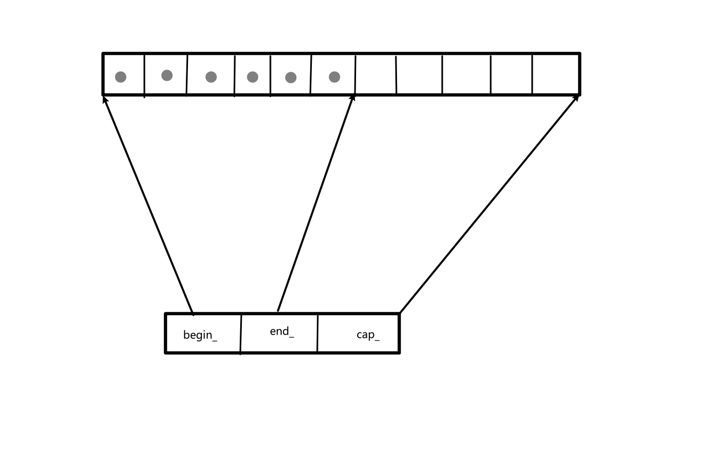

### vector

代码仓库：`https://github.com/sjz-hub/mystl`

**简介**

+ vector是向量，c++标准STL容器的一种
+ 特点
  + 顺序存储：容器元素严格按照线性顺序排序
  + 随机访问：支持[]和at()，时间复杂度是O(1)
  + 动态添加删除：支持在内部添加删除元素

**实现原理**

+ vector的成员变量
  + `iterator begin_`指向存放的第一个元素
  + `iterator end_`指向存放的最后一个元素的下一个元素
  + `iterator cap_`指向容器空间最后一个位置的下一个位置
+ vector底层实现结构为数组，所以其迭代器`iterator `就是`T*`
+ 当容器空间不足时，会重新申请一块更大空间，然后将原先的内容都move过来

**vector的public方法**

| 方法名                                                       | 含义                                                         |
| ------------------------------------------------------------ | ------------------------------------------------------------ |
| vector()                                                     | 尝试初始化一块16内存空间                                     |
| explicit vector(size_type n)                                 | 创建包含n个元素的vector,调用默认构造函数                     |
| vector(size_type n, const value_type& value)                 | 创建包含n个指定元素的vector                                  |
| template <class Iter, typename std::enable_if<   mystl::is_input_iterator<Iter>::value, int>::type = 0> | 使用[first,last)初始化容器                                   |
| vector(const vector& rhs)                                    | 拷贝构造函数                                                 |
| vector(vector&& rhs) noexcept                                | 移动构造函数                                                 |
| vector(std::initializer_list<value_type> ilist)              | 使用列表的方式初始化容器                                     |
| vector& operator=(const vector& rhs)                         | 拷贝运算符                                                   |
| vector& operator=(vector&& rhs) noexcept                     | 移动运算符                                                   |
| vector& operator=(std::initializer_list<value_type> ilist)   | 接收列表的等于运算符                                         |
| ~vector()                                                    | 析构函数                                                     |
| iterator               begin()         noexcept              | 返回开始迭代器                                               |
| const_iterator         begin()   const noexcept              | 返回const_iterator开始迭代器                                 |
| iterator               end()           noexcept              | 返回尾迭代器                                                 |
| const_iterator         end()     const noexcept              | 返回尾const_iterator                                         |
| reverse_iterator       rbegin()        noexcept              | 返回反向开始迭代器                                           |
| const_reverse_iterator rbegin()  const noexcept              | 返回const_reverse_iterator开始迭代器                         |
| reverse_iterator       rend()          noexcept              | 返回reverse_iterator尾迭代器                                 |
| const_reverse_iterator rend()    const noexcept              | 返回const_reverse_iterator尾迭代器                           |
| const_iterator         cbegin()  const noexcept              |                                                              |
| const_iterator         cend()    const noexcept              |                                                              |
| const_reverse_iterator crbegin() const noexcept              |                                                              |
| const_reverse_iterator crend()   const noexcept              |                                                              |
| bool      empty()    const noexcep                           | 判断容器是否为空                                             |
| size_type size()     const noexcept                          | 返回容器存储元素的个数                                       |
| size_type max_size() const noexcept                          | 返回容器的最大大小                                           |
| size_type capacity() const noexcept                          | 返回容器的开辟空间大小                                       |
| void      reserve(size_type n)                               | 当原容量大小小于n时会重新分配，新的容量应该大于等于n         |
| void      shrink_to_fit();                                   | 放弃多余的容量，使得容器容量变为和size一样的大小             |
| reference operator                            | 访问元素，返回的是引用                                       |
| const_reference operator const                | 访问元素，返回的是const引用                                  |
| reference at(size_type n)                                    | 返回指定索引的引用                                           |
| const_reference at(size_type n) const                        | 返回指定索引的const引用                                      |
| reference front()                                            | 返回第一个元素的引用                                         |
| const_reference front() const                                | 返回第一个元素的const引用                                    |
| reference back()                                             | 返回最后一个元素的引用                                       |
| const_reference back() const                                 | 返回最后一个元素的const引用                                  |
| pointer       data()       noexcept                          | 返回第一个元素的指针                                         |
| const_pointer data() const noexcept                          | 返回第一个元素的const指针                                    |
| void assign(size_type n, const value_type& value)            | 重新分配空间，包含n个内容为value的元素                       |
| template <class Iter, typename std::enable_if<   mystl::is_input_iterator<Iter>::value, int>::type = 0> void assign(Iter first, Iter last) | 重新分配，使用[first,last)赋值                               |
| void assign(std::initializer_list<value_type> il)            | 使用列表的形式进行重新分配                                   |
| template <class T> template <class ...Args> typename vector<T>::iterator vector<T>::emplace(const_iterator pos, Args&& ...args) | 如果pos是尾迭代器，直接在这个位置构造元素，并且尾迭代器后移；在pos位置构造元素，原先的元素和后面的都统一后移 |
| template <class... Args> void emplace_back(Args&& ...args)   | 在最后的位置添加一个元素                                     |
| void push_back(const value_type& value)                      | 在最后的位置添加一个元素                                     |
| void push_back(value_type&& value)                           | 在最后的位置添加一个元素                                     |
| void pop_back()                                              | 删除最后一个元素                                             |
| template <class T> typename vector<T>::iterator vector<T>::insert(const_iterator pos, const value_type& value) | 在pos前面插入一个元素，并返回这个元素的迭代器                |
| iterator insert(const_iterator pos, value_type&& value)      | 在pos前面插入一个元素，并返回这个元素的迭代器                |
| iterator insert(const_iterator pos, size_type n, const value_type& value) | 在pos前面插入n个元素，并返回这n个元素中第一个元素的迭代器    |
| template <class Iter, typename std::enable_if<   mystl::is_input_iterator<Iter>::value, int>::type = 0> void     insert(const_iterator pos, Iter first, Iter last) | 在pos前面插入[first,last)的内容                              |
| iterator erase(const_iterator pos);                          | 删除指定位置的元素，使得后面的元素前移一位，并且返回删除位置的迭代器 |
| template <class T> typename vector<T>::iterator vector<T>::erase(const_iterator first, const_iterator last) | 删除指定范围的元素，并返回删除元素后的first的迭代器          |
| template <class T> void vector<T>::resize(size_type new_size, const value_type& value) | 重置容器大小，如果size大于new_size删除对应的元素即可，如果小于new_size,则在后面使用value进行填充 |
| void     resize(size_type new_size)                          | 重置容器大小，如果size大于new_size删除对应的元素即可，如果小于new_size,则在后面使用T()进行填充 |
| template <class T> void vector<T>::swap(vector<T>& rhs) noexcept | 与另一个vector进行交换                                       |
| void     reverse()                                           | 容器元素反转                                                 |
| void     clear()                                             | 清空容器，对容器中的每个元素调用析构函数，但是不释放内存     |

**vector的private帮助函数**

| 方法名                                                       | 含义                                                         |
| ------------------------------------------------------------ | ------------------------------------------------------------ |
| template <class T> void vector<T>::try_init() noexcept       | 尝试分配初始空间16，初始化三个迭代器                         |
| template <class T> void vector<T>::init_space(size_type size, size_type cap) | 初始化空间大小为cap，并且此时已经有了size个大小，这里只需要初始化三个迭代器，这里只是先确定了end_的大小，在调用这个函数的位置肯定会把前size个位置进行一个填充的；（调用这个函数的时候需要释放原先的空间，因为进行重新分配了） |
| template <class T> void vector<T>:: fill_init(size_type n, const value_type& value) | 初始化包含n个value的的vector,如果小于16就开辟16个元素空间，如果大于16，则开辟n个空间，然后将前n个元素进行初始化 |
| template <class T> template <class Iter> void vector<T>:: range_init(Iter first, Iter last) | 这个和fill_init(size_type n, const value_type& value)函数一样，只不过每个元素的值为两个迭代器之间的值，这里面可以通过两个迭代器获得m |
| template <class T> typename vector<T>::size_type  vector<T>:: get_new_cap(size_type add_size) | 根据给出的增加的大小返回一个新的容器的大小；如果old_size*1.5>max_size() 此时返回的是 old_size+add_size（+16）如果加上16之后没有超过max_size()的话；如果old_size * 1.5< max_size() 此时会根据old_size是否为0，如果为0则返回16 和add_size的最大值，如果不为0，则返回1.5old_size和old_size+add_size的最大值 |
| template <class T> void vector<T>:: fill_assign(size_type n, const value_type& value) | 对vector进行重新分配，如果n>capacity()则重新分配一个新空间的为n,然后为其进行赋值为value;如果只是大于size()则只需要将其前n个进行填充替换即可;如果n<size()，则填充前n个后面的则删除 |
| template <class T> template <class IIter> void vector<T>:: copy_assign(IIter first, IIter last, input_iterator_tag) | 使用迭代器间的值进行重新分配[first,last)                     |
| template <class T> template <class FIter> void vector<T>:: copy_assign(FIter first, FIter last, forward_iterator_tag) | 双向迭代器的拷贝重新分配，这个和上面的那个输入迭代器没感觉出来应该有啥区别啊，所以这里暂时只将输入迭代器的方式实现，其实也不是输入迭代器的方式，而是直接实现，不管迭代器的类型 |
| template <class T> typename vector<T>::iterator  vector<T>:: fill_insert(iterator pos, size_type n, const value_type& value) | 就是在pos前面插入n个value,返回插入元素的迭代器               |
| template <class T> template <class IIter> void vector<T>:: copy_insert(iterator pos, IIter first, IIter last) | 和fill_insert(iterator pos, size_type n, const value_type& value)类似，只是使用两个迭代器之间的值进行赋值[first,last) |
| template <class T> void vector<T>::reinsert(size_type size)  | 申请vector大小为size,然后将原先的内容move过来新的数组空间    |

代码仓库：`https://github.com/sjz-hub/mystl`
